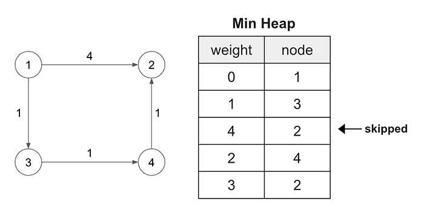

> All diagrams presented herein are original creations, meticulously designed to enhance comprehension and recall. Crafting these aids required considerable effort, and I kindly request attribution if this content is reused elsewhere.
{: .prompt-danger }

> **Difficulty** :  Easy
{: .prompt-tip }

> Dijkstra's Algorithm (Graph), BFS, Min-Heap
{: .prompt-info }

## Problem

You are given a network of `n` nodes, labeled from `1` to `n`. You are also given `times`, a list of travel times as directed edges `times[i] = (ui, vi, wi)`, where `ui` is the source node, `vi` is the target node, and `wi` is the time it takes for a signal to travel from source to target.

We will send a signal from a given node `k`. Return *the **minimum** time it takes for all the* `n` *nodes to receive the signal*. If it is impossible for all the `n` nodes to receive the signal, return `-1`.

**Example 1:**


```
Input: times = [[2,1,1],[2,3,1],[3,4,1]], n = 4, k = 2
Output: 2
```

## Solution

This is the classic **Dijkstra's Algorithm**. If you know how to solve it then there is no additional explanation is required. 

### High Level Explanation

1.	Traverse the graph based on current smallest weights using **min heap**.
2.	Do not visit a node if its already visited using the **visit set**.
3.	Add **cumulative** **weight** as the key to the min heap.

The first thing we will do it create the edge list (**Adjacency Map**). This part is very common for most of the graph problem. Loop through each element in `times` array and append the connected nodes with the edge weights.

```python
def network_delay_time(times,n,k):
  edges = collections.defaultdict(list)
  for u, v, w in times:
    edges[u].append((v,w))
```

We need to start from the provided node `k`. Add that manually to the min-heap with weight set to `0` as this will be the starting node. 

> The **weight** is the first element in the **tuple**, hence the heap will be **sorted** :fire: based on the weight by default.This is one of the most important step
{: .prompt-info }

```python
  min_heap = [(0,k)]
```

Create a `visited` `set` for avoiding duplicate paths and `distance` for tracking the last visited node.

```python
  visited = set()
  distance = 0
```

Next, keep looping until the `min_heap` is not empty so that we can traverse across the entire directed graph using `BFS`. During every visit, pop the top element from the `min_heap` which is the node with min `weight`.

```python
  while min_heap:
    parent_weight,parent_node = heapq.heappop(min_heap)
```

Here is a sample of how the logic is going to workout. We will start from node `1` and traverse through the graph. Notice, the node `2` can be reached in two different ways, however `(4,2)` entry will be skipped as `(3,2)` will be popped before it and the node `2` will be marked as `visited` in the `set()`.



If the popped node is already in the `visited` `set` we won't do anything. Any node with alternative larger cumulative weight will **not be processed** automatically using the `visited` `set()`.

```python
    if parent_node in visited:
    	continue
```

Otherwise add it to the `visited` `set` and save the `parent_weight` . :fire: The assumption here is the last visited node will always be farthest away from node `k` as we are always popping the min weight from the `min_heap.` This `distance` will be returned at the end.

> This is the extra step added on top of basic `Dijkstra's Algorithm` with BFS.
{: .prompt-tip }

```python
    visited.add(parent_node)
    distance = parent_weight
```

Now add all the nodes in the `min_heap` which can be reached from the `parent_node`. 

> The last line is the most important where we are appending the `parent_weight` with the `child_weight` to get the **cumulative weight** to reach from node `k` to the current `child_node`.
{: .prompt-tip }

```python
    for child_node, child_weight in edges[parent_node]:
    	if child_node not in visited:
      	heapq.heappush(min_heap, (parent_weight+child_weight,child_node))
```

Finally, return the `distance` only if we have visited all the `n` nodes, else return `-1`.

```python
  return distance if len(visited) ==n else -1
```

## Final Code 

Here is the full code.

```python
def network_delay_time(times, n, k):
    edges = collections.defaultdict(list)
    for u, v, w in times:
        edges[u].append((v, w))

    visited = set()
    distance = 0
    min_heap = [(0, k)]

    while min_heap:
        parent_weight, parent_node = heapq.heappop(min_heap)
        if parent_node in visited:
            continue

        distance = parent_weight
        visited.add(parent_node)

        for child_node, child_weight in edges[parent_node]:
            if child_node not in visited:
                heapq.heappush(
                    min_heap, (parent_weight+child_weight, child_node))

    return distance if len(visited) == n else -1
```


