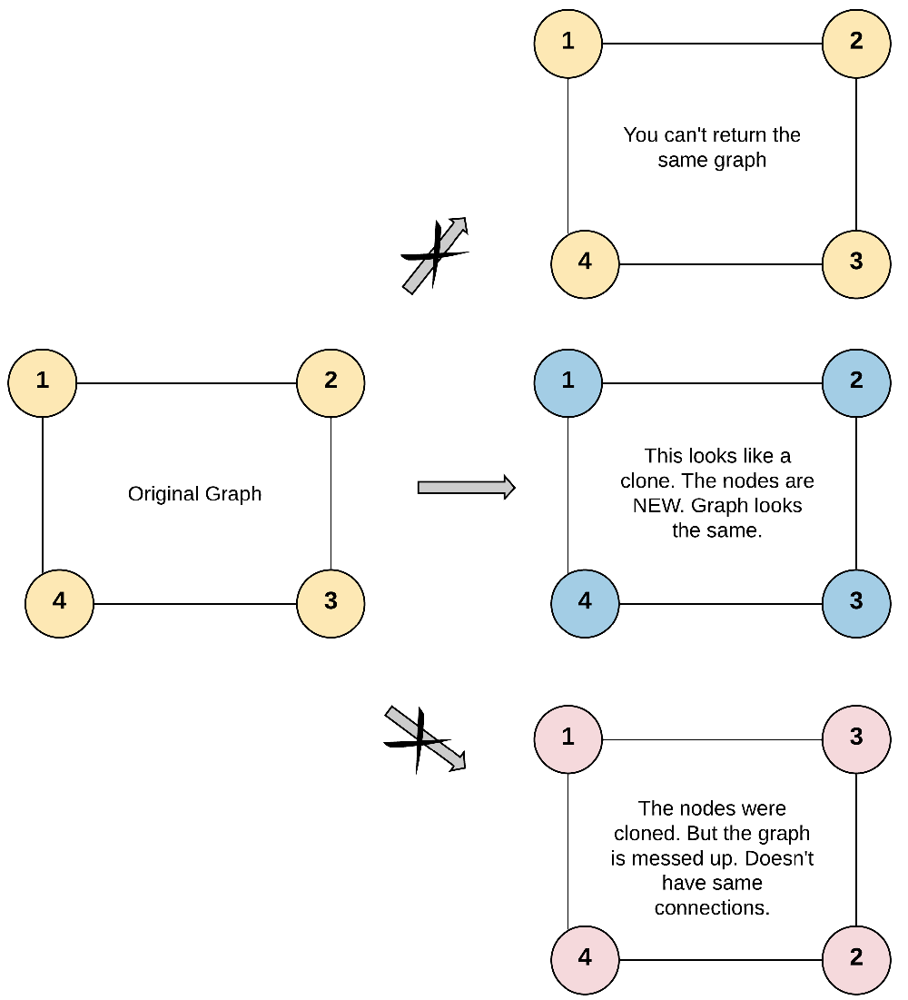

> All diagrams presented herein are original creations, meticulously designed to enhance comprehension and recall. Crafting these aids required considerable effort, and I kindly request attribution if this content is reused elsewhere.
{: .prompt-danger }

> **Difficulty** :  Easy
{: .prompt-tip }

> DFS, Map
{: .prompt-info }

## Problem

Given a reference of a node in a **[connected](https://en.wikipedia.org/wiki/Connectivity_(graph_theory)#Connected_graph)** undirected graph. Return a [**deep copy**](https://en.wikipedia.org/wiki/Object_copying#Deep_copy) (clone) of the graph.

Each node in the graph contains a value (`int`) and a list (`List[Node]`) of its neighbors.

```
class Node {
    public int val;
    public List<Node> neighbors;
} 
```

**Example 1:**



```
Input: adjList = [[2,4],[1,3],[2,4],[1,3]]
Output: [[2,4],[1,3],[2,4],[1,3]]
Explanation: There are 4 nodes in the graph.
1st node (val = 1)'s neighbors are 2nd node (val = 2) and 4th node (val = 4).
2nd node (val = 2)'s neighbors are 1st node (val = 1) and 3rd node (val = 3).
3rd node (val = 3)'s neighbors are 2nd node (val = 2) and 4th node (val = 4).
4th node (val = 4)'s neighbors are 1st node (val = 1) and 3rd node (val = 3).
```

## Solution

### High Level Explanation

1.	Very simple and basic DFS problem.
2.	Only new line is the creation of new Node().
3.	The **Map** is a mapping between **old** (**key**) and **new** (**val**) node.

Maintain a `visited` `map` in the main function. We are using a `dict` object and not a `set` as we need more than just to track the nodes. We also want to get the newly created duplicate node for the original node whenever returning a visit to the node. 


```python
visited = {}
```

Now we can start our `dfs()` function. If we are revisiting a already visited node, just return the newly created node.

```python
def dfs(node):
  if node in visited:
    return visited[node]
```

Otherwise, create a new node by copying existing node.

```python
dup_node = Node(node.val)
visited[node] = dup_node
```

Traverse all the neighbors by running `dfs()` on each `neighbor`. This way the `dfs()` function will always return the newly created duplicate node.

```python
for neighbor in node.neighbors:
  dup_neighbor = dfs(neighbor)
```

Now add the `dup_neighbor` as new neighbor to current `node`.

```python
  dup_node.neighbors.append(dup_neighbor)
```

Finally, return the new `node`.

```python
return dup_node
```

At the end, call the `dfs()` function.

```python
return dfs(node) if node else None
```

## Final Code 

Here is the full code.

```python
"""
# Definition for a Node.
class Node:
    def __init__(self, val = 0, neighbors = None):
        self.val = val
        self.neighbors = neighbors if neighbors is not None else []
"""
        
def clone_graph(node):
    visited = {}

    def dfs(node):
        if node in visited:
            return visited[node]

        dup_node = Node(node.val)
        visited[node]= dup_node

        for neighbor in node.neighbors:
            dup_node.neighbors.append(dfs(neighbor))

        return dup_node
    return dfs(node) if node else None
  

```


