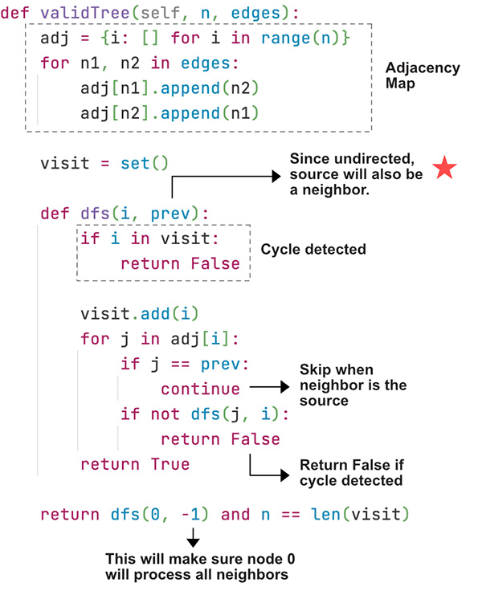

> All diagrams presented herein are original creations, meticulously designed to enhance comprehension and recall. Crafting these aids required considerable effort, and I kindly request attribution if this content is reused elsewhere.
{: .prompt-danger }

> **Difficulty** :  Easy
{: .prompt-tip }

> DFS, Map
{: .prompt-info }

## Problem

Given `n` nodes labeled from `0` to `n - 1` and a list of `undirected` edges (each edge is a pair of nodes), write a function to check whether these edges make up a valid tree. (A valid tree does not have loops and all nodes need to be connected).

**Example 1:**

```
Input: n = 5 edges = [[0, 1], [0, 2], [0, 3], [1, 4]]
Output: true.
```

**Example 2:**

```
Input: n = 5 edges = [[0, 1], [1, 2], [2, 3], [1, 3], [1, 4]]
Output: false.
```

## Solution

There two conditions we need to check to make sure the graph is a valid tree.

1. **All nodes are connected** - This can be validated by comparing `len(visited)==n`
2. **No cycle exists** - This can be validated when we run `dfs()`. If we find the current node is already visited then a cycle is detected.

### High Level Explanation

1.	Very simple and basic DFS problem.
2.	Create the **adjacency map**
3.	Visit each node and its neighbors
4.	Keep track of the **prev node** since the graph is **undirected**. 

The input will be `n` (number of nodes) and the `edges` (connected nodes). Let's first start with the **adjacency map** for traversal.

```python
adjacency_map = collections.defaultdict(list)
for n1, n2 in edges:
  adj[n1].append(n2)
  adj[n2].append(n1)
```

Initialize the `visit` `set`

```python
visited = set()
```

Now create the `dfs()` function to traverse the graph. The `dfs()` function takes the current `node` and also the previous  `prev_node`, this is to make sure not to traverse backwards since the graph is undirected. 

Check for cycle first. As stated earlier,  if we find the current node is already visited then a cycle is detected. We return `False`.

```python
def dfs(node, prev_node):
  if node in visited:
    return False
```

Now, add the node to `visited` `set`

```python
visited.add(node)
```

Traverse the neighbors of the `node` except the `prev_node`. Return `False` if the `dfs()` returns `False`. Finally return `True`.

```python
for neighbor in adjacency_map[node]:
  if neighbor == prev_node:
    continue
  
  if not dfs(neighbor,node):
    return False
return True
```

Finally call `dfs()` and also validate if all the nodes have been visited. We are passing `None` for the first time to make sure the first node visits all its  neighbors. We can pass any other values such as `-1` or `n+1` etc.

```python
return dfs(0, None) and n==len(visited)
```


Here is the annoyed version, some of variable names are different though.



## Final Code 

Here is the full code.

```python
"""
# Definition for a Node.
class Node:
    def __init__(self, val = 0, neighbors = None):
        self.val = val
        self.neighbors = neighbors if neighbors is not None else []
"""
        
def valid_tree(n, edges):
  adjacency_map = collections.defaultdict(list)
  for node1, node2 in edges:
    adjacency_map[node1].append(node2)
    adjacency_map[node2].append(node1)
    
  visited = set()
  
  def dfs(node, prev_node):
    if node in visited :
      return False
    
    visited.add(node)
    
    for neighbor in adjacency_map[node]:
      if neighbor !=prev_node:
        if not dfs(neighbor, node):
          return False
    return True
  
  return dfs(0, None) and len(visited)==n  

```


