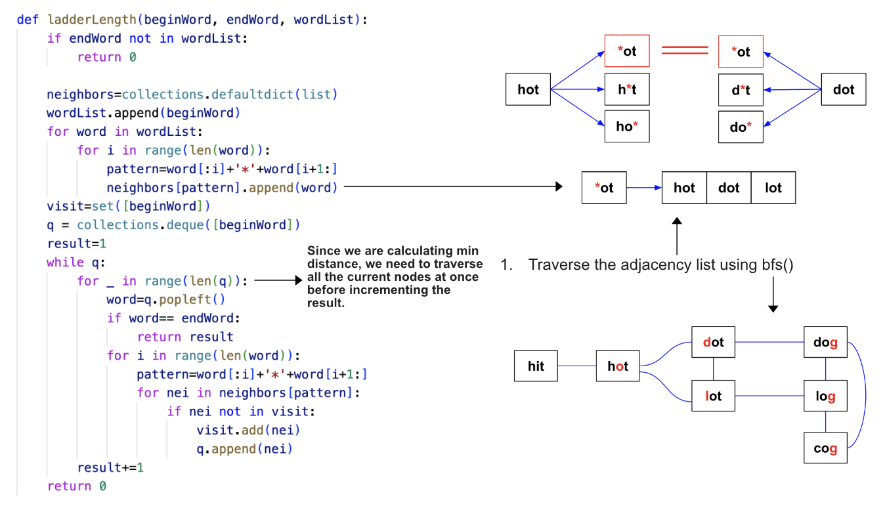

> All diagrams presented herein are original creations, meticulously designed to enhance comprehension and recall. Crafting these aids required considerable effort, and I kindly request attribution if this content is reused elsewhere.
{: .prompt-danger }

> **Difficulty** :  Easy
{: .prompt-tip }

> Adjacency List, BFS
{: .prompt-info }

## Problem

A **transformation sequence** from word `beginWord` to word `endWord` using a dictionary `wordList` is a sequence of words `beginWord -> s1 -> s2 -> ... -> sk` such that:

- Every adjacent pair of words differs by a single letter.
- Every `si` for `1 <= i <= k` is in `wordList`. Note that `beginWord` does not need to be in `wordList`.
- `sk == endWord`

Given two words, `beginWord` and `endWord`, and a dictionary `wordList`, return *the **number of words** in the **shortest transformation sequence** from* `beginWord` *to* `endWord`*, or* `0` *if no such sequence exists.*

**Example 1:**

```
Input: beginWord = "hit", endWord = "cog", wordList = ["hot","dot","dog","lot","log","cog"]
Output: 5
Explanation: One shortest transformation sequence is "hit" -> "hot" -> "dot" -> "dog" -> cog", which is 5 words long.
```

**Example 2:**

```
Input: beginWord = "hit", endWord = "cog", wordList = ["hot","dot","dog","lot","log"]
Output: 0
Explanation: The endWord "cog" is not in wordList, therefore there is no valid transformation sequence.
```

## Solution

### High Level Idea

- Since this is a graph problem, we need to first find out how to create a graph so that the final result is just a traversal in the graph through the nodes (if exists)
- :fire: One cleaver technique is to find all the adjacent words for each word with one letter difference. This is the main trick for solving the problem.
- Once we have the **Adjacency Map**, we can use either **DFS** or **BFS** to traverse the graph.

Here is the entire code and related diagram. Let's understand each part now.




## Final Code 

Here is the full code.

```python

        


```


