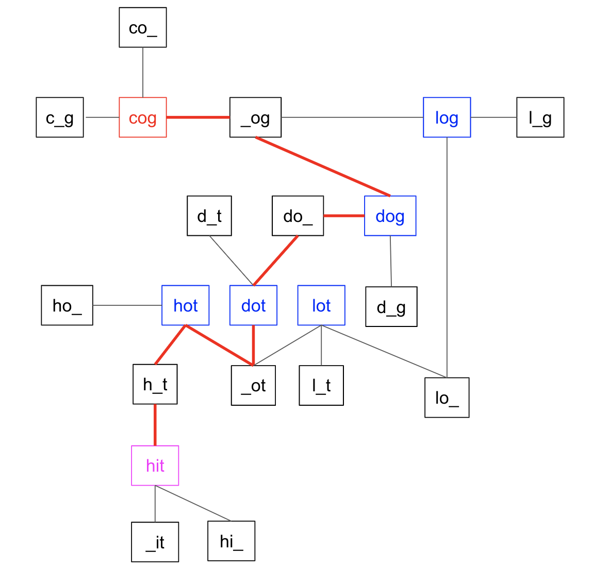

> All diagrams presented herein are original creations, meticulously designed to enhance comprehension and recall. Crafting these aids required considerable effort, and I kindly request attribution if this content is reused elsewhere.
{: .prompt-danger }

> **Difficulty** :  Medium
{: .prompt-warning }

> Adjacency List, BFS
{: .prompt-info }

## Problem

A **transformation sequence** from word `beginWord` to word `endWord` using a dictionary `wordList` is a sequence of words `beginWord -> s1 -> s2 -> ... -> sk` such that:

- Every adjacent pair of words differs by a single letter.
- Every `si` for `1 <= i <= k` is in `wordList`. Note that `beginWord` does not need to be in `wordList`.
- `sk == endWord`

Given two words, `beginWord` and `endWord`, and a dictionary `wordList`, return *the **number of words** in the **shortest transformation sequence** from* `beginWord` *to* `endWord`*, or* `0` *if no such sequence exists.*

**Example 1:**

```
Input: beginWord = "hit", endWord = "cog", wordList = ["hot","dot","dog","lot","log","cog"]
Output: 5
Explanation: One shortest transformation sequence is "hit" -> "hot" -> "dot" -> "dog" -> cog", which is 5 words long.
```

**Example 2:**

```
Input: beginWord = "hit", endWord = "cog", wordList = ["hot","dot","dog","lot","log"]
Output: 0
Explanation: The endWord "cog" is not in wordList, therefore there is no valid transformation sequence.
```

## Solution

### High Level Idea

- Since this is a graph problem, we need to first find out how to create a graph so that the final result is just a traversal in the graph through the nodes (if exists)
- :fire: One cleaver technique is to find all the adjacent words for each word with one letter difference. This is the main trick for solving the problem.
- Once we have the **Adjacency Map**, we can use either **DFS** or **BFS** to traverse the graph.

Here is the entire code and related diagram. Let's understand each part now.


First step is to create the **Adjacency List**. We can find all the words which are one word different than current word and create an **Adjacency List** using those words. So `hit` can have 3 words which are one letter different that `hit`, there are  `_it, h_t, hi_`.  The idea is to use these patterns to find which words from the dictionary can be reached.

The `begin_word` is not part of the `word_list`, so we will add it first as the `begin_word` will be our starting node.

```python
#def ladder_length(begin_word, end_word, word_list):
adjacency_list = collections.defaultdict(list)
word_list.append(begin_word)
```

Loop through the `word_list`, for each `word`, construct a pattern where one word can be wild. We will use `__` symbol to indicate the wild. :fire: The most important part is, this edge list is for the `pattern` and not for the `word`. 

- You can also do the opposite and still solve the problem, but the runtime complexity will be higher (will be more clear later).   
- You can also build a bi-directional graph and solve this. However we are going to create bi-directional as we can easily find neighbors of `word` in `word_list` by using for loop to regenerate the pattern again. So are just using the `pattern` as the key in the adjacent list (uni-directional)

```python
for word in word_list:
  for index in range(len(word)):
    pattern = word[:index]+"_"+word[index+1:]
    adjacency_list[pattern].append(word)
```

Here is how the `adjacency_list` looks for the **Example 1** given above.

```
{'_ot': 
['hot', 'dot', 'lot'], 
'h_t': ['hot', 'hit'], 
'ho_': ['hot'], 
'd_t': ['dot'], 
'do_': ['dot', 'dog'], 
'_og': ['dog', 'log', 'cog'], 
'd_g': ['dog'], 
'l_t': ['lot'], 
'lo_': ['lot', 'log'], 
'l_g': ['log'], 
'c_g': ['cog'], 
'co_': ['cog'], 
'_it': ['hit'], 
'hi_': ['hit']})
```

Here is the visualization of the graph. Notice all we have to do is now to traverse the graph to find path to `end_word` (cog) starting from `begin_word` (hit). 



We will start with the `visited` `set()` and initialize the queue for our BFS.

```python
visited = set([begin_word])
queue = collections.deque([begin_word])
```

The final return will be this `result` variable. Since we have already visited `begin_word`, we will start with `result=1`

```python
result = 1
```

Now, let’s traverse the `queue` until it’s empty. Then visit all the words in the queue using a `for` loop. 

```python 
while queue:
  for _ in range(len(queue)):     
```

Get the first element (oldest) from the queue

```python
    word = queue.popleft()    
```

If this is the `end_word` return the `result`.

```python
    if word == end_word:
      return result
```

Next we need to find all the neighbors of `word`, since the adjacency list is unidirectional we do not have the details there. So we need to find all the `pattern`s like we did when we built the adjacency list and those will be the neighbors (refer the diagram of the graph above for more clarity). 

> There is one more trick here in case you have not noticed. We are not adding the `pattern` into the `queue` rather the `neighbor` of the `pattern` node. This way we are always looking for `word`s in the `word_list` to be traversed as we already know that two `word`s will always be connected using a `pattern`.
{: .prompt-tip }

If the `neighbor` is not `visited`, add it to the `visited` `set` and also to the `queue`.

```python
    for index in range(len(word)):
      pattern = word[:index]+"_"+word[index+1:]
      for neighbor in adjacency_list[pattern]:
        if neighbor not in visited:
          visited.add(neighbor)
          queue.append(neighbor)
```

:fire: It’s very important to understand that one round of `while` loop is equal to traversing `1` layer of the tree. So it’s the best time to increment `result`

```python
    result+=1
```

Finally, if the `end_word` has not reached, return `0`

```python
return 0
```

## Final Code

Here is the full code.

```python
def ladder_length(begin_word, end_word, word_list):
  	# Edge case for passing in leetcode
    if end_word not in word_list:
        return 0

    adjacency_list = collections.defaultdict(list)
    word_list.append(begin_word)

    for word in word_list:
        for index in range(len(word)):
            pattern = word[:index]+"_"+word[index+1:]
            adjacency_list[pattern].append(word)

    visited = set([begin_word])
    queue = collections.deque([begin_word])
    result = 1
    while queue:
        for _ in range(len(queue)):
            word = queue.popleft()
            if word == end_word:
                return result
            # The visited can be populated either 
            # when inserting in the queue
            # or when processing the word
            visited.add(word)

            for index in range(len(word)):
                pattern = word[:index]+'_'+word[index+1:]
                for neighbor in adjacency_list[pattern]:
                    if neighbor not in visited:
                        queue.append(neighbor)
        result += 1

    return 0
```


