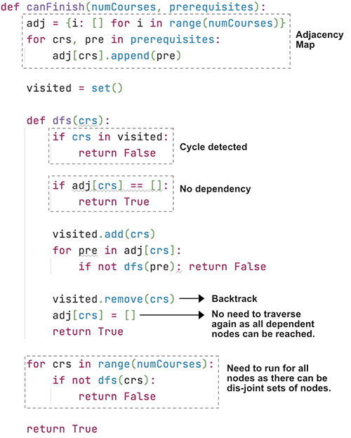

> All diagrams presented herein are original creations, meticulously designed to enhance comprehension and recall. Crafting these aids required considerable effort, and I kindly request attribution if this content is reused elsewhere.
{: .prompt-danger }

> **Difficulty** :  Medium
{: .prompt-warning }

> Backtracking, DFS
{: .prompt-info }

## Problem

There are a total of `numCourses` courses you have to take, labeled from `0` to `numCourses - 1`. You are given an array `prerequisites` where `prerequisites[i] = [ai, bi]` indicates that you **must** take course `bi` first if you want to take course `ai`.

- For example, the pair `[0, 1]`, indicates that to take course `0` you have to first take course `1`.

Return `true` if you can finish all courses. Otherwise, return `false`.

**Example 1:**

```
Input: numCourses = 2, prerequisites = [[1,0]]
Output: true
Explanation: There are a total of 2 courses to take. 
To take course 1 you should have finished course 0. So it is possible.
```

**Example 2:**

```
Input: numCourses = 2, prerequisites = [[1,0],[0,1]]
Output: false
Explanation: There are a total of 2 courses to take. 
To take course 1 you should have finished course 0, and to take course 0 you should also have finished course 1. So it is impossible.
```

## Solution

Before going into the solution, let's visualize a problem. Here is our input:

- **Input :**  [ [ 0, 1 ] , [ 0, 2 ] , [ 1, 3 ] , [ 1, 4 ] , [ 3, 4 ] ]
- **Output :** True


### High Level Idea
1. Very simple and basic DFS problem with Backtracking.
2. The adjacency map should be able to help to make sure all dependencies can be traversed.
3. Use **visited set()** to track **cycles**.
4. Return **false** only when **cycle is detected** :fire:

Start by creating the adjacency list.

```python
#def can_finish(num_courses, prerequisites)
adjacency_list = collection.defaultdict(list)
for course, prerequisite in prerequisites:
  adjacency_list[course].append(prerequisite)
```

Define `visited` `set`.

```python
visited = set()
```

The idea is to traverse through all the nodes ( `0` to `n-1` ) and make sure we can visit all of them. Since the graph can be **disjoint** we need to run the `dfs()` starting from all the nodes. If at anytime the `dfs()` returns `False` we can just return `False` and not keep going through running all the nodes.

```python
for course in range(num_courses):
  if not dfs(course):
    return False
```

In the `dfs()` function return `False` if a **cycle** is detected.

```python
def dfs(course):
  if course in visited:
    return False
```

Now if there is no `prerequisites` for a course, we can return `True`. Like in case of `2` and `4`


```python
  if adjacency_list[course]=[]:
    return True
```

There are two scenarios in which we can return `True`, the first one we saw above where the `prerequisites` are empty in the `adjacency_list`. The second scenario is when all the `prerequisites` of the current `course` is traversed and no cycle is detected (None of the `prerequisites` `course`s returned `False`).

Let's code for this 2nd scenario. Also, if anytime any of the `dfs()` returns `False` (a `False` is returned only if cycle is detected) we can straightway return `False`.

```python
  for prerequisite in adjacency_list[course]:
    if not dfs(prerequisite):
      return False
  return True
```

Here is the full code so far. Please take a look and make sure you understand fully as we will be adding some additional lines.

```python
def can_finish(num_courses, prerequisites):
  adjacency_list = collections.defaultdict(list)
  for course, prerequisite in prerequisites:
    adjacency_list[course].append(prerequisite)
  
  visited = set()
  
  def dfs(course):
    if course in visited:
      return False
    if adjacency_list[course]==[]:
      return True
    visited.add(course)
    
    for prerequisite in adjacency_list[course]:
      if not dfs(prerequisite):
        return False
    return True
  
  for course in range(num_courses):
    if not dfs(course):
      return False
    
  return True
```

There is two problems with the above code. 

### 1. False Cycle Detection

It's very important to understand why the above code won't work and how to make it work. Consider the below example. 

- We will start with `0` which does not have any dependency. 
- Process `1`. `1` is dependent on `4`. Once we process `dfs(1)`, the `visited` set will have value `1`.
- Now process `2`, similar to `1`, once `dfs(2)` is processed the `visited` set will have value `1, 2`.
- Now once we start with `dfs(3)`, we will start processing its `prerequisite` and immediately encounter `1` or `2` in the visited set. This will result in cycle detection and return `False`, which is inaccurate.


We might think one way to mitigate is reseting the visited set before `line 21` where we call `dfs()` for each `course`. 

```python
for course in range(num_courses):
  	visited = set()
    if not dfs(course):
      return False
```

It will work for this particular graph, however let's look at another example. This is a test case in LeetCode. 

- **Input :** `[[1,0],[0,3],[0,2],[3,2],[2,5],[4,5],[5,6],[2,4]`, `num_courses = 7`
- **Output :** True


- We start with visiting `0`. The `visited` set has `0`.
- Then try to process `3` as we have `[0,3]` before `[0,2]` in the input given. 
- `3`'s `prerequisite` is `2`. So start with `2` which also has more `prerequisite`. The `visited` set becomes `0, 2, 3`.
- Now since `[2,5]` is before `[2,4]` we visit `5` and then visit `6`. The `visited` set is now `0, 2, 3, 5`
- Now comes `[2,4]` :fire:, so we run `dfs(4)`, since `4` has `prerequisites`, we add `4` to `visited` and start with `dfs(5)`.
- Here is the problem, the `visited` already has `5`, as we have already processed `5`. This detects a false cycle and returns `False`. 

The way to solve this problem is **backtracking**. Every time all it's `prerequisite` have been processed, we need to remove it from the `visited` set. This way when we visit `5`, the visit set does not have `5` as it was removed. So we don't return `False`.

```python
# remove course from visited before
# returning True at the end
visited.remove(course)
return True
```

#### 2. Output Limit Exceeded

Logically everything we have done is enough, it will run file in your local. However the above code will fail due to **Output Limit Exceeded** in **LeetCode**.  One easy way to optimize it to remove the `prerequisite` of a course after we know all the `prerequisite`s of that course can be completed. 

Let's add some print statements. 

```python
def dfs(course):
    print("visiting ->",course)
    if course in visited:
			...
    visited.add(course)
    print(visited)
```

Here is the log when we visit a node.  As you see we are visiting the same nodes even when we know their `prerequisite`s can be fulfilled. 

```python
visiting -> 0
{0}
visiting -> 3
{0, 3}
visiting -> 2
{0, 2, 3}
visiting -> 5
{0, 2, 3, 5}
visiting -> 6
visiting -> 4
{0, 2, 3, 4}
visiting -> 5
{0, 2, 3, 4, 5}
visiting -> 6
visiting -> 2
{0, 2}
visiting -> 5
{0, 2, 5}
visiting -> 6
visiting -> 4
{0, 2, 4}
visiting -> 5
{0, 2, 4, 5}
visiting -> 6
visiting -> 1
{1}
visiting -> 0
{1, 0}
visiting -> 3
{1, 3, 0}
visiting -> 2
{1, 2, 3, 0}
visiting -> 5
{1, 2, 3, 0, 5}
visiting -> 6
visiting -> 4
{1, 2, 3, 0, 4}
visiting -> 5
{1, 2, 3, 0, 4, 5}
visiting -> 6
visiting -> 2
{1, 0, 2}
visiting -> 5
{1, 0, 5, 2}
visiting -> 6
visiting -> 4
{1, 0, 4, 2}
visiting -> 5
{1, 5, 0, 4, 2}
visiting -> 6
visiting -> 2
{2}
visiting -> 5
{5, 2}
visiting -> 6
visiting -> 4
{4, 2}
visiting -> 5
{5, 4, 2}
visiting -> 6
visiting -> 3
{3}
visiting -> 2
{2, 3}
visiting -> 5
{5, 2, 3}
visiting -> 6
visiting -> 4
{4, 2, 3}
visiting -> 5
{5, 4, 2, 3}
visiting -> 6
visiting -> 4
{4}
visiting -> 5
{5, 4}
visiting -> 6
visiting -> 5
{5}
visiting -> 6
visiting -> 6
```

So whenever a `course`'s `prerequisite`s can be completed set the `prerequisite` of that `course` to be empty. This way we can avoid multiple round trips and traverse one node (`course`) just once.

```python
visited.remove(course)
# set the prerequisite to []
# at the end when all of them
# can be reached without any cycle.
adjacency_list[course] = []
return True
```

Here is the same log after adding this code. 

```
visiting -> 0
{0}
visiting -> 3
{0, 3}
visiting -> 2
{0, 2, 3}
visiting -> 5
{0, 2, 3, 5}
visiting -> 6
visiting -> 4
{0, 2, 3, 4}
visiting -> 5
visiting -> 2
visiting -> 1
{1}
visiting -> 0
visiting -> 2
visiting -> 3
visiting -> 4
visiting -> 5
visiting -> 6
```

Here is the code to visualize at once for reference (the variable names might be different).



## Final Code

Here is the full code.

```python
def can_finish(num_courses, prerequisites):
    adjacency_list = collections.defaultdict(list)
    for course, prerequisite in prerequisites:
        adjacency_list[course].append(prerequisite)

    visited = set()

    def dfs(course):
        if course in visited:
            return False

        if adjacency_list[course] == []:
            return True

        visited.add(course)

        for prerequisite in adjacency_list[course]:
            if not dfs(prerequisite):
                return False

        visited.remove(course)
        adjacency_list[course] = []
        return True

    for course in range(num_courses):
        if not dfs(course):
            return False

    return True
```


