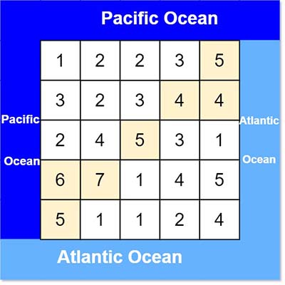
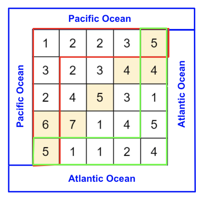
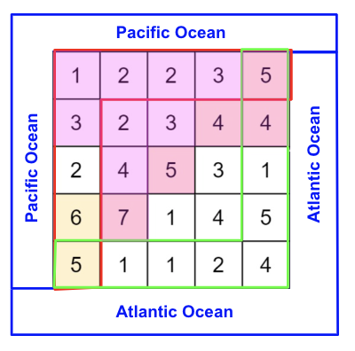

> All diagrams presented herein are original creations, meticulously designed to enhance comprehension and recall. Crafting these aids required considerable effort, and I kindly request attribution if this content is reused elsewhere.
{: .prompt-danger }

> **Difficulty** :  Easy
{: .prompt-tip }

> DFS
{: .prompt-info }

## Problem

There is an `m x n` rectangular island that borders both the **Pacific Ocean** and **Atlantic Ocean**. The **Pacific Ocean** touches the island's left and top edges, and the **Atlantic Ocean** touches the island's right and bottom edges.

The island is partitioned into a grid of square cells. You are given an `m x n` integer matrix `heights` where `heights[r][c]` represents the **height above sea level** of the cell at coordinate `(r, c)`.

The island receives a lot of rain, and the rain water can flow to neighboring cells directly north, south, east, and west if the neighboring cell's height is **less than or equal to** the current cell's height. Water can flow from any cell adjacent to an ocean into the ocean.

Return *a **2D list** of grid coordinates* `result` *where* `result[i] = [ri, ci]` *denotes that rain water can flow from cell* `(ri, ci)` *to **both** the Pacific and Atlantic oceans*.


**Example 1:**



```
Input: heights = [[1,2,2,3,5],[3,2,3,4,4],[2,4,5,3,1],[6,7,1,4,5],[5,1,1,2,4]]
Output: [[0,4],[1,3],[1,4],[2,2],[3,0],[3,1],[4,0]]
Explanation: The following cells can flow to the Pacific and Atlantic oceans, 
as shown below:
[0,4]: [0,4] -> Pacific Ocean 
       [0,4] -> Atlantic Ocean
[1,3]: [1,3] -> [0,3] -> Pacific Ocean 
       [1,3] -> [1,4] -> Atlantic Ocean
[1,4]: [1,4] -> [1,3] -> [0,3] -> Pacific Ocean 
       [1,4] -> Atlantic Ocean
[2,2]: [2,2] -> [1,2] -> [0,2] -> Pacific Ocean 
       [2,2] -> [2,3] -> [2,4] -> Atlantic Ocean
[3,0]: [3,0] -> Pacific Ocean 
       [3,0] -> [4,0] -> Atlantic Ocean
[3,1]: [3,1] -> [3,0] -> Pacific Ocean 
       [3,1] -> [4,1] -> Atlantic Ocean
[4,0]: [4,0] -> Pacific Ocean 
       [4,0] -> Atlantic Ocean
Note that there are other possible paths for these cells to flow to 
the Pacific and Atlantic oceans.
```

**Example 2:**

```
Input: heights = [[1]]
Output: [[0,0]]
Explanation: The water can flow from the only cell to the Pacific and Atlantic oceans.
```

## Solution

This problem can certainly be solved by running a search algorithm (BFS or DFS) for every cell to find out if it reaches the oceans. However solving the exact opposite way might be faster as already know all the adjacent sides can reach at least one ocean. So instead of finding the ocean, we can climb the hills in the opposite direction. The idea is to find every cells from where water can flow to the red and green zones.



Start by defining the variables.

```python
ROWS, COLS = len(heights), len(heights[0])
```

We will create two separate visit sets, one for each ocean.

```python
visited_pacific=set()
visited_atlantic=set()
```

Since we already know that all the cells highlighted in red can reach the pacific ocean, we will go through each of those cells and mark every hills which can be visited using the `visited_pacific` set. We need to pass the `prev` as we need to make sure the current cell can be reached based on the previous cell value.

```python
# Top row
for c in range(COLS):
  prev = heights[0][c]
  dfs(0, c, visited_pacific, prev)
```

Now the same for left column.

```python
# Left Col
for c in range(ROW):
  prev = heights[r][0]
  dfs(r, 0, visited_pacific, prev)
```

And then for bottom row and right column.

```python
# last row
for c in range(COLS):
  prev= heights[ROWS-1][c]
  dfs(ROWS-1, c, visited_atlantic, prev)
  
# last col
for r in range(ROWS):
  prev= heights[r][COLS-1]
  dfs(r, COLS-1, visited_atlantic, prev)
```

So the starting cell will be `[0][0]`. The `dfs()` starting from `[0][0]` for `visited_pacific` will find the below (highlighted in pink) cells from where the water can flow into Pacific Ocean. This way the recursive call stack will be reduced a lot, as you see just one `dfs()` call can flag many cells which we do not have to process anymore.



The code for `dfs()` is very simple. 

```python
def dfs(r, c, visited, prev):
  if r < 0 or c< 0 or r == ROWS or c == COLS or (r,c) in visited or heights[r][c]< prev:
    return
   
 	visited.add((r,c))
  
  dfs(r-1, c, visited, heights[r][c])
  dfs(r+1, c, visited, heights[r][c])
  dfs(r, c-1, visited, heights[r][c])
  dfs(r, c+1, visited, heights[r][c])
```

Finally all we have do is find which cell is present in both `visited_atlantic` and `visited_pacific`.

```python
result = []
for r in range(ROWS):
  for c in range(COLS):
    if (r,c) in visited_atlantic and (r,c) in visited_pacific:
      result.append([r,c])
return result
```

## Final Code

Here is the full code.

```python
def pacific_atlantic(heights):
    ROWS, COLS = len(heights), len(heights[0])

    visited_pacific = set()
    visited_atlantic = set()

    def dfs(r, c, visited, prev):
        if r < 0 or c < 0 or r == ROWS or c == COLS or (r, c) in visited or heights[r][c] < prev:
            return

        visited.add((r, c))

        dfs(r-1, c, visited, heights[r][c])
        dfs(r+1, c, visited, heights[r][c])
        dfs(r, c-1, visited, heights[r][c])
        dfs(r, c+1, visited, heights[r][c])

    result = []
    for r in range(ROWS):
        dfs(r, 0, visited_pacific, heights[r][0])
        dfs(r, COLS-1, visited_atlantic, heights[r][COLS-1])

    for c in range(COLS):
        dfs(0, c, visited_pacific, heights[0][c])
        dfs(ROWS-1, c, visited_atlantic, heights[ROWS-1][c])

    result = []
    for r in range(ROWS):
        for c in range(COLS):
            if (r, c) in visited_atlantic and (r, c) in visited_pacific:
                result.append([r, c])

    return result
```


