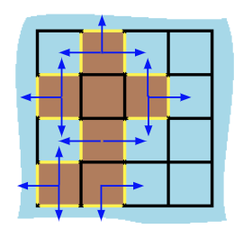

> All diagrams presented herein are original creations, meticulously designed to enhance comprehension and recall. Crafting these aids required considerable effort, and I kindly request attribution if this content is reused elsewhere.
{: .prompt-danger }

> **Difficulty** :  Easy
{: .prompt-tip }

> DFS
{: .prompt-info }

## Problem

You are given `row x col` `grid` representing a map where `grid[i][j] = 1` represents land and `grid[i][j] = 0` represents water. Grid cells are connected **horizontally/vertically** (not diagonally). The `grid` is completely surrounded by water, and there is exactly one island (i.e., one or more connected land cells).

The island doesn't have "lakes", meaning the water inside isn't connected to the water around the island. One cell is a square with side length 1. The grid is rectangular, width and height don't exceed 100. Determine the perimeter of the island.

**Example 1:**


```
Input: grid = [[0,1,0,0],
              [1,1,1,0],
              [0,1,0,0],
              [1,1,0,0]]
Output: 16
Explanation: The perimeter is the 16 yellow 
stripes in the image above.
```

**Example 2:**

```
Input: grid = [[1]]
Output: 4
```

**Example 3:**

```
Input: grid = [[1,0]]
Output: 4
```

## Solution

Even though this is an easy problem, there is a cleaver trick that needs to be applied to solve this problem in an easier way. 

**How to detect the perimeter ?**

You can think of various ways of calculating the parameter. One way is to find if water or wall exists in any side of the current cell and keep adding it. However there is a much better way, all we need to do it if we end up in a cell which is water or face a wall then just `1`to our perimeter. Here is the diagram to refer. (Return `1` whenever the blue arrow conditions are met `r < 0 or c < 0 or r == ROWS or c == COLS or grid[r][c]==0`) 



This way a simple traversing using `dfs()` or `bfs()` should be enough to solve the problem. Let's look at the `dfs()` function. Below is the pretty much the main code to calculate the perimeter. 

```python
#def dfs(r,c)
# This is the main condition
if r < 0 or c < 0 or r == ROWS or c == COLS or grid[r][c]==0:
	return 1 
```

We need to validate against the `visited` set and return `0`.

```python
if (r,c) in visited:
  # Does not add to peremeter if already visited.
  return 0 
```

Add to the `visited` set and search in each neighbor cells.

```python
visited.add((r,c))
return dfs(r-1,c)+dfs(r+1,c)+dfs(r,c-1)+dfs(r,c+1)
```

Now, find one cell thats part of the island and return the `dfs()` function.

```python
for r in range(ROWS):
  for c in range(COLS):
    if grid[r][c]==1:
      return dfs(r,c)
```

## Final Code

Here is the full code.

```python
def island_perimeter(grid):
    ROWS, COLS = len(grid), len(grid[0])
    visited = set()

    def dfs(r, c):
        if (r, c) in visited:
            return 0

        if r < 0 or c < 0 or r == ROWS or c == COLS or grid[r][c] == 0:
            return 1

        visited.add((r, c))

        return dfs(r-1, c)+dfs(r+1, c)+dfs(r, c-1)+dfs(r, c+1)

    for r in range(ROWS):
        for c in range(COLS):
            if grid[r][c] == 1:
                return dfs(r, c)
```


