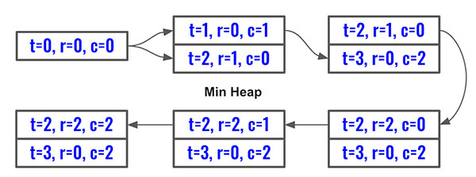

> All diagrams presented herein are original creations, meticulously designed to enhance comprehension and recall. Crafting these aids required considerable effort, and I kindly request attribution if this content is reused elsewhere.
{: .prompt-danger }

> **Difficulty** :  Easy
{: .prompt-tip }

> Dijkstra’s Algorithm
{: .prompt-info }

## Problem

You are given an `n x n` integer matrix `grid` where each value `grid[i][j]` represents the elevation at that point `(i, j)`.

The rain starts to fall. At time `t`, the depth of the water everywhere is `t`. You can swim from a square to another 4-directionally adjacent square if and only if the elevation of both squares individually are at most `t`. You can swim infinite distances in zero time. Of course, you must stay within the boundaries of the grid during your swim. Return *the least time until you can reach the bottom right square* `(n - 1, n - 1)` *if you start at the top left square* `(0, 0)`.

**Example 1:**


```
Input: grid = [[0,2],[1,3]]
Output: 3
Explanation:
At time 0, you are in grid location (0, 0).
You cannot go anywhere else because 4-directionally adjacent neighbors have a higher elevation than t = 0.
You cannot reach point (1, 1) until time 3.
When the depth of water is 3, we can swim anywhere inside the grid.
```

**Example 2:**


```
Input: grid = [[0,1,2,3,4],[24,23,22,21,5],[12,13,14,15,16],[11,17,18,19,20],[10,9,8,7,6]]
Output: 16
Explanation: The final route is shown.
We need to wait until time 16 so that (0, 0) and (4, 4) are connected.
```

## Solution

Even though this problem is set as **Hard**, in LeetCode, it.s actually a fairly easy problem to solve. The hardest part is to understand the problem and not really the solution to it. In nutshell, we need find the shortest path from `[0,0]` to `[N-1,N-1]` with lowest max cost. Say we have two paths `[1,1,5,1,1,1]` and `[2,3,2,2,3,2]` the 2nd one is the answer as the max value is `3` than the max value of `5` in the first example.

Whenever we think about shortest path algorithm we first consider Dijkstra’s Algorithm. 

Let's start with a better visualization. Here is a simpler problem to look at. We will be using a `min_heap` to find the shortest path.


So at every node, traverse using BFS and find the max cost then push the node to the `min_heap`. Then we pop the min from the `mean_heap` and traverse its neighbors. If at any point we reach node `[N-1,N-1]` we return the path cost. Below is the flow of the `min_heap` for the example above.



### Main Difference to Dijkstra’s Algorithm

The code is almost exactly same as Dijkstra’s Algorithm. You can refer the explanation of that [here](https://adeveloperdiary.com/algorithm/graph/network-delay-time/) if needed. However there are two places the implementations are different.

- **Cost/Time calculation:** 

  - The calculation of cost/time to reach a node is different. In original Dijkstra’s Algorithm, we are just adding the cost/time for every traversal. 
    - `heapq.heappush(min_heap, (parent_weight+child_weight, child_node))`
  - However here we need to find the `max` cost/time between current node and the neighboring node we are planning to traverse as we can freely travel if the current elevation/cost/time is less than `max` value in the current path.
    - `heapq.heappush(min_heap, (max(parent_cost, child_node_cost),r,c))`

- **Weight/Cost/Time impact on visited**

  There is another major difference between this algorithm implementation and default Dijkstra’s Algorithm's implementation.Let me try to explain.

  - In default Dijkstra’s Algorithm, the weight/cost/time to reach a node is in the edge connecting two nodes. Now a node can be reached using various edges and each can have a different weight/cost/time. So it's important to add the node multiple times (as many times as it has incoming edges) into the `min_heap`. 

  - Here is an example, `3` can be reached from either `2` or `1`. 

    ```mermaid
    flowchart LR
        1-->|1|2
        2-->|2|3
        1-->|4|3
    ```

    

  - However, in the current problem does not matter how an edge can be reached the weight/cost/time is always fixed by its own value. So we shall not try to push the node into the `min_heap` more than once as this will cause the `min_heap` to **overflow and timeout**.

  - For an example, the `4` in the example outlined above, can be reached from 2 of its neighbors. Lets explore this step by step. There are two ways to solve this. 

  - **Option 1:** Add to `visited` set right after (or before) the node is pushed to the `min_heap`.

    

  - **Option 2:** Follow the code structure as Dijkstra’s Algorithm, and skip processing if the node is already visited, however only after popping the node from the `min_heap`. This way the `min_heap` won't grow larger.

So in nutshell, there are two ways to solve this problem however same is not true for the Dijkstra’s Algorithm.

Let's explore **Option 2** first as the code is more similar to Dijkstra’s Algorithm.

Define all the variables needed. 

```python
N=len(grid)
cost_at_start = grid[0][0]
min_heap = [[cost_at_start,0,0]]
directions=[[0,1],[1,0],[-1,0],[0,-1]]

visited=set()
```

Start the `while` loop and pop the node from `min_heap`

```python
while min_heap:
  t, r, c = heapq.heappop(min_heap)
```

In case the last node is reached, return the weight/time/cost.

```python
  if r == N-1 and c == N-1:
    return t
```

If the node is already visited, skip rest of the processing do not traverse its neighbors.

```python
  if (r,c) in visited:
    continue
```

Otherwise, add the node to the `visited`.

```python
  visited.add((r,c))
```

Now, just like in default Dijkstra’s Algorithm push all its neighbors only if it's not out of bound and not `visited`. The other difference as we saw earlier is the max weight based on the node value.

```python
  for dr,dc in directions:
    nei_r= r+dr
    nei_c= c+dc
    if nei_r < 0 or nei_c <0 or nei_r==N or nei_c==N or (nei_r,nei_c) in visited:
      continue
    heapq.heappush(min_heap, (max(t, grid[nei_r][nei_c]),nei_r,nei_c))
```

Let's explore the **Option 1**. All the variable initialization are same as before.

```python
N=len(grid)
cost_at_start = grid[0][0]
min_heap = [[cost_at_start,0,0]]
directions=[[0,1],[1,0],[-1,0],[0,-1]]
visited=set()
```

The only difference is we are going to add the starting node into the `visited` set.

```python
visited.add((0,0))
```

Now remaining part is same as well.

```python
while min_heap:
  t, r, c =heapq.heappop(min_heap)

  if r == N-1 and c == N-1:
    return t
```

We won't have to verify or add the node to the `visited` set as the node will already be inside `visited` set. We can directly add it's neighbors to the `min_heap`. (Same code as Option 2)

```python
  for dr,dc in directions:
    nei_r= r+dr
    nei_c= c+dc
    if nei_r < 0 or nei_c <0 or nei_r==N or nei_c==N or (nei_r,nei_c) in visited:
      continue
    heapq.heappush(min_heap, (max(t, grid[nei_r][nei_c]),nei_r,nei_c))
```

Now, once the node is added to the `min_heap`, add it to `visited` as well.

```python
visited.add((nei_r,nei_c))
```

Here are the two flow charts.


## Final Code

Here is the full code.

### Option 1:

```python
def swin_in_water(grid):
    N = len(grid)
    directions = [[1, 0], [0, 1], [-1, 0], [0, -1]]
    min_heap = [[grid[0][0], 0, 0]]
    visited = set((0, 0))

    while min_heap:
        t, r, c = heapq.heappop(min_heap)

        if r == N-1 and c == N-1:
            return t

        for dr, dc in directions:
            nei_r = r+dr
            nei_c = c+dc
            if nei_r < 0 or nei_c < 0 or nei_r == N or nei_c == N or (nei_r, nei_c) in visited:
                continue
            heapq.heappush(
                min_heap, (max(t, grid[nei_r][nei_c]), nei_r, nei_c))
            visited.add((nei_r, nei_c))
```

**Option 2:**

```python
def swin_in_water(grid):
    N = len(grid)
    directions = [[1, 0], [0, 1], [-1, 0], [0, -1]]
    min_heap = [[grid[0][0], 0, 0]]
    visited = set()
    
    while min_heap:
        t, r, c = heapq.heappop(min_heap)

        if r == N-1 and c == N-1:
            return t
			
      	if (r, c) in visited:
          continue
          
       	visited.add((r,c))
      
        for dr, dc in directions:
            nei_r = r+dr
            nei_c = c+dc
            if nei_r < 0 or nei_c < 0 or nei_r == N or nei_c == N or (nei_r, nei_c) in visited:
                continue
            heapq.heappush(
                min_heap, (max(t, grid[nei_r][nei_c]), nei_r, nei_c))

  
```


