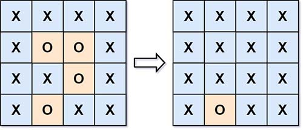

> All diagrams presented herein are original creations, meticulously designed to enhance comprehension and recall. Crafting these aids required considerable effort, and I kindly request attribution if this content is reused elsewhere.
{: .prompt-danger }

> **Difficulty** :  Easy
{: .prompt-tip }

> DFS
{: .prompt-info }

## Problem

Given an `m x n` matrix `board` containing `'X'` and `'O'`, *capture all regions that are 4-directionally surrounded by* `'X'`. A region is **captured** by flipping all `'O'`s into `'X'`s in that surrounded region.

**Example 1:**



```
INF  -1  0  INF
INF INF INF  -1
INF  -1 INF  -1
  0  -1 INF INF
```

## Solution

Whenever there is a question on identifying some elements from a given datasets/data structure its always advisable to look at the problem tangentially. In this specific problem the ask is to "reclaim/capture" islands/areas surrounded by `X`". However the converse is much easier to implement which is to "Keep only the islands/areas which are touching the border" 

- Run `dfs()` on each border element, flag any  islands/areas starting from this with another letter say `N`.
- Change all the `O`s to `X` and `N`'s to `O`.

Start by defining the `ROWS`, `COLS` and `visited`.

```python
ROWS, COLS = len(board), len(board[0])
visited=set()
```

We need to run the `dfs` on every cell/node in the border with value `O`.

```python
for r in range(ROWS):
  for c in range(COLS):
    if board[r][c]=='O' and (r in [0,ROWS-1] or c in [0, COLS-1]):
      dfs(r,c)     
```

Let's implement a simple `dfs` function to change the values of the islands/areas to `N`.

```python
def dfs(r,c):
  
  if r<0 or c<0 or r==ROWS or c==COLS or (r,c) in visited or board[r][c]!='O':
    return
  
  visited.add((r,c))  
  board[r][c]='N'
  
  dfs(r-1,c)
  dfs(r+1,c)
  dfs(r,c-1)
  dfs(r,c+1)
```

Here is the output of the above code:

```
[
	['X', 'X', 'X', 'X'], 
	['X', 'O', 'O', 'X'], 
	['X', 'X', 'O', 'X'], 
	['X', 'N', 'X', 'X']
]
```

The only thing thats left is to update all `O`s to `X` and `N` back to `O`.

```python
for r in range(ROWS):
  for c in range(COLS):
    if board[r][c]=='O':
      board[r][c]='X'
      
    if board[r][c]=='N':
      board[r][c]='O'
```

## Final Code

Here is the full code.

```python
def surrounded_regions(board):
    ROWS, COLS = len(board), len(board[0])
    visited = set()

    def dfs(r, c):

        if r < 0 or c < 0 or r == ROWS or c == COLS or (r, c) in visited or board[r][c] != 'O':
            return

        visited.add((r, c))
        board[r][c] = 'N'

        dfs(r-1, c)
        dfs(r+1, c)
        dfs(r, c-1)
        dfs(r, c+1)

    for r in range(ROWS):
        for c in range(COLS):
            if board[r][c] == 'O' and (r in [0, ROWS-1] or c in [0, COLS-1]):
                dfs(r, c)

    for r in range(ROWS):
        for c in range(COLS):
            if board[r][c] == 'O':
                board[r][c] = 'X'

            if board[r][c] == 'N':
                board[r][c] = 'O'

    return board
```


