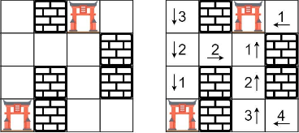
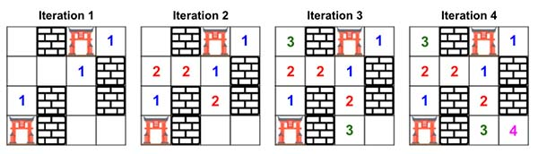

> All diagrams presented herein are original creations, meticulously designed to enhance comprehension and recall. Crafting these aids required considerable effort, and I kindly request attribution if this content is reused elsewhere.
{: .prompt-danger }

> **Difficulty** :  Easy
{: .prompt-tip }

> Multi-Source BFS
{: .prompt-info }

## Problem

You are given a *m x n* 2D grid initialized with these three possible values.

1. `-1` - A wall or an obstacle.
2. `0` - A gate.
3. `INF` - Infinity means an empty room. We use the value `231 - 1 = 2147483647` to represent `INF` as you may assume that the distance to a gate is less than `2147483647`.

Fill each empty room with the distance to its *nearest* gate. If it is impossible to reach a gate, it should be filled with `INF`.

**Example 1:**

Given the 2D grid:

```
INF  -1  0  INF
INF INF INF  -1
INF  -1 INF  -1
  0  -1 INF INF
```

After running your function, the 2D grid should be:

```
  3  -1   0   1
  2   2   1  -1
  1  -1   2  -1
  0  -1   3   4
```

## Solution

Here is a simpler diagram to understand. This is a Multi-Source BFS problem, means initially we are going to have more than one root in the `queue` and run BFS for all of them. 



Start by creating the needed variables.

```python
ROWS, COLS = len(rooms), len(rooms[0])
visited=set()
queue = collections.deque()
directions = [[1,0],[0,1],[0,-1],[-1,0]]
```

Next step would be to identify all the gates and push them to both the `visited` set and the `queue` to start with.

```python
for r in range(ROWS):
  for c in range(COLS):
    if rooms[r][c]==0:
      visited.add((r,c))
      queue.append([r,c])
      
```

We will keep tracking the cost using the `distance` variable. We just need one `distance` as in every iteration we will traverse equal distance from each source. Here is the diagram.



```python
distance=0
```

Process each node in the `queue`, set the current `distance` as the cell value, traverse the neighbors and finally increment the `distance`.

```python
while queue:
  for _ in range(len(queue)):
	  r,c = queue.popleft()
    rooms[r][c] = distance
		for dr,dc in directions:
      nei_r, nei_c = r + dr, c + dc
      if nei_r < 0 or nei_c < 0 or nei_r == ROWS or nei_c == COLS or (nei_r, nei_c) in visited or rooms[nei_r][nei_c] == -1:
        continue
      
      queue.append([nei_r, nei_c])
      visited.add((nei_r, nei_c))
      
  distance+=1
```

## Final Code

Here is the full code.

```python
def walls_and_gate(rooms):
    ROWS, COLS = len(rooms), len(rooms[0])
    visited = set()
    queue = collections.deque()
    directions = [[1, 0], [0, 1], [0, -1], [-1, 0]]
    for r in range(ROWS):
        for c in range(COLS):
            if rooms[r][c] == 0:
                visited.add((r, c))
                queue.append([r, c])

    distance = 0
    while queue:
        for _ in range(len(queue)):
            r, c = queue.popleft()
            rooms[r][c] = distance
            for dr, dc in directions:
                nei_r, nei_c = r + dr, c + dc
                if nei_r < 0 or nei_c < 0 or nei_r == ROWS or nei_c == COLS or (nei_r, nei_c) in visited or rooms[nei_r][nei_c] == -1:
                    continue

                queue.append([nei_r, nei_c])
                visited.add((nei_r, nei_c))

        distance += 1
    return rooms
```

```
[
	[3, -1, 0, 1], 
	[2, 2, 1, -1], 
	[1, -1, 2, -1], 
	[0, -1, 3, 4]
]
```

### Alternative solution

As you might have seen in other graph problem, this can also be solve by adding `visited` after popping the node. For more details please refer [here](https://adeveloperdiary.com/algorithm/graph/swim-in-rising-water/). 

```python
def walls_and_gate(rooms):
    ROWS, COLS = len(rooms), len(rooms[0])
    visited = set()
    queue = collections.deque()
    directions = [[1, 0], [0, 1], [0, -1], [-1, 0]]
    for r in range(ROWS):
        for c in range(COLS):
            if rooms[r][c] == 0:
              	# Removed this
                # visited.add((r, c))
                queue.append([r, c])

    distance = 0
    while queue:
        for _ in range(len(queue)):
            r, c = queue.popleft()
            
            # Added this
            if (r, c) in visited:
                continue
            visited.add((r, c))
            
            
            rooms[r][c] = distance
            
            for dr, dc in directions:
                nei_r, nei_c = r + dr, c + dc
                if nei_r < 0 or nei_c < 0 or nei_r == ROWS or nei_c == COLS or (nei_r, nei_c) in visited or rooms[nei_r][nei_c] == -1:
                    continue

                queue.append([nei_r, nei_c])
                # visited.add((nei_r, nei_c))

        distance += 1
    return rooms
```


