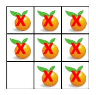

> All diagrams presented herein are original creations, meticulously designed to enhance comprehension and recall. Crafting these aids required considerable effort, and I kindly request attribution if this content is reused elsewhere.
{: .prompt-danger }

> **Difficulty** :  Easy
{: .prompt-tip }

> Multi-Source BFS
{: .prompt-info }

## Problem

You are given an `m x n` `grid` where each cell can have one of three values:

- `0` representing an empty cell,
- `1` representing a fresh orange, or
- `2` representing a rotten orange.

Every minute, any fresh orange that is **4-directionally adjacent** to a rotten orange becomes rotten.

Return *the minimum number of minutes that must elapse until no cell has a fresh orange*. If *this is impossible, return* `-1`.

**Example 1:**


```
Input: grid = [[2,1,1],[1,1,0],[0,1,1]]
Output: 4
```

**Example 2:**

```
Input: grid = [[2,1,1],[0,1,1],[1,0,1]]
Output: -1
Explanation: The orange in the bottom left corner (row 2, column 0) is never rotten, because rotting only happens 4-directionally.
```

**Example 3:**

```
Input: grid = [[0,2]]
Output: 0
Explanation: Since there are already no fresh oranges at minute 0, the answer is just 0.
```

## Solution

This is almost the same problem as [Walls and Gates](https://adeveloperdiary.com/algorithm/graph/walls-and-gates/#google_vignette). The additional logic is hidden in the final part of the problem "If *this is impossible, return* `-1`". This means if there are islands of isolated fresh oranges then they will never be rotten, so in that case we need to return `-1`. This tells us that we need to find count of all available fresh oranges and then whenever an orange becomes rotten, we shall decrement this value. If we see there are no fresh oranges `fresh==0` then we will return the time or return `-1`.

Start by defining all the variables. Following are the same as in [Walls and Gates](https://adeveloperdiary.com/algorithm/graph/walls-and-gates/#google_vignette).

```python
ROWS, COLS = len(grid), len(grid[0])
directions = [[1,0],[0,1],[0,-1],[-1,0]]
visited=set()
queue = collections.deque()
time = 0
```

We need one more variable to keep track of `fresh` oranges.

```python
fresh = 0
```

Now, scan the `grid` and find all the rotten oranges and the `fresh` counts.

```python
for r in range(ROWS):
  for c in range(COLS):
    if grid[r][c] == 2:
      queue.append([r,c])
      visited.add((r,c))
    if grid[r][c] == 1:
      fresh+=1     
```

Now run the `BFS` and keep decrementing `fresh`. The `[r,c]` in line `3` should already be visited and processed. The only thing pending is process its neighbors. From `line 9-12`, we will first add it to the `queue` and `visited`, then decrement `fresh` and set the `grid` value to `2`. Finally for every iteration increment `time`. (Same as in [Walls and Gates](https://adeveloperdiary.com/algorithm/graph/walls-and-gates/#google_vignette))

```python
while queue:
  for _ in range(len(queue)):
    r,c = queue.popleft()
    for dr,dc in directions:
      nei_r, nei_c= r+dr, c+dc
      if nei_r< 0 or nei_c < 0 or nei_r==ROWS or nei_c ==COLS or (nei_r,nei_c) in visited or grid[nei_r][nei_c] in [0,2]:
        continue
      
      queue.append([nei_r,nei_c])
      visited.add((nei_r,nei_c))
      fresh-=1
      grid[nei_r][nei_c]=2
  
  time+=1
```

Finally return `time` if no `fresh` orange left or return `-1`

```python
return time if fresh ==0 else -1
```

All seems to be fine however except for two scenarios. 

- **Issue 1:** In case there are **no** `fresh` oranges in the `grid`, initially the queue will **not** be empty. So the while loop will run and the `time` will be incremented to `1`. In order to fix this we need to make sure `fresh > 0` before starting the `while` loop.

  

  - The code might look like this

    ```python
    if fresh > 0:
      while ...
    ```

- **Issue 2:** There is another scenario, refer the diagram below. Say we are processing the `[1,2]` cell. We find one of its neighbor is not visited and also fresh (`1`), so we add that final `[2,2]` to the queue, set the cell value to `2`, add it to the `visited` set and since this was the last entry in the `queue` while entering the `for` loop, we also increment `time`. 

  

  - This should be the end as `time` was updated accordingly, however since the `queue` still has one value the `while` loop will again execute and update the `time`. This cause `time ` to be always `1` greater than expected value. Here is the print of the `time` and `queue` for every iteration of the `while ` loop. As you can see that extra element in queue incremented `time` by `+1` to `5`. We need to also take care of this.

    ```
    #while queue:
    	#print(time, queue)
    	
    0 deque([(0, 0)])
    1 deque([[1, 0], [0, 1]])
    2 deque([[1, 1], [0, 2]])
    3 deque([[2, 1]])
    4 deque([[2, 2]])
    5
    ```

  - There are many ways to fix this. We can start `time` from `-1` before the `while` loop is started (keeping original initialization as it). This will negate the effect of the extra iteration. This will pass in LeetCode. Mine was "Beats 76.51%of users with Python3". However the code is not getting very clean.

    ```python
    if fresh >0:
      time = -1
      while queue:
    ```

### Fix both the issues at once

We can fix both the issues just by making sure we shall run the `while` loop only if the `fresh > 0` just not one time but for every iteration. This way both the issues will be taken care. 

```python
while queue and fresh > 0:
  ...
```


## Final Code

Here is the full code.

```python
def oranges_rotting(grid):
    ROWS, COLS = len(grid), len(grid[0])
    directions = [[1, 0], [0, 1], [0, -1], [-1, 0]]
    visited = set()
    queue = collections.deque()
    time = 0

    fresh = 0

    for r in range(ROWS):
        for c in range(COLS):
            if grid[r][c] == 2:
                queue.append((r, c))
                visited.add((r, c))
            if grid[r][c] == 1:
                fresh += 1

    while queue and fresh > 0:
        for _ in range(len(queue)):
            r, c = queue.popleft()
            for dr, dc in directions:
                nei_r, nei_c = r+dr, c+dc
                if nei_r < 0 or nei_c < 0 or nei_r == ROWS or nei_c == COLS or (nei_r, nei_c) in visited or grid[nei_r][nei_c] in [0, 2]:
                    continue

                queue.append([nei_r, nei_c])
                visited.add((nei_r, nei_c))
                fresh -= 1
                grid[nei_r][nei_c] = 2

        time += 1

    return -1 if fresh > 0 else time
```


