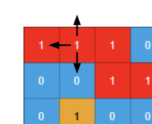
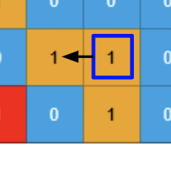

> All diagrams presented herein are original creations, meticulously designed to enhance comprehension and recall. Crafting these aids required considerable effort, and I kindly request attribution if this content is reused elsewhere.
{: .prompt-danger }

> **Difficulty** :  Easy
{: .prompt-tip }

> DFS
{: .prompt-info }

## Problem

You are given two `m x n` binary matrices `grid1` and `grid2` containing only `0`'s (representing water) and `1`'s (representing land). An **island** is a group of `1`'s connected **4-directionally** (horizontal or vertical). Any cells outside of the grid are considered water cells.

An island in `grid2` is considered a **sub-island** if there is an island in `grid1` that contains **all** the cells that make up **this** island in `grid2`. Return the **number of islands** in `grid2` that are considered **sub-islands**.

**Example 1:**


```
Input: grid1 = [[1,1,1,0,0],
		[0,1,1,1,1],
		[0,0,0,0,0],
		[1,0,0,0,0],
		[1,1,0,1,1]], 
grid2 = [[1,1,1,0,0],
	[0,0,1,1,1],
	[0,1,0,0,0],
	[1,0,1,1,0],
	[0,1,0,1,0]]
	
Output: 3
Explanation: In the picture above, 
the grid on the left is grid1 and 
the grid on the right is grid2.
The 1s colored red in grid2 are those considered
to be part of a sub-island. There are three sub-islands.
```

**Example 2:**


```
Input: grid1 = [[1,0,1,0,1],
		[1,1,1,1,1],
		[0,0,0,0,0],
		[1,1,1,1,1],
		[1,0,1,0,1]], 
grid2 = [[0,0,0,0,0],
	[1,1,1,1,1],
	[0,1,0,1,0],
	[0,1,0,1,0],
	[1,0,0,0,1]]
	
Output: 2 
Explanation: In the picture above, the grid on 
the left is grid1 and the grid on the right is grid2.
The 1s colored red in grid2 are those considered 
to be part of a sub-island. There are two sub-islands.
```

## Solution

This is not a difficult problem but there is a small trick that needs to be implemented. Let visit step by step process.

First as usual define the two variables we need for the `dfs()` function.

```python
ROWS, COLS = len(grid2), len(grid2[0])
visited = set()
```

The `dfs()` function will return a `True` or `False` based on if this is truly a sub-island or not.

Now inside the `dfs()` function lets understand the boundary conditions first. We will use the **Example 1**, and focus on the `[0,1]` and assume we are traversing this specific cell. The left `[0,0]` cell  is already visited, so we will check for `(r,c) in visited` which will be `True` and we will not progress any further by returning from this point.

Next, the top cell `[-1,1]` is out of bound so we will not progress any further by returning from this point as well.

Finally, bottom cell `[1,1]` contains `0` (water) so we will not progress any further by returning from this point. 



:fire: The most important thing to notice that none of the above conditions,

1. Previously visited cell
2. Out of bound cell
3. Cell containing Water

invalidates the current progression of finding **sub-islands**.They are all valid scenarios where we shouldn't traverse more, and thats all. So we shall return `True` whenever any one of the three scenarios occurs. 

```python
def dfs(r,c):
	if r < 0 or c < 0 or r == ROWS or c == COLS or (r, c) in visited or grid2[r][c] == 0:
    return True
```

Now we know we have a cell with value `1`, lets first add it to the `visited` set.

```python
visited.add((r,c))
```

:fire: Now there are 5 separate conditions to validate to make sure this is truly a sub-island.

- The current location/cell in `grid1` is also `1`.
- The `dfs()` calls of all 4 surroundings are also either:
  - One of the 3 base conditions and
  - Corresponding cell in `grid1` is also `1`

Here are the all five conditions. All of them needs to be `True` for the sub-island to be valid.

```python
if grid1[r][c] == 0:
  current_cell = False
else:
  current_cell=True
  
bottom=dfs(r+1,c)
top=dfs(r-1,c)
right=dfs(r,c+1)
left=dfs(r,c-1)
```

Now there is one thing in python thats important to know. If there are multiple `and` then python will start executing from left to right, however if it receives `False` then it will stop executing the remaining conditions. 

Consider following `return` statement. If in case `current_cell` is `False` , then the remaining `dfs()` functions will not be executed at all. 

```python
return current_cell and dfs(r+1,c) and dfs(r-1,c) and ...
```

In our case, even one of the above 5 conditions returns `False`, we shall go ahead & add all the cells in the island to the `visited` set.

For an example, in **Example 1**, when we are traversing the cell highlighted below, the matching cell in `grid1` is `0`, so we know its not a valid sub-island. However we still need to add the left of the cell with value `1` to the `visited`  set, so that we don't start the `dfs()` again from that cell.  All 3 cells creates one island so we need to initiate `dfs()` only once.



 :fire:In order to achieve this, we will be invoking `dfs()` 4 times and then only returning the final result like below and not like we did above (`return current_cell and dfs(r+1,c) and dfs(r-1,c) and ...`).

```python
return current_cell and top and bottom and right and left
```

The only thing left is to invoke `dfs()` whenever there is an unvisited island.

```python
islant_counter=0
for r in range(ROWS):
  for c in range(COLS):
    if grid2[r][c]==1 and (r,c) not in visited:
      if dfs(r,c):
        islant_counter+=1
        
return islant_counter
```


## Final Code

Here is the full code.

```python
def count_sub_islands(grid1, grid2):
    ROWS, COLS = len(grid2), len(grid2[0])
    visited = set()

    def dfs(r, c):
        if r < 0 or c < 0 or r == ROWS or c == COLS or (r, c) in visited or grid2[r][c] == 0:
            return True

        visited.add((r, c))

        if grid1[r][c] == 0:
            current_cell = False
        else:
            current_cell = True

        bottom = dfs(r+1, c)
        top = dfs(r-1, c)
        right = dfs(r, c+1)
        left = dfs(r, c-1)

        return current_cell and top and bottom and right and left

    islant_counter = 0
    for r in range(ROWS):
        for c in range(COLS):
            if grid2[r][c] == 1 and (r, c) not in visited:
                if dfs(r, c):
                    islant_counter += 1

    return islant_counter
```


