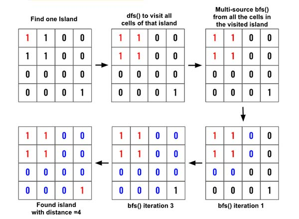

> All diagrams presented herein are original creations, meticulously designed to enhance comprehension and recall. Crafting these aids required considerable effort, and I kindly request attribution if this content is reused elsewhere.
{: .prompt-danger }

> **Difficulty** :  Easy
{: .prompt-tip }

> DFS, BFS
{: .prompt-info }

## Problem

You are given an `n x n` binary matrix `grid` where `1` represents land and `0` represents water. An **island** is a 4-directionally connected group of `1`'s not connected to any other `1`'s. There are **exactly two islands** in `grid`. You may change `0`'s to `1`'s to connect the two islands to form **one island**. Return *the smallest number of* `0`*'s you must flip to connect the two islands*.

**Example 1:**

```
Input: grid = [[0,1],[1,0]]
Output: 1
```

**Example 2:**

```
Input: grid = [[0,1,0],[0,0,0],[0,0,1]]
Output: 2
```

**Example 3:**

```
Input: grid = [[1,1,1,1,1],[1,0,0,0,1],[1,0,1,0,1],[1,0,0,0,1],[1,1,1,1,1]]
Output: 1
```

## Solution

Once you understand the steps it would be very easy solve this problem. Below is the diagram.



Here are the detailed steps:

- Find one island using loop.

  ```python
  for r in range(len(ROWS)):
    for r in range(len(COLS)):
      if grid[r][c]==1:
        ...
  ```

- Now run `dfs()` and add all the nodes of the island to the `visited` set.

  ```python
  for r in range(len(ROWS)):
    for r in range(len(COLS)):
      if grid[r][c]==1:
        dfs(r,c)
  ```

- Now run `bfs()` and use the `visited` set as the starting nodes. Whenever a `1` is found, return the `distance`

  ```python
  for r in range(len(ROWS)):
    for r in range(len(COLS)):
      if grid[r][c]==1:
        dfs(r,c)
        return bfs()
  ```

Now all is left to write the `dfs()` and `bfs()` function.

## Final Code

Here is the full code.

```python

```


