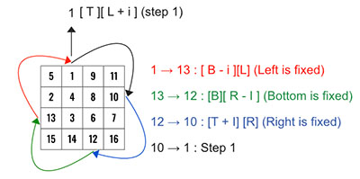

> All diagrams presented herein are original creations, meticulously designed to enhance comprehension and recall. Crafting these aids required considerable effort, and I kindly request attribution if this content is reused elsewhere.
{: .prompt-danger }

> **Difficulty** :  Easy
{: .prompt-tip }

> Divide and Concur, 4 pointers
{: .prompt-info }

## Problem

You are given an `n x n` 2D `matrix` representing an image, rotate the image by **90** degrees (clockwise).

You have to rotate the image [**in-place**](https://en.wikipedia.org/wiki/In-place_algorithm), which means you have to modify the input 2D matrix directly. **DO NOT** allocate another 2D matrix and do the rotation.

**Example 1:**

.jpg)

```
Input: matrix = [[1,2,3],[4,5,6],[7,8,9]]
Output: [[7,4,1],[8,5,2],[9,6,3]]
```

**Example 2:**

.jpg)

```
Input: matrix = [[5,1,9,11],[2,4,8,10],[13,3,6,7],[15,14,12,16]]
Output: [[15,13,2,5],[14,3,4,1],[12,6,8,9],[16,7,10,11]]
```

## Solution

We have to rotate each layers at once and move inward. Refer the fig below, we need to rotate the outer later (in blue) first before rotating the inner layer (red). 


Once thats clear, the next important part is use of 4 pointers **left**, **right**, **top** and **bottom** when trying to rotate the matrix. The exit condition is: whenever `left=>right` we know there is no inner layer to rotate too. Like in the example above, once the red matrix gets rotated, `left` will be `>=`  `right` as after every iteration we will be incrementing `left` and decrementing `right`.

We will start with `left` and `right` pointer. The `top` and `bottom` pointer will be same as `left` and `right`, as we have `n x n` matrix. Here is the structure of the `while` loop and we will keep moving all the pointers. 

```python
left, right = 0, len(matrix)-1
while left < right:
  top, bottom = left,right
  
  # To be implemented
  rotate(left,right,top,bottom)
  
  left+=1
  right-=1
```

For the `rotate()` function, let's visualize the solution first. 

- The bottom-left (`15`) will be assigned to top-left.
- The bottom-right (`16`) will be assigned to bottom-left.
- The top-right (`11`) will be assigned to  bottom-right.
- Finally, the top-left (`5`) will be assigned to top-right.


We need to repeat this `t` times (`t` is one less than the number of row/col in the layer we are rotating) and every time we need to move the pointers. Let's create a loop which can do this automatically. We can find `t` using `left` and `right` as `t = right -left`.

We will be moving `left` forward and `right` backward and the different in them is basically `t`. For the outer layer in the above diagram, `t= (3-0) = 3` and for the inner layer its `t = (2-1) = 1`.

Now let's write the logic of rotating one element. The generic logic will be `top_left_cache = matrix[top][left]`, however we know that `left` needs to move forward once the first element is done. So let's have it incremented by `i`. `i` will run from `0` till `t`. So `left+i`

```python
top_left_cache = matrix[top][left+i]
```

Now, the bottom-left (`15`) will be assigned to top-left. Here `left` is fixed, but `bottom` needs to move upward, means it needs to be decremented by `i`. So `bottom-i`

```python
matrix[top][left+i] = matrix[bottom-i][left]
```

Repeat the same for `matrix[bottom][right]` and ``

```python
matrix[bottom-i][left] = matrix[bottom][right-i]
matrix[bottom][right-i] = matrix[top+i][right]
```

Finally, resign `matrix[top+1][right]` from `top_left_cache`

```python
matrix[top+i][right] = top_left_cache
```

We can have all these into one function named `rotate_one_element`

```python
def rotate_one_element(left,right,top,bottom,i):
  top_left_cache = matrix[top][left+i]
  
  matrix[top][left+i] = matrix[bottom-i][left]
  matrix[bottom-i][left] = matrix[bottom][right-i]
	matrix[bottom][right-i] = matrix[top+i][right]
  matrix[top+i][right] = top_left_cache
```

Here is another visualization for the 2nd element.



Add a `for` loop inside `rotate()` which will call `rotate_one_element()`.

```python
def rotate(left,right,top,bottom):
  for i in range(right-left):
    rotate_one_element(left,right,top,bottom,i)
```

## Final Code

Here is the full code.

```python
def rotate_image(matrix):
  def rotate_one_element(left,right,top,bottom,i):
    top_left_cache = matrix[top][left+i]

    matrix[top][left+i] = matrix[bottom-i][left]
    matrix[bottom-i][left] = matrix[bottom][right-i]
    matrix[bottom][right-i] = matrix[top+i][right]
    matrix[top+i][right] = top_left_cache

  def rotate(left,right,top,bottom):
    for i in range(right-left):
      rotate_one_element(left,right,top,bottom,i)
    
  left, right = 0, len(matrix)-1
  
  while left < right:
    top, bottom = left,right

    rotate(left,right,top,bottom)

    left+=1
    right-=1
```


