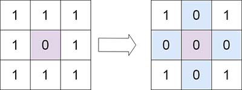
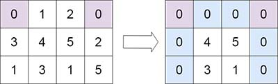
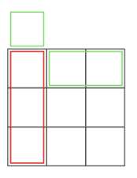
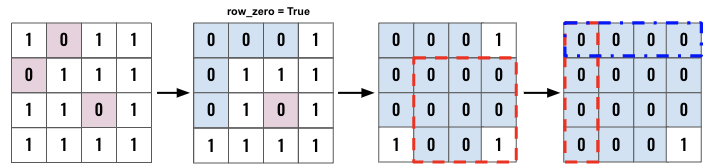

> All diagrams presented herein are original creations, meticulously designed to enhance comprehension and recall. Crafting these aids required considerable effort, and I kindly request attribution if this content is reused elsewhere.
{: .prompt-danger }

> **Difficulty** :  Easy
{: .prompt-tip }

> Use **existing row/col** for tracking
{: .prompt-info }

## Problem

Given an `m x n` integer matrix `matrix`, if an element is `0`, set its entire row and column to `0`'s.

You must do it [in place](https://en.wikipedia.org/wiki/In-place_algorithm).

**Example 1:**



```
Input: matrix = [[1,1,1],[1,0,1],[1,1,1]]
Output: [[1,0,1],[0,0,0],[1,0,1]]
```

**Example 2:**



```
Input: matrix = [[0,1,2,0],[3,4,5,2],[1,3,1,5]]
Output: [[0,0,0,0],[0,4,5,0],[0,3,1,0]]
```

## Solution

The only added complexity comes from the requirement that this needs to be done **in place** without using any additional memory. We can use the first row and col as temporary storage space and loop through `m x n` matrix. Here are the high level steps:



- In order to achieve TC: **O(m x n)** and SC: **O(1)** use the first row and column to track which column and row needs to be set to zero.
- Need an extra space for the first element of either row or column since the (0,0) index has the overlapping element.
- Otherwise, this problem can easily be solved 


Start by defining the required variables. Since the space `[0,0]` will be needed by both row and col, we will create a new variable named `row_zero` just to keep track of `row 0` and use `matrix[0][0]` for the col. (Please refer the pic above)

```python
ROWS, COLS = len(matrix), len(matrix[0])
row_zero = False
```

Now the first step is to go through all the rows and cols and set the first row/col to zero accordingly. If the current cell is `0` then set the corresponding first col to `0`. In case of row, verify if its the first row, in case it is, set the `row_zero` to `True`. Otherwise set the corresponding first row to `0`.

```python
for r in range(ROWS):
  for c in range(COLS):
    if matrix[r][c]==0:
      matrix[r][0]=0
      if r==0:
        row_zero=True
      else:
        matrix[0][c]=0
```

Let's visualize an example before moving forward. Leftmost grid is the input `matrix`. The double loop we just now executed is depicted in the 2nd grid below. 



We know which of the rows and cols to set as zeros. We shouldn't change the first row and col as that will make the entire matrix zero. So lets update everything else. (Highlighted in red in the 3rd grid)

```python
for r in range(1,ROWS):
  for c in range(1,COLS):
    if matrix[0][c]==0 and matrix[r][0]==0:
      matrix[r][c]=0	
```

Now, set zones in the first col if needed. (Fig - 4th grid, highlighted in red)

```python
if matrix[0][0] ==0:
  for r in range(ROWS):
    matrxi[r][0]=0
```

Same for the row, however use the `row_zero` flag instead.  (Fig - 4th grid, highlighted in blue)

```python
if row_zero:
  for c in range(COLS):
    matrxi[0][c]=0
```

## Final Code

Here is the full code.

```python
def set_zeroes(matrix):
    ROWS, COLS = len(matrix), len(matrix[0])
    row_zero = False

    for r in range(ROWS):
        for c in range(COLS):
            if matrix[r][c] == 0:
                matrix[0][c] = 0
                if r == 0:
                    row_zero = True
                else:
                    matrix[r][0] = 0

    for r in range(1, ROWS):
        for c in range(1, COLS):
            if matrix[0][c] == 0 or matrix[r][0] == 0:
                matrix[r][c] = 0

    if matrix[0][0] == 0:
        for r in range(ROWS):
            matrix[r][0] = 0

    if row_zero:
        for c in range(COLS):
            matrix[0][c] = 0
```


