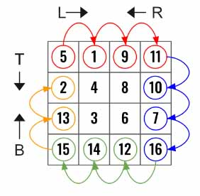
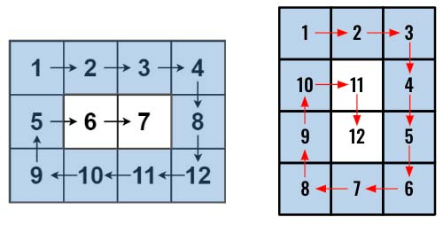

> All diagrams presented herein are original creations, meticulously designed to enhance comprehension and recall. Crafting these aids required considerable effort, and I kindly request attribution if this content is reused elsewhere.
{: .prompt-danger }

> **Difficulty** :  Easy
{: .prompt-tip }

> Divide and Concur, 4 pointers
{: .prompt-info }

## Problem

Given an `m x n` `matrix`, return *all elements of the* `matrix` *in spiral order*.

**Example 1:**


```
Input: matrix = [[1,2,3],[4,5,6],[7,8,9]]
Output: [1,2,3,6,9,8,7,4,5]
```

**Example 2:**


```
Input: matrix = [[1,2,3,4],[5,6,7,8],[9,10,11,12]]
Output: [1,2,3,4,8,12,11,10,9,5,6,7]
```

## Solution

Just like the previous problem ([Rotate Image](https://adeveloperdiary.com/algorithm/matrices/rotate-image/)), we need to solve this for one layer. This problem is also very similar. The [Rotate Image](https://adeveloperdiary.com/algorithm/matrices/rotate-image/) problem can be technically solved using 2 pointers as `top` and `bottom` values will always be same as `left` and `right`. However, that is not the case here as we have `m x n` matrix (not `n x n`).

1.	Use **4 pointers** (L, R, T, B). 
2.	Once top row is completed update T → T+1
3.	Once right col is completed update R→ R -1
4.	Once bottom row is completed update B→ B -1
5.	Once left col is completed update L→ L -1
6.	Exit conditions are when `L==R or T==B`



As the figure shows, we need to move the 4 pointers until we have completed flatten out one layer. Repeat the same unless the pointers cross over.

Start by defining the pointers.

```python
ROWS, COLS = len(matrix), len(matrix[0])

left, right = 0, COLS
top, bottom = 0 , ROWS

flatten_array=[]
```

Let's skip the loop part and find out how to unwrap one layer first. Need to move the `left` pointer till it reaches the `right` pointer. Since the `left` to `right` was for the `top` row, we will increment `top` by `1` as well.

```python
for i in range(left,right):
  flatten_array.append(matrix[top][i])
top+=1
```

Now the right column (blue arrows). Since `top` is already incremented by `1`, we will only capture from 2nd row, which is what we want as well. Also decrement the `right` pointer.

```python
for i in range(top,bottom):
  flatten_array.append(matrix[i][right-1])
right-=1
```

Similarly, for the last row (Green Arrow), the `range()` function needs to be in reverse way.

```python
for i in range(right-1,left-1,-1):
  flatten_array.append(matrix[bottom-1][i])
bottom-=1
  
```

Finally, for the left col.

```python
for i in range(bottom-1,top-1,-1):
  flatten_array.append(matrix[i][left])
left+=1
```

Now here is the `while` loop, very similar to the previous problem.

```python 
while left < right and top < bottom:
  ...
```

The above code is going to work fine for input matrix where there is no one dimensional sub matrix that we need to flatten out. However for scenarios as given below, if there are sub-matrix which are one dimensional (`[6,7]` or `[11,12]`), the above code is not going to work. 

The reason is, `left->right` will add `6,7` into the `flatten_array`, which is fine and expected. Then `top->bottom` loop won't be executed as by now we already have incremented `top` by `1`. So both `top` and `bottom` will have the same value. 

However, `right->left` loop will be executed as `right` was decremented by `1` however `left` was not incremented. Since this is 1D matrix (vector) now `right->left` will add same number into the `flatten_array` which is wrong.

In case of the 2nd example, the `right->left` would be fine as they will have the same value. However, the `bottom->top ` will still be executed, which will add extra element in the `flatten_array`.



In order to overcome this issue, we need to find out if `left==right` (for 1D row, like in the left example) `or` `top==bottom` after `left->right` and `top-bottom`. If so then break the `while` loop as at this point we are done adding all the elements into the `flatten_array`.

```python
if left==right or top==bottom:
  break
```

## Final Code

Here is the full code.

```python
def spiral_order(matrix):
    ROWS, COLS = len(matrix), len(matrix[0])

    left, right = 0, COLS
    top, bottom = 0 , ROWS

    flatten_array=[]
    
    while left < right and top < bottom:
        for i in range(left,right):
            flatten_array.append(matrix[top][i])
        top+=1
        
        for i in range(top,bottom):
            flatten_array.append(matrix[i][right-1])
        right-=1
        
        if left==right or top==bottom:
            break

        for i in range(right-1,left-1,-1):
            flatten_array.append(matrix[bottom-1][i])
        bottom-=1
        
        for i in range(bottom-1,top-1,-1):
            flatten_array.append(matrix[i][left])
        left+=1
            
    return flatten_array
```


