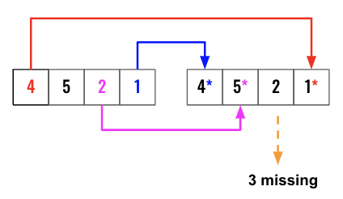
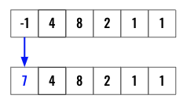
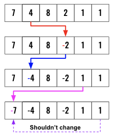

> All diagrams presented herein are original creations, meticulously designed to enhance comprehension and recall. Crafting these aids required considerable effort, and I kindly request attribution if this content is reused elsewhere.
{: .prompt-danger }

> **Difficulty** :  Easy
{: .prompt-tip }

> Cyclic Sort
{: .prompt-info }

## Problem

Given an unsorted integer array `nums`. Return the *smallest positive integer* that is *not present* in `nums`. You must implement an algorithm that runs in `O(n)` time and uses `O(1)` auxiliary space.

**Example 1:**

```
Input: nums = [1,2,0]
Output: 3
Explanation: The numbers in the range [1,2] are all in the array.
```

**Example 2:**

```
Input: nums = [3,4,-1,1]
Output: 2
Explanation: 1 is in the array but 2 is missing.
```

**Example 3:**

```
Input: nums = [7,8,9,11,12]
Output: 1
Explanation: The smallest positive integer 1 is missing.
```

## Solution

In order to solve this problem using `O(1)` space complexity and `O(n)` time complexity, we need to use the input `nums` array to store the information needed. This is a general pattern for many of the problem when asked to solve using `O(1)` space complexity and `O(n)` time complexity.

:fire: The number we are looking for always either will be in the range of `1 -> len(N)` or `len(N)+1`. It will not be a negative number. This is the single most important information we need to solve the problem. 

> Also remember, its not about knowing how to solve it & then just implement it. It's all about how to train our brain to solve previously unseen similar problem. 
{: .prompt-tip }

**Is there a way to scan the `nums` array once and then find if a specific number present or not?**

This way total time complexity is `O(n)+O(n)= O(2n)= O(n)`

```python
scan(nums) # O(n)
find(1) # O(1)
find(2) # O(1)
...
find(n) #O(1)
```

In order to solve this, we need to find a way to preserve the current value plus also have some sort of flag to indicate if the number corresponding to the index value of that location is present or not. 

Imagine as we scan the array, if we could put an `*` in the `index` location of the current number, that `*` can indicate presence or absence of a number. Here is an example, the first element in the below figure is `4`, now add an `*` along with the current number at the `index` location `4`. So we change `1` (don't really care about the value), to `1*`. This way when we query to find if `4` present in the `nums` array we can just check `if * exists in nums(4) `. In this case it does. 



Once the `*` are all added, we can loop from `1 -> len(nums)` find if the location does not have an `*`, since that will be the smallest missing number. If the question is about largest number, we can loop backward to find it. Here is the pseudo code below. In the above example, the `nums[3]` does not have an `*`, so thats the missing number. 

> So far we have assumed that our array is `1` indexed, but in reality they are `0` indexed, we need to consider that when we implement.

```python
for index range(len(nums)):
  if * not in nums[index]:
    return index
```

You should be able to build the implementation from this point forward. However if you are still looking for answers, here is the detail implementation.

We need to consider few cases. First of all, adding `*` will increase the space requirement for the problem. It will also change the data type to `str` from `int`. What we can do is, instead of using `*`  we will use the negative sign `-` as our flag to indicate if that index position is in the array. `-` does not also change the datatype. 

However, in order to make this work, we need to perform additional preprocessing. Let's understand them step by step.

Based on the problem statement, the `nums` array can have negative values. So we won't be able to differentiate them using a `-` sign. 

At this point it's important to understand the boundaries. The only values that we will be looking for is from `1 ->len(nums)`. Any value `<1` or `>len(nums)` are not useful and can used as needed.

So what we can do is, update all the negative values to a larger number than the length of the `nums` array. 

```python
for index in range(len(nums)):
  if nums[index] < 1:
    nums[index]=len(nums)+1
```

Here an example.



Now we can scan the `nums` array and change the sign the index position of each element as long as they are within the boundary (`1 ->len(nums)`).

- Get the absolute value of each element.
- If the value is less than `len(nums)` and we also need to make sure the value is not a negative number. In case of duplicate values (like shown above), the `value` in the `index` location might already be negative, we shouldn't change it to a positive value. So we also check for `nums[value-1]>0` where `value-1` is the `index` location.
- Once both are satisfied, we change the sign of the value at `index` position of `value`

```python
for index in range(len(nums)):                                             
  value=abs(nums[index])               
  if value <= len(nums) and nums[value-1]>0:                                
    nums[value-1]*= -1            
```



Now, just loop through and find the first not negative value, return `index+1`. Here, `3` will be returned.

```python
for index in range(len(nums)):
  if nums[index] > 0:
    return index + 1
```

It could happen that there are no missing value. In that case, return `len(nums)+1`

```python
return len(nums)+1
```

## Final Code

Here is the full code.

```python
def first_missing_positive(nums):
    for index in range(len(nums)):
        if nums[index] < 1:
            nums[index] = len(nums)+1

    for index in range(len(nums)):
        value = abs(nums[index])
        if value <= len(nums) and nums[value-1] > 0:
            nums[value-1] *= -1

    for index in range(len(nums)):
        if nums[index] > 0:
            return index+1

    return len(nums)+1
```


