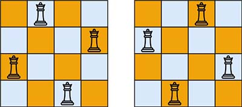
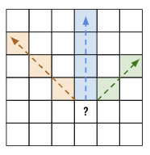
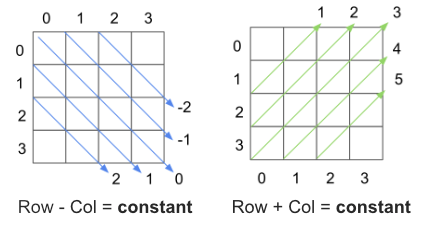

> All diagrams presented herein are original creations, meticulously designed to enhance comprehension and recall. Crafting these aids required considerable effort, and I kindly request attribution if this content is reused elsewhere.
{: .prompt-danger }

> **Difficulty** :  Easy
{: .prompt-tip }

> DFS, Backtracking, 3 visited sets
{: .prompt-info }

## Problem

The **n-queens** puzzle is the problem of placing `n` queens on an `n x n` chessboard such that no two queens attack each other.

Given an integer `n`, return *all distinct solutions to the **n-queens puzzle***. You may return the answer in **any order**. Each solution contains a distinct board configuration of the n-queens' placement, where `'Q'` and `'.'` both indicate a queen and an empty space, respectively.

**Example 1:**



```
Input: n = 4
Output: [[".Q..","...Q","Q...","..Q."],["..Q.","Q...","...Q",".Q.."]]
Explanation: There exist two distinct solutions to the 4-queens puzzle as shown above
```

**Example 2:**

```
Input: n = 1
Output: [["Q"]]
```

## Solution

This is a classic backtracking algorithm. Even though in LeetCode it's **Hard** problem, you need to understand and practice this such a way that it becomes a simple problem to solve. 

At a high level, we have to go through every row and col and find out if we can place a **Queen** there. We are going to use backtracking algorithm as not all path will lead to the solution. Also understand there are multiple solutions and we need to find all.

As you know the **Queen** in the **Chess** game one of the most powerful unit as the queen can move in all direction including diagonal. Now in every iteration we can find if there are existing Queen in the same col and two diagonals.

Refer the figure below, in order to place a queen we need to make sure there is no queen in the same col or diagonally.



Two questions arises from here:

- Why not find in `row` as well? Why just col and two diagonals.

  - We are going to process each row one by one, so we can be sure that in the current row there are no queen. Hence no need to keep track of `row`

- Identifying if a queen exists in the same `col` is a very simple comparison, however, how to find the same for all diagonals as both the row and col value will be different for each diagonals.

  - There is a trick we will be using. I feel due to this trick the question was flagged as **Hard** in LeetCode. 

  - There is a concept of **negative constant** and **positive constant**. Let's look at the diagram below.

    

  - As you notice, `row-col` and `row+col` stays constant diagonally. We can use to track if there is any queen diagonally.


Remaining of the problem is very simple. Let's start the step by step process.

Create three sets for storing `col_tracker`, `positive_constant` and `negative_constant`. Create an `output_boards` array for storing all the solutions. There will be more than one solution, hence we need an array. Consider these are 3 `visited` sets.

```python
col_tracker, positive_constant , negative_constant = set(), set(), set()

output_boards=[]
```

Next part is creating an empty board with all dots `.`. We will be creating a 2D Array as we need to track `col_tracker`, `positive_constant` and `negative_constant`. Before adding the solution to `output_boards` we will transform it to array of strings.

```
[
	['.', '.', '.', '.'], 
	['.', '.', '.', '.'], 
	['.', '.', '.', '.'], 
	['.', '.', '.', '.']
]
```

```python
board = [["."]*n for i in range(n)]
```

The backtracking algorithm takes the row number to process. We will use a basic `dfs()` for backtracking.

```python
def dfs(row):
  ...
  
```

As in all the `dfs()` function we need to define the base condition. Here once the `row_number` reaches `n` (passed the last row `n-1`) we know that we were able to place all our queens. So we can add the result to `output_boards` and return. We convert the 2D array to 1D array with strings and append that to the `output_boards`

```python
def dfs(row):
  if row == n:
    output_boards.append(["".join(r) for r in board])
    return
```

So if we have not processed all the rows yet, we need to try to place a Queen in the current now. Now it's the time to loop through each column in the current row to identify in which `col` a queen can be places. If no queen can be placed we just return.

```python
for col in range(n):
  ...
```

Inside the loop, we fist need to find if the current `col` is eligible to have a queen by looking into `col`, `positive_constant` and `negative_constant` sets. If not then just `continue` and pick the next `col`.

```python
for col in range(n):
  if col in col_tracker or (row+col) in positive_constant or (row-col) in negative_constant:
    continue
```

Once we past the above step we know a queen can be placed in current `col`.  So let's track all three of them.

```python
  col_tracker.add(col)
  positive_constant.add(row+col)
  negative_constant.add(row-col)  
  
  board[row][col]="Q"
```

Now we can call the `dfs(row)` function again to process the next `row`

```python
  dfs(row+1)
```

Now, the backtracking part, we need to reset all the visited sets and the board so that another combination can be found.

```python
  board[row][col]="."
	
  negative_constant.remove(row-col)  
  positive_constant.remove(row+col)
  col_tracker.remove(col) 
```

At this point we are pretty much done. Call the `dfs()` function by passing `row=0` and return `output_boards`.

```python
dfs(0)
return output_boards
```

## Final Code

Here is the full code.

```python
def n_queen(n):
    col_tracker, negative_constant, positive_constant = set(), set(), set()
    output_boards = []
    board = [["."]*n for i in range(n)]

    def dfs(row):
        if row == n:
            output_boards.append(["".join(r) for r in board])
            return

        for col in range(n):
            if col in col_tracker or (row+col) in positive_constant or (row-col) in negative_constant:
                continue

            col_tracker.add(col)
            positive_constant.add(row+col)
            negative_constant.add(row-col)

            board[row][col] = "Q"

            dfs(row+1)

            board[row][col] = "."

            negative_constant.remove(row-col)
            positive_constant.remove(row+col)
            col_tracker.remove(col)

    dfs(0)
    return output_boards
```


