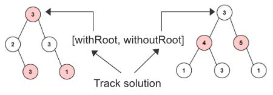
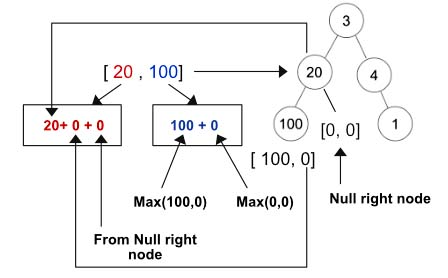
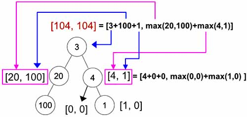

> All diagrams presented herein are original creations, meticulously designed to enhance comprehension and recall. Crafting these aids required considerable effort, and I kindly request attribution if this content is reused elsewhere.
{: .prompt-danger }

> **Difficulty** :  Easy
{: .prompt-tip }

> Post Order DFS
{: .prompt-info }

## Problem

The thief has found himself a new place for his thievery again. There is only one entrance to this area, called `root`.

Besides the `root`, each house has one and only one parent house. After a tour, the smart thief realized that all houses in this place form a binary tree. It will automatically contact the police if **two directly-linked houses were broken into on the same night**.

Given the `root` of the binary tree, return *the maximum amount of money the thief can rob **without alerting the police***.

**Example 1:**


```
Input: root = [3,2,3,null,3,null,1]
Output: 7
Explanation: Maximum amount of money the thief can rob = 3 + 3 + 1 = 7.
```

**Example 2:**


```
Input: root = [3,4,5,1,3,null,1]
Output: 9
Explanation: Maximum amount of money the thief can rob = 4 + 5 = 9.
```

## Solution

This is one of my favorite problem. Notice the two example given above. The first example uses the root for the best solution and the 2nd one does not use the root for the best solution.



We will be doing the same, always track two solutions for each node. 

- Return two solution for each node [**`withRoot`**, **`withoutRoot`**]
- For every node, perform **post-order DFS** and find `[withRoot, withoutRoot]`.
- **`withRoot`** = **Current Node Val + Left Child withoutRoot + Right Child withoutRoot**
- **`withoutRoot`** = **max(Left Child) + max(Right Child)**
- Leaf node will have `[0,0]` values.

Finally we will return the `max([withRoot,withoutRoot])`

Let's go through an example first. In the below graph,

- The node `100` will return `[100,0]`. 
- The node `20`'s `withRoot` value is `20+0+0= 20` and `withoutRoot` value is `max(100,0)+max(0,0)=100`. It's going to return `[20, 100]`



- The node `4` at the right will have `withRoot` as `4+0+0=4` and `withoutRoot` as `max(0,0)+max(1,0)= 1`. Its going to return `[4,1]`
- Now for the root node, its `withRoot` value is `3+100+1=104` (Blue Arrow) and its `withoutRoot` value is `max(20,100)+max(4,1)=104`
- So finally we return any one of the value as both are same.



Let's start with the `dfs()` function. The base/terminating condition is for the leaf nodes. They will have  `[withRoot, withoutRoot]` as `[0,0]`

```python
def dfs(root):
  if not root:
    return [0,0]  
```

Now perform traversals in the `left` and `right` nodes.

```python
  left_node_val = dfs(root.left)
  right_node_val = dfs(root.right)
```

Calculate the  `[withRoot, withoutRoot]`  values for the `root` node and return.

```python
  with_root = root.val+left_node_val[1]+right_node_val[1]
  without_root = max(left_node_val)+max(right_node_val)

  return [with_root,without_root]
```

Now return the `max(dfs(root))`

## Final Code

Here is the full code.

```python
def house_robber_iii(root):
    def dfs(root):
        if not root:
            return [0, 0]

        left_node_val = dfs(root.left)
        right_node_val = dfs(root.right)

        with_root = root.val+left_node_val[1]+right_node_val[1]
        without_root = max(left_node_val)+max(right_node_val)

        return [with_root, without_root]

    return max(dfs(root))
```


