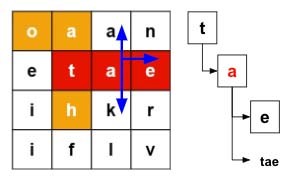

> All diagrams presented herein are original creations, meticulously designed to enhance comprehension and recall. Crafting these aids required considerable effort, and I kindly request attribution if this content is reused elsewhere.
{: .prompt-danger }

> **Difficulty** :  Easy
{: .prompt-tip }

> DFS, Backtracking, Tries
{: .prompt-info }

## Problem

Given an `m x n` `board` of characters and a list of strings `words`, return *all words on the board*.

Each word must be constructed from letters of sequentially adjacent cells, where **adjacent cells** are horizontally or vertically neighboring. The same letter cell may not be used more than once in a word.

**Example 1:**


```
Input: board = [["o","a","a","n"],["e","t","a","e"],["i","h","k","r"],["i","f","l","v"]], words = ["oath","pea","eat","rain"]
Output: ["eat","oath"]
```

**Example 2:**


```
Input: board = [["a","b"],["c","d"]], words = ["abcb"]
Output: []
```

## Solution

This is almost similar as [Word Search](https://adeveloperdiary.com/algorithm/matrices/word-search), however need to search multiple words. Whenever there is a requirement for multiple word search, Tries will be the first algorithm to approach for. 

The idea here is a bit different than the last problem. In the last problem we were keeping track of the `index` which would tell us if we shall traverse more or a word has already been found. 

However, here multiple words can start from the same cell and we need to find all of them. So we can't use the `index`. Here, we can focus on the current char in the board at location `[row][col]` and the word it makes by appending it to the existing char-sequence so far traversed. This tell us that we need to pass the `current_word` instead of the `index` as one of the argument to the `dfs()` function.

We will also traverse the Trie simultaneously using the char present in `[row][col]` . Now, once we know the updated `current_word` we can see if that word exists in the Trie. If it does then we can add it to the `output`. 

At this point even if we have found one word, does not mean we can return as there might be other words using the same sequence of char as prefix. So we keep traversing in all four direction by pass the current Trie `node` and `current_word`.



So if a word starts somewhere in-between, we won't be looking for it just yet. When we start from that cell we will look for that word. For an example, even if `[1][1]` has a new starting word `tae`, we won't be looking for `tae` unless we start our `dfs(1,1)` from that cell.

Let's start coding and see how all this aligns. 

Here is the code for the **Tries**. I am not going to detail, by now you should be knowing enough about Tries to understand the code below.

```python
class TrieNode:
  def __init__(self):
    self.children={}
    self.is_word = False

  def add(self,word):
    node = self
    for char in word:
      if char not in node.children:
        node.children[char]=TrieNode()
      node = node.children[char]
    node.is_word=True
```

Now the very first step is to add all the `words` into the Trie.

```python
root = TrieNode()
for word in words:
  root.add(word)
```

In the previous problem, we returned whenever the `word` was found, however in this problem since the are multiple words to find, we need to add all identified words in an array. So need another additional `output` `set()` to be created. We will use set here as we need to return all unique words and not duplicates.

```python
ROWS, COLS = len(board), len(board[0])
path_visited = set()
output = set()
```

Similar to the last problem, we need to run `dfs()` at every cell of the `board`. We are going to pass the Trie as an additional argument to the `dfs()` function.Initially we will pass the `root`, however as we traverse we will traverse through the Trie nodes as well. We will pass the `current_word` as an empty string as we have not started traversing yet.

```python
for row in range(ROWS):
  for col in range(COLS):
    dfs(row, col, root, '')
```

Now, the main part of the problem is the `dfs()` function. As discussed earlier, the `dfs()` function will take four arguments. Here we are going to focus on the terminating/base condition. 

We are going to use the first two conditions from previous problem, however modify the 3rd. Make sure the cell is

- not outside of the boundary conditions and 
- not visited and 
- the char in the cell is present in the current `TrieNode`.

Otherwise just `return` since this indicates there is no possible solution in this path to explore.

```python
def dfs(row, col, trie_node, current_word):
  if row < 0 or col < 0 or row == ROWS or col == COLS or (row,col) in path_visited or board[row][col] not in trie_node.children:
    return
```

If there are paths forward, lets first add the current location to the `path_visited`.

```python 
  path_visited.add((row,col))
```

We know that the current char in location `[row][col]` exists in the TrieNode. Let's traverse and get that next.

```python
  trie_node = trie_node.children[board[row][col]]
```

Now construct the new word.

```python
  current_word+=board[row][col]
```

Add the `current_word` to `output` is the `is_word` flag is `True` in `TrieNode`.

```python
  if trie_node.is_word:
    output.add(current_word)
```

We can't stop traversing even though we have found one word. Let's recursively call `dfs()` to explore all sides. Pass the new `TrieNode` and updated `current_word`.

```python
  dfs(row+1,col,trie_node,current_word)
  dfs(row-1,col,trie_node,current_word)
  dfs(row,col+1,trie_node,current_word)
  dfs(row,col-1,trie_node,current_word)
```

Once traversing is complete, we need to backtrack to make sure to remove the entry from the `path_visited`

```
   path_visited.remove((row,col))
```

That's all needed for the `dfs()` function. Now just call return the `output` as a list.

```python
return list(output)
```

## Final Code

Here is the full code.

```python
class TrieNode:
    def __init__(self):
        self.children = {}
        self.is_word = False

    def add(self, word):
        node = self
        for char in word:
            if char not in node.children:
                node.children[char] = TrieNode()
            node = node.children[char]
        node.is_word = True


def word_search_ii(board, words):
    root = TrieNode()
    for word in words:
        root.add(word)

    ROWS, COLS = len(board), len(board[0])
    path_visited = set()
    output = set()

    def dfs(row, col, trie_node, current_word):
        if row < 0 or col < 0 or row == ROWS or col == COLS or (row, col) in path_visited or board[row][col] not in trie_node.children:
            return
        path_visited.add((row, col))
        trie_node = trie_node.children[board[row][col]]
        current_word += board[row][col]
        if trie_node.is_word:
            output.add(current_word)

        dfs(row+1, col, trie_node, current_word)
        dfs(row-1, col, trie_node, current_word)
        dfs(row, col+1, trie_node, current_word)
        dfs(row, col-1, trie_node, current_word)

        path_visited.remove((row, col))

    for row in range(ROWS):
        for col in range(COLS):
            dfs(row, col, root, '')

    return list(output)
```


