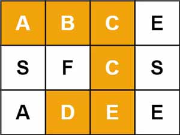
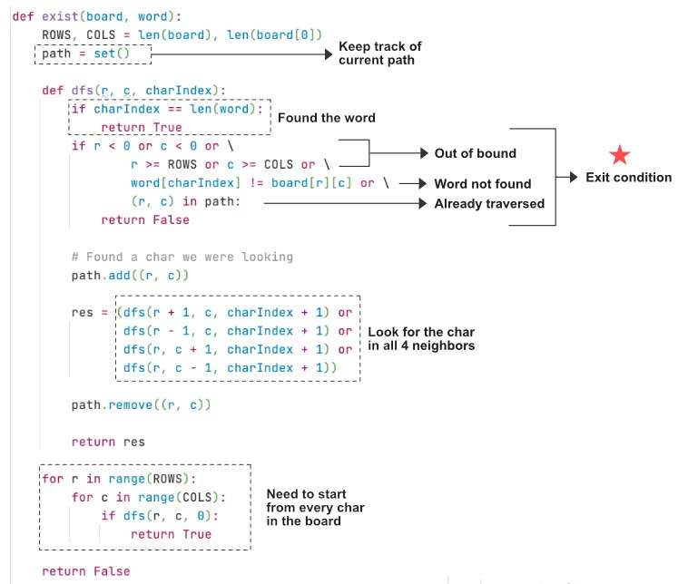

> All diagrams presented herein are original creations, meticulously designed to enhance comprehension and recall. Crafting these aids required considerable effort, and I kindly request attribution if this content is reused elsewhere.
{: .prompt-danger }

> **Difficulty** :  Easy
{: .prompt-tip }

> DFS, Backtracking
{: .prompt-info }

## Problem

Given an `m x n` grid of characters `board` and a string `word`, return `true` *if* `word` *exists in the grid*.

The word can be constructed from letters of sequentially adjacent cells, where adjacent cells are horizontally or vertically neighboring. The same letter cell may not be used more than once.

**Example 1:**



```
Input: board = [["A","B","C","E"],["S","F","C","S"],["A","D","E","E"]], word = "ABCCED"
Output: true
```

**Example 2:**


```
Input: board = [["A","B","C","E"],["S","F","C","S"],["A","D","E","E"]], word = "SEE"
Output: true
```

**Example 3:**


```
Input: board = [["A","B","C","E"],["S","F","C","S"],["A","D","E","E"]], word = "ABCB"
Output: false
```

## Solution

Classic backtracking algorithm where we need to run `dfs()` from every cell of the board. Start by defining the variables.

```python
ROWS, COLS = len(board), len(board[0])
path_visited = set()
```

The `dfs()` will take the `row` , `col` and current `index` in the `word` is searching for. As stated, need to invoke `dfs()` from every cell. If any one of the `dfs()` returns `True` then return `True`, otherwise return `False`.

```python
for row in range(ROWS):
  for col in range(COLS):
    if dfs(row, col, 0):
      return True
return False
```

Now define the `dfs()` function. If the `index` reaches the end of the `word` we have found the `word`. This is our base/terminating condition, so return `True`

```python
def dfs(row, col, char_index):
  if char_index == len(word):
    return True
```

Otherwise, make sure the cell is, 

- not outside of the boundary conditions and 
- not visited and 
- The char at current `index` matches with current char in the cell.

Otherwise return `False` since this indicates its not end of the `word` yet and there is no possible solution in this path to explore.

```python
  if row < 0 or col < 0 or row == ROWS or col == COLS or (row,col) in path_visited or word[char_index]!=board[row][col]:
    return False
```

Add the location to `path_visited` .

```python 
	path_visited.add((row, col))
```

Now run the `dfs()` for all the four directions. We need to return the `True` if any of the `dfs()` returns `True`

```python
found = dfs(row+1,col,char_index+1) or dfs(row-1,col,char_index+1) or dfs(row,col+1,char_index+1) or dfs(row,col-1,char_index+1)
```

Now perform the backtracking and return `found`

```python
path_visited.remove((row, col))
return found
```

If no solution found, return `False`.

Visualize the code below.



## Final Code

Here is the full code.

```python
def word_search(board, word):
    ROWS, COLS = len(board), len(board[0])
    path_visited = set()

    def dfs(row, col, char_index):
        if char_index == len(word):
            return True

        if row < 0 or col < 0 or row == ROWS or col == COLS or (row, col) in path_visited or word[char_index] != board[row][col]:
            return False

        path_visited.add((row, col))

        found = dfs(row+1, col, char_index+1) or dfs(row-1, col, char_index +
                                                     1) or dfs(row, col+1, char_index+1) or dfs(row, col-1, char_index+1)

        path_visited.remove((row, col))
        return found

    for row in range(ROWS):
        for col in range(COLS):
            if dfs(row, col, 0):
                return True

    return False
```


