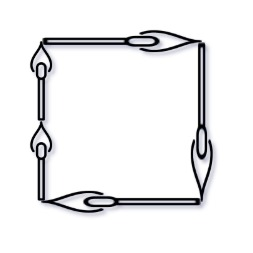
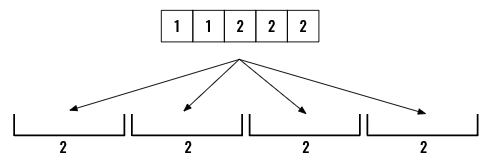
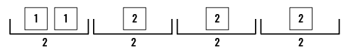
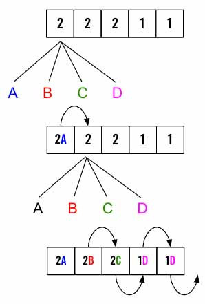

> All diagrams presented herein are original creations, meticulously designed to enhance comprehension and recall. Crafting these aids required considerable effort, and I kindly request attribution if this content is reused elsewhere.
{: .prompt-danger }

> **Difficulty** :  Easy
{: .prompt-tip }

> DFS, Backtracking
{: .prompt-info }

## Problem

You are given an integer array `matchsticks` where `matchsticks[i]` is the length of the `ith` matchstick. You want to use **all the matchsticks** to make one square. You **should not break** any stick, but you can link them up, and each matchstick must be used **exactly one time**.

Return `true` if you can make this square and `false` otherwise.

**Example 1:**



```
Input: matchsticks = [1,1,2,2,2]
Output: true
Explanation: You can form a square with length 2, one side of the square came two sticks with length 1.
```

**Example 2:**

```
Input: matchsticks = [3,3,3,3,4]
Output: false
Explanation: You cannot find a way to form a square with all the matchsticks.
```

## Solution

I will start with explaining the problem using a different storyline. Distribute positive integers from an array `4` buckets such that each bucket has same total number. How do we know how much each buckets can hold, we can simply find that using `sum(array)/4`. In case of the first example, it will be `8/2=4`. If the result is not a whole number then we know this is not possible and return `False` immediately.



:fire: On a contrary, if we can distribute all of them, then we know that we have equally distributed them as we have already validated that these number can be distributed in those `4` buckets. This is very important to understand as this is going to be our terminating condition.



As you already might have guessed it, we have to use backtracking to go through every single paths to find to find the solution. Again as long as we are able to place all of them we know for sure we have a solution.

The `dfs()` function will take `index` the input as we need to traverse through the array and place it in all the buckets to find which one might lead us to a solution. Lets define the terminating condition as well.

> You want to make sure that you have understood the terminating condition as it's not trivial. Since we already know the `sum(nums)/4` is a whole number and not a fraction then placing the final number in a bucket confirms all of the buckets must have values equal to `sum(nums)/4` as we will verify if a number can be placed in a bucket each time we place it. For an example, if a bucket already has a `1`, then we will not be able to place a `2` there (Given the Example 1 above).
{: .prompt-info }

```python
def dfs(index):
  if index == len(nums):
    return True
```

If above is not `True` then we have not yet done placing all the numbers. The next step is try to place the current number at `index` in all `4` buckets. We will start another path [ `dfs()` call by incrementing the index] once we are allowed to place the number [`if bucket[j]+nums[index]<=allowed` ] from here. Let's look at a visualization. 



Every half circle arrow above is a `dfs()` call and when the `index` reaches the end we know that the solution has been found.  

Let's loop through all `4` buckets and try to place the number in them. If we can then, add the number to the bucket and then call the `dfs()` using by incrementing the `index` to traverse the next number in the list.

If anytime the `dfs()` returns `True` (This will happen only if we have processed all the numbers), just return `True`. Otherwise we know that the solution by placing the number into that bucket didn't work out. So. remove it from the bucket (backtrack) and try to place it in the next available bucket.

In case none of them provide any solution return `False`

```python
	# Loop through all 4 buckets
	for j in range(4):
    # Find if the current bucket can have the number
    if buckets[j]+nums[index] <= allowed:
      # Add the number to the current bucket
      buckets[j]+=nums[index]
      # Try the next number and return True if the path leads to success
      if dfs(index+1):
        return True
      # Othersie remove from this bucket and try the next bucket in 
      # next iteration of the loop
      buckets[j]-=nums[index]
  # If nothing works out return False
  return False
```

We have written the most important logics. Now we need to make sure the edge cases are covered. Start by calculating the `allowed` number for each bucket. 

```python
allowed = sum(nums) // 4
```

Then make sure the `sum(nums)` can be equally divided among `4` buckets. This is very important :fire: as our success criteria in the `dfs()` function depends on this.

```python
if sum(nums) /4 != allowed:
  return False
```

Now define `4` empty buckets.

```python
buckets = [0]*4
```

Finally `return dfs(0)`

### Final Trick

The above code technically is fine however will encounter TimeOut Error in LeetCode. One easy fix is to sort the array from large to small number then try the `dfs()` solution. This way the call stack of the `dfs()` function will be much shorter. I will have you explore the reasoning. 

```python
nums.sort(reverse=True)
```

### Not Necessary

You can optimize the code a bit by making sure there is no number larger then `allowed`. This way the `dfs()` won't be executed. I am not going to include this in the full code.

```python
for num in nums:
  if num > allowed:
    return False
```


## Final Code

Here is the full code.

```python
def matchsticks_to_square(nums):
    allowed = sum(nums) // 4

    if sum(nums) / 4 != allowed:
        return False
		
    #for num in nums:
		#  if num > allowed:
    #		return False
    
    buckets = [0]*4
	
    nums.sort(reverse=True)

    def dfs(index):
        if index == len(nums):
            return True
        # Loop through all 4 buckets
        for j in range(4):
            # Find if the current bucket can have the number
            if buckets[j]+nums[index] <= allowed:
                # Add the number to the current bucket
                buckets[j] += nums[index]
                # Try the next number and return True if the path leads to success
                if dfs(index+1):
                    return True
                # Othersie remove from this bucket and try the next bucket in
                # next iteration of the loop
                buckets[j] -= nums[index]
        # If nothing works out return False
        return False
    return dfs(0)
```


