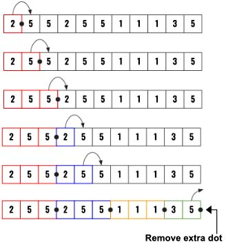
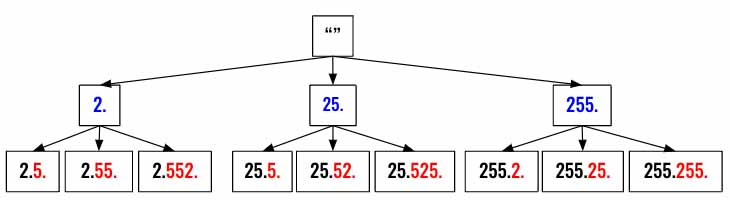
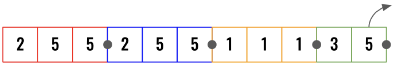

> All diagrams presented herein are original creations, meticulously designed to enhance comprehension and recall. Crafting these aids required considerable effort, and I kindly request attribution if this content is reused elsewhere.
{: .prompt-danger }

> **Difficulty** :  Easy
{: .prompt-tip }

> DFS
{: .prompt-info }

## Problem

A **valid IP address** consists of exactly four integers separated by single dots. Each integer is between `0` and `255` (**inclusive**) and cannot have leading zeros.

- For example, `"0.1.2.201"` and `"192.168.1.1"` are **valid** IP addresses, but `"0.011.255.245"`, `"192.168.1.312"` and `"192.168@1.1"` are **invalid** IP addresses.

Given a string `s` containing only digits, return *all possible valid IP addresses that can be formed by inserting dots into* `s`. You are **not** allowed to reorder or remove any digits in `s`. You may return the valid IP addresses in **any** order.

**Example 1:**

```
Input: s = "25525511135"
Output: ["255.255.11.135","255.255.111.35"]
```

**Example 2:**

```
Input: s = "0000"
Output: ["0.0.0.0"]
```

**Example 3:**

```
Input: s = "101023"
Output: ["1.0.10.23","1.0.102.3","10.1.0.23","10.10.2.3","101.0.2.3"]
```

## Solution

Here is the high level idea on how to solve the problem.

- Use DFS

- From every char recursively call up to max **3 next** char for possible combinations ( unless end has reached ). 

  

- Need to validate for leading “0” numbers however 0 is an allowed number in ip.

- Remove the extra dot added at the end.

Let's solve this step by step. Start with the edge cases. If the string length is more than `12` then this can not be a valid IP address.

```python
output = []

if len(s)> 12:
  return output
```

Now start the `dfs()`. How do we even find out what parameter to pass in the `dfs()` function ? 

- At least we know that we need to move forward in the string, so `index` should be one parameter. 
- We also know number of `dots` need to be tracked as having more than `4` dots invalidates the current traversal. So, let's pass `num_dots` as well. 
- Finally, different path we take will create a new ip, so for every path of have its own `ip` we need to pass the `current_ip` as well. 

Let us start with these three and we can add more if needed later.

```python
def dfs(index, num_dots, current_ip):
  ...
```

The first think we need to define is the base/terminating condition so that we can terminate current path progression. This can have multiple parts some for successful completion and some for stopping as we know for sure that valid result won't be possible to be achieved in this path. 

### Successful condition

Let's start with successful completion criteria. We know that if the `index` has reached the end of the string and we have exactly 4 dots then we know that we have a valid ip. 

**Question** - Why `4` dots when the ip needs only `3` ?

**Answer** - The 4th dot confirms that the last segment of the ip after 3rd dot is a valid segment. For an example if we have a string `"25525511100"`, then we know `255.255.111.00` is not a valid ip even if it has `3` dots.

Make sure to remove the extra 4th dot before appending it to the output array.

```python
  if num_dots == 4 and index == len(s):
    output.append(current_ip[:-1])
    return
```

### Terminating condition

Now is there a terminating condition. You will soon find that if `num_dot>4` but `index < len(s)` then the `current_ip` can not be a valid ip. So we need to return without adding it to the `output`.

```python
  if num_dots > 4:
    return
```

### Traversal

From every `index` position we should open `3` paths forward and explore all possible combinations for all possible valid ip. Here is the example of how that might look for the above example.



So in every `dfs()` call we need to have a `for` loop to call `dfs()` `3` more times. There just only one edge condition, what if there are less then `3` numbers available at the end of the string. So we need to always make sure we to consider the chars we have **up to** `3`. 

In the example above, whenever we are at `3` (green segment), we won't be having `3` more char to look at. So we have to take `range(index ,min(index+3, len(s))) = range(9, min(9+3, 11)) = range(9,min(12,11))= range(9,11)` and progress accordingly.  



```python
    for j in range(index, min(index+3, len(s))):
      val = s[index:j+1]
```

We have to perform some more validations before we can invoke `dfs()`

- Ip number's segments are always between `0` and `255`
- There can not be leading `0`

We can't run `dfs()` if any following two validations are passed.

```python
    if int(val) > 255 or (len(val)>1 and val[0]=="0"):
    	continue
```

Invoke the `dfs()`, we need to pass the next `index` from `j`, so increment `j` by `1`.   We have increment `num_dots` as well as we are going to update `current_ip` by appending `val` and `.`.

```python
    dfs(j+1, num_dots+1,current_ip+val+'.')
```

We are near end now. Just invoke the `dfs()` and return `output`.

```python
dfs(0,0,'')
return output
```

## Final Code

Here is the full code.

```python
def restore_ip_addresses(s):
    output = []

    if len(s) > 12:
        return output

    def dfs(index, num_dots, current_ip):
        if num_dots == 4 and index == len(s):
            output.append(current_ip[:-1])
            return

        if num_dots > 4:
            return

        for j in range(index, min(index+3, len(s))):
            val = s[index:j+1]

            if int(val) > 255 or (len(val) > 1 and val[0] == "0"):
                continue

            dfs(j+1, num_dots+1, current_ip+val+'.')

    dfs(0, 0, "")
    return output
```


