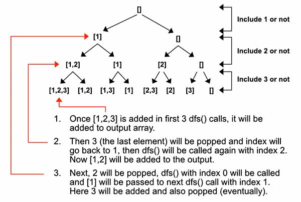

> All diagrams presented herein are original creations, meticulously designed to enhance comprehension and recall. Crafting these aids required considerable effort, and I kindly request attribution if this content is reused elsewhere.
{: .prompt-danger }

> **Difficulty** :  Easy
{: .prompt-tip }

> DFS
{: .prompt-info }

## Problem

Given an integer array `nums` of **unique** elements, return *all possible* *subsets*  *(the power set)*.

The solution set **must not** contain duplicate subsets. Return the solution in **any order**.

**Example 1:**

```
Input: nums = [1,2,3]
Output: [[],[1],[2],[1,2],[3],[1,3],[2,3],[1,2,3]]
```

**Example 2:**

```
Input: nums = [0]
Output: [[],[0]]
```

## Solution

This is one of the classic backtracking algorithm. For every `index` location, we need to run `dfs()` twice. One using the element and another time is not using the element. Let's look at the graph below.



Start by defining the variables. We need two of them, one for returning the final `output` and another one for saving the `subset`. 

```python
output = []
subset = []
```

Next the most important part is to identify the terminating condition, that is when to add the current `subset` to the `output` array. Whenever we reach the end of the tree, that is the `index` is equal to the `len(nums)` we know that we have reached a leaf and now need to add the `subset` to the `output`.

```python 
def dfs(index):
  if index >= len(nums):
    output.append(subset.copy())
    return
```

Now the recursive calls.

```python
  subset.append(nums[index])
  dfs(index + 1)

  subset.pop()
  dfs(index + 1)
```

Now call the `dfs()` by passing `index` as `0` and return the `output`.

```python
dfs(0)
return output
```

### Reverse Way!

Can you now implement the reverser way? So instead of adding the `nums[index]` value to the `subset` and popping it later. Start without the `subset.append(nums[index])` and add it in the second choice. Below is the code:

```python 
	...
	
  # Call dfs() without appending the nums[i]
	dfs(index + 1)
  	
  # now add it and call dfs()
  subset.append(nums[index])
  dfs(index + 1)
	
  # before returning still need to pop it.
  subset.pop()

```

## Final Code

Here is the full code.

```python
def subsets(nums):
    output = []
    subset = []

    def dfs(index):
        if index >= len(nums):
            output.append(subset.copy())
            return

        subset.append(nums[index])
        dfs(index + 1)

        subset.pop()
        dfs(index + 1)

    dfs(0)
    return output
```


