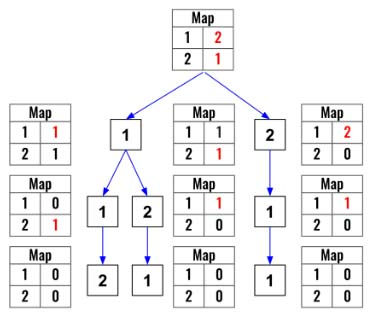

> All diagrams presented herein are original creations, meticulously designed to enhance comprehension and recall. Crafting these aids required considerable effort, and I kindly request attribution if this content is reused elsewhere.
{: .prompt-danger }

> **Difficulty** :  Medium
{: .prompt-warning }

> DFS, Backtracking, Map 
{: .prompt-info }

## Problem

Given a collection of numbers, `nums`, that might contain duplicates, return *all possible unique permutations **in any order**.*

**Example 1:**

```
Input: nums = [1,1,2]
Output:
[[1,1,2],
 [1,2,1],
 [2,1,1]]
```

**Example 2:**

```
Input: nums = [1,2,3]
Output: [[1,2,3],[1,3,2],[2,1,3],[2,3,1],[3,1,2],[3,2,1]]
```

## Solution

This is very similar to the previous [Permutations](https://adeveloperdiary.com/algorithm/backtracking/permutations/) problem however like we used almost the same solution for [Subset II](https://adeveloperdiary.com/algorithm/backtracking/subsets-ii/) from [Subset](https://adeveloperdiary.com/algorithm/backtracking/subsets/), we won't be able to do the same. Here in order to avoid the duplicates, we will transform the input `list` to a `map` object and use that to traverse the `dfs()` for negating sequences.

```python
nums_map=collections.defaultdict(int)
for n in nums:
  nums_map[n]+=1
```

```
{
	1: 2, 
	2: 1
}
```

In the `dfs()` function, the terminating/base condition is similar to what we have used in the [Subset](https://adeveloperdiary.com/algorithm/backtracking/subsets/) problem. Like in the [Subset](https://adeveloperdiary.com/algorithm/backtracking/subsets/) problem we will define `permutation_arr` outside, though it can also be passed as an argument in the `dfs()` function.

```python 
permutation_arr = []
output=[]
def dfs():
  if len(permutation_arr) == len(nums):
    output.append(permutation_arr.copy())
    return
```

Now we will loop through each unique element in the `nums_map`. If the number in the `nums_map` is more than `0` then we know we can call `dfs()` again. The idea is to keep subtracting the value from the `nums_map` however the loop will only be for `len(nums_map.keys())`. This will ensure number of unique combinations are equal to number of unique elements in the input `nums` array. 

```python 
  for key in nums_map:
    if nums_map[key] >0 :
    ...
```

Now add each key to the `permutation_arr` , decrement the counter in the `nums_map` then run `dfs()`. Once its completed perform the backtracking.

```python
  for key in nums_map:
    if nums_map[key] >0 :
      permutation_arr.append(key)
      nums_map[key]-=1
    
      dfs()
    
      nums_map[key]+=1
      permutation_arr.pop()
```

Finally invoke `dfs()` and return the `output`.

```python 
dfs()
return output
```

Here is the visualization.



## Final Code

Here is the full code.

```python
def permutations_ii(nums):
    output = []
    permutation_arr = []
    nums_map = collections.defaultdict(int)
    for n in nums:
        nums_map[n] += 1

    def dfs():
        if len(permutation_arr) == len(nums):
            output.append(permutation_arr.copy())
            return

        for key in nums_map:
            if nums_map[key] > 0:
                permutation_arr.append(key)
                nums_map[key] -= 1

                dfs()

                nums_map[key] += 1
                permutation_arr.pop()

    dfs()
    return output
```
