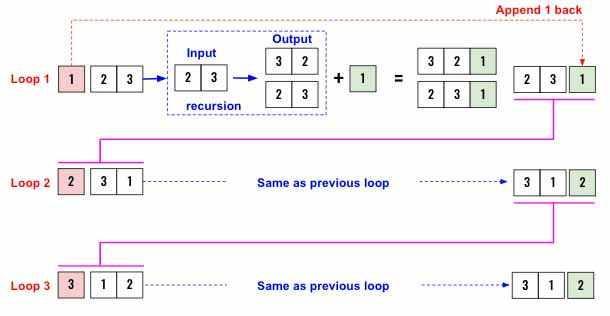
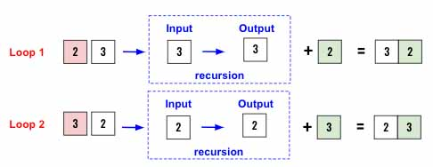
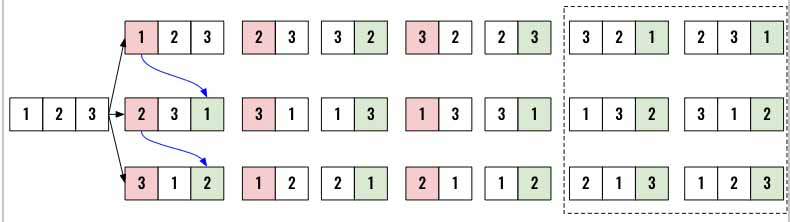
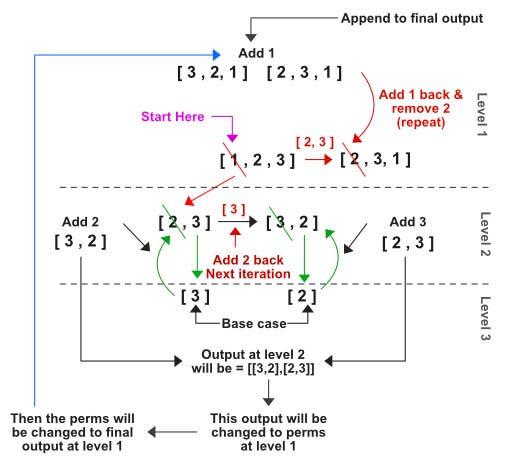

> All diagrams presented herein are original creations, meticulously designed to enhance comprehension and recall. Crafting these aids required considerable effort, and I kindly request attribution if this content is reused elsewhere.
{: .prompt-danger }

> **Difficulty** :  Medium
{: .prompt-warning }

> Recursive 
{: .prompt-info }

## Problem

Given an array `nums` of distinct integers, return *all the possible permutations*. You can return the answer in **any order**.

**Example 1:**

```
Input: nums = [1,2,3]
Output: [[1,2,3],[1,3,2],[2,1,3],[2,3,1],[3,1,2],[3,2,1]]
```

**Example 2:**

```
Input: nums = [0,1]
Output: [[0,1],[1,0]]
```

**Example 3:**

```
Input: nums = [1]
Output: [[1]]
```

## Solution

Let's look at solving the problem visually first. We will use **Example 1** and will be running a recursive algorithm to solve this. Below diagram explains the high level design of it. We are going to have an `output` list which we will populate all the combinations.

- We will have a `for` loop to run `len(nums)` times to generate all the combinations.
```python
for index in range(len(nums)):
```

- In the diagram below in the left all `3` Loops are depicted. In start of **loop 1**, we will remove the element `1` at index `0` from the list.

```python
	first = nums.pop(0)
```

- Then take the remaining two elements (`[2,3]`) and invoke a recursive algorithm. 

```python
	permutation_arr = recursive_function(nums)
```

- We should design the recursive algorithm so that it returns an array with two combinations `[[3,2],[2,3]]`. 

- Now we append the removed element `1` at the end of the returned list. So the output becomes `[[3,2,1],[2,3,1]]`. Add these to the `output` array. 

```python
	for perm in permutation_arr:
    perm.append(first)
```

- Add the updated `permutation_arr` into the `output`.

```python
  output.extend(permutation_arr)
```

- :fire: Then add `1` back to the original input list. This is the trick to understand. Now the array has been shifted by `1` and in **loop 2**, `2` will be picked as the first element to be removed.

```python
	nums.append(first)
```



Here is the python code for the same. 

```python
for index in range(len(nums)):
  first = nums.pop(0)
  
  permutation_arr = recursive_function(nums)
  for perm in permutation_arr:
    perm.append(first)
  
  output.extend(permutation_arr)
  nums.append(first)
```

If we pass just one element to the recursion program, we can just return that. This will be the base case.

```python
if len(nums) == 1:
  return [nums.copy()]
```

So let's see how the base case going to work.  From the **Loop 1**, of the previous diagram we are invoking the `recursive_function` by passing `[2,3]`. Below is the same diagram using `[2,3]` as an input and generating the `[[3,2],[2,3]]` as output. As we see, in the base case the same element is getting returned. 



We will keep continuing this way until the loop ends (Referring back the first diagram). This should generate all `6` combinations needed.



 Here is the different way to explain the same algorithm. 



## Final Code

Here is the full code.

```python
def permutations(nums):
	output = []
  
  if len(nums)==1:
    return [nums.copy()]
  
  for index in range(len(nums)):
    first = nums.pop(0)

    permutation_arr = permutations(nums)
    for perm in permutation_arr:
      perm.append(first)

    output.extend(permutation_arr)
    nums.append(first)
  
  return output
```


