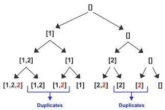
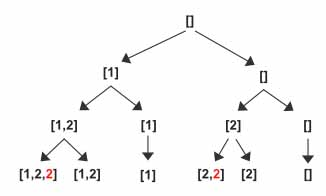
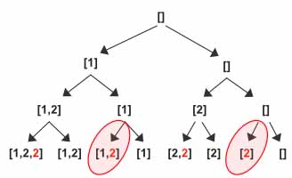
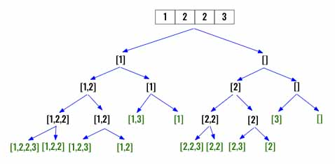

> All diagrams presented herein are original creations, meticulously designed to enhance comprehension and recall. Crafting these aids required considerable effort, and I kindly request attribution if this content is reused elsewhere.
{: .prompt-danger }

> **Difficulty** :  Medium
{: .prompt-warning }

> DFS, Pruning 
{: .prompt-info }

## Problem

Given an integer array `nums` that may contain duplicates, return *all possible* *subsets* *(the power set)*.

The solution set **must not** contain duplicate subsets. Return the solution in **any order**.

**Example 1:**

```
Input: nums = [1,2,2]
Output: [[],[1],[1,2],[1,2,2],[2],[2,2]]
```

**Example 2:**

```
Input: nums = [0]
Output: [[],[0]]
```

## Solution

If we follow the exact same solution as [Subsets](https://adeveloperdiary.com/algorithm/backtracking/subsets/), you will find two duplicates for the input array `[1,2,2]`.  I have highlighted all the `2`'s which were `3` in the  [Subsets](https://adeveloperdiary.com/algorithm/backtracking/subsets/) problem as the input array changed from `[1,2,3]` to `[1,2,2]`



The solution we want is the following. The issue is after popping the value `2` from the `subset` we are incrementing the `index` again however since there is another `2` in the new `index` our results now has duplicates. We still want the previous results if the input is `[1,2,3]` instead of `[1,2,2]`.



The way to resolve this is to increment `index` such a way it does not land in another `2` after popping `2` from the `subset`. The first step is to make sure the input array is sorted. This way all duplicates will be continuously repeated.

```python
nums.sort()
```

Now, we can keep incrementing `index` until it finds a new value other than current `nums[index]` or reaches `len(nums)-1`. So in case of `[1,2,2]`, after we pop `2` from `subset` and instead of calling `dfs(index+1)= dfs(1+1)` we keep incrementing `index` until it reaches `len(nums)-1` and then we call `dfs(index+1)= dfs(2+1)`. This way the terminating condition is triggered and `[1]` will be added to the `output`. 

This way the highlighted traversal does not execute and the duplicate entry does not get added to the `subset` array.



Here is another example of input array `[1,2,2,3]`, when we come back to `index=0`, instead of incrementing it by `+1` we shift it to `2+1`.



Here is just 2 additional lines of code to add to the existing [Subsets](https://adeveloperdiary.com/algorithm/backtracking/subsets/) solution. The reason we are using ` < len(nums)-1` is, we have to compare with the next value so setting `< len(nums)` will cause out of bound exception and we are going to increment `index` when calling `dfs()` anyway.

```python
while index < len(nums)-1 and nums[index]==nums[index+1]:
  index+=1
```

And thats all the changes needed for this to work. If it's not yet clear, my suggestion is to work out an example using on paper. 

## Final Code

Here is the full code.

```python
def subsets(nums):
    output = []
    subset = []
    
    # Sort the values
    nums.sort()

    def dfs(index):
        if index >= len(nums):
            output.append(subset.copy())
            return

        subset.append(nums[index])
        dfs(index + 1)

        subset.pop()
        
        # Skip all the duplicates
        while index < len(nums)-1 and nums[index] == nums[index+1]:
            index+=1
            
        dfs(index + 1)

    dfs(0)
    return output
```


