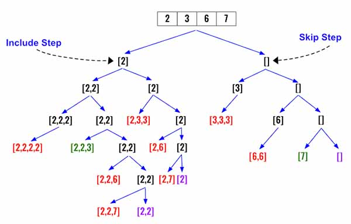

> All diagrams presented herein are original creations, meticulously designed to enhance comprehension and recall. Crafting these aids required considerable effort, and I kindly request attribution if this content is reused elsewhere.
{: .prompt-danger }

> **Difficulty** :  Easy
{: .prompt-tip }

> DFS, Backtracking
{: .prompt-info }

## Problem

Given an array of **distinct** integers `candidates` and a target integer `target`, return *a list of all **unique combinations** of* `candidates` *where the chosen numbers sum to* `target`*.* You may return the combinations in **any order**.

The **same** number may be chosen from `candidates` an **unlimited number of times**. Two combinations are unique if the  frequency of at least one of the chosen numbers is different. 

The test cases are generated such that the number of unique combinations that sum up to `target` is less than `150` combinations for the given input.

**Example 1:**

```
Input: candidates = [2,3,6,7], target = 7
Output: [[2,2,3],[7]]
Explanation:
2 and 3 are candidates, and 2 + 2 + 3 = 7. Note that 2 can be used multiple times.
7 is a candidate, and 7 = 7.
These are the only two combinations.
```

**Example 2:**

```
Input: candidates = [2,3,5], target = 8
Output: [[2,2,2,2],[2,3,3],[3,5]]
```

**Example 3:**

```
Input: candidates = [2], target = 1
Output: []
```

## Solution

I will provide two templates for solving problem like this. However let's visualize the problem first. Every step of the way we have a decision to make. (1) whether to include current number at index `i ` or (2) not include it and move to next number at `i+1`.

In the below diagram it's defined as `include step` and `skip step`.



Now to solve problem like this we can follow two separate templates. 

- In the **template 1**, we simulate traversing the array using two recursive calls from each `dfs()` function. One for current `index` and another for the next `index`.
- In **template 2**, we use a loop to traverse the array recursively for each `index` position starting from current position.


###  Basic Structure

Before implementing each solutions, let's build the basic structure of the code, which is not going to change. We would need one variables for the `output` to return. The `dfs()` function takes 3 parameters :

- The `index` location for traversing
- The `path` to return to.
- The `curr_sum` whenever need to determine base case.

```python
output = []

def dfs(index, path, curr_sum):
```

Lets also define the terminating condition when the `path` can be added to the `output`.

```python
def dfs(index, path, curr_sum):
  if curr_sum == target:
    output.append(path.copy())
    return
```

We will skip the internal logic and finally call the `dfs()` and return the `output`.

```python
output = []

def dfs(index, path, curr_sum):
  if curr_sum == target:
    output.append(path.copy())
    return
  
  # Traversal logic goes here
  
def(0,[],0)
return output
```

### Implement using Template 1

When using **template 1**, we can't keep incrementing the `index` so we need to check for boundary condition. We shouldn't traverse further if any one of the following is `True`.

```python
if index == len(candidates) or curr_sum > target:
  return
```

Now it's time to follow the building blocks of template 1. Here is the `dfs(i)` call where we first update `path` and add pass the same `index` to `dfs()`. Once done we will `pop()` back the latest so that we now have the original `path` to try the next `index`.

```python
path.append(candidates[index])
dfs(index,path,curr_sum+candidates[index])
path.pop()
```

Increase the `index` and call the `dfs()` using existing `path` and `curr_sum`

```python
dfs(index+1,path,curr_sum)
```

Thats all needed for implementing using **template 1**.

### Implement using Template 2

I feel this implementation is very easy to implement using the **Template 2**. We need to traverser using a loop till end of the `candidates` array starting from current `index` and call `dfs()` only if the `curr_sum+candidates[j]<=target`.

Append `candidates[j]` to current `path`, call the `dfs()` and then backtrack `path`.

```python
for j in range(index,len(candidates)):
  if curr_sum+candidates[j]<=target:
    path.append(candidates[j])
    dfs(j,path,curr_sum+candidates[j])
    path.pop()
```

## Final Code

Here is the full code.

```python
def combinationSum(candidates, target):

    output = []

    def dfs(index, path, curr_sum):
        if curr_sum == target:
            output.append(path.copy())
            return

        '''
        # Using Template 2

        for j in range(index,len(candidates)):
            if curr_sum+candidates[j]<=target:
                path.append(candidates[j])
                dfs(j,path,curr_sum+candidates[j])
                path.pop()
        '''
				
        # Using Template 1
        if index == len(candidates) or curr_sum > target:
            return

        path.append(candidates[index])
        dfs(index, path, curr_sum+candidates[index])
        path.pop()

        dfs(index+1, path, curr_sum)

    dfs(0, [], 0)

    return output
```
