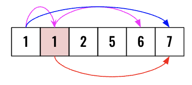
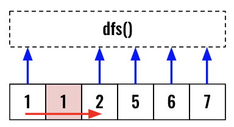

> All diagrams presented herein are original creations, meticulously designed to enhance comprehension and recall. Crafting these aids required considerable effort, and I kindly request attribution if this content is reused elsewhere.
{: .prompt-danger }

> **Difficulty** :  Easy
{: .prompt-tip }

> DFS, Backtracking
{: .prompt-info }

## Problem

Given a collection of candidate numbers (`candidates`) and a target number (`target`), find all unique combinations in `candidates` where the candidate numbers sum to `target`.

Each number in `candidates` may only be used **once** in the combination.

**Note:** The solution set must not contain duplicate combinations.

**Example 1:**

```
Input: candidates = [10,1,2,7,6,1,5], target = 8
Output: 
[
  [1,1,6],
  [1,2,5],
  [1,7],
  [2,6]
]
```

**Example 2:**

```
Input: candidates = [2,5,2,1,2], target = 5
Output: 
[
  [1,2,2],
  [5]
]
```

## Solution

Here we need to make sure that `[1, 7]` and `[7, 1]` both are not selected using **Example 1**. In order to achieve this, first **sort** the array and **skip over** to the next different element than current one. This way `1` will not be selected after choosing `7` as duplicates are not allowed.

It is a very similar problem as the [Combination Sum](https://adeveloperdiary.com/algorithm/backtracking/combination-sum/). Here also we will implement using both the templates we have already discussed.


###  Basic Structure

Before implementing each solutions, let's build the basic structure of the code, which is not going to change. We would need one variables for the `output` to return. The `dfs()` function takes 3 parameters :

- The `index` location for traversing
- The `path` to return to.
- The `curr_sum` whenever need to determine base case.

We will sort the `candidates` just to make sure we can skip the duplicates. (More on this below)

```python
output = []

candidates.sort() 

def dfs(index, path, curr_sum):
```

Lets also define the terminating condition when the `path` can be added to the `output`.

```python
def dfs(index, path, curr_sum):
  if curr_sum == target:
    output.append(path.copy())
    return
```

We will skip the internal logic and finally call the `dfs()` and return the `output`.

```python
output = []

def dfs(index, path, curr_sum):
  if curr_sum == target:
    output.append(path.copy())
    return
  
  # Traversal logic goes here
  
def(0,[],0)
return output
```

### Implement using Template 1

When using **template 1**, we can't keep incrementing the `index` so we need to check for boundary condition. We shouldn't traverse further if any one of the following is `True`.

```python
if index == len(candidates) or curr_sum > target:
  return
```

Now it's time to follow the building blocks of template 1. Here is the `dfs(i)` call where we first update `path` and add pass the same `index` to `dfs()`. Once done we will `pop()` back the latest so that we now have the original `path` to try the next `index`.

```python
path.append(candidates[index])
dfs(index,path,curr_sum+candidates[index])
path.pop()
```

>  The only change in this solution from the previous one is this one and it's very important to understand the difference.
{: .prompt-tip }

What we don't want is the duplication of `[1,7]`. Once we initiate the `dfs()` from the 1st `1` it will always try to find a path to `target` using the 2nd `1`. However initiating another `dfs()` from the 2nd `1` will create duplicate entry (red arrow).



Hence we will **skip** all the duplicate entries as they are already part of the recursive call. We need one `[1,7]`, it does not matter the `1` comes from `index` `0` or `index` `1`. As see below, we will skip over the 2nd `1` and call `dfs()` using `2`.



```python
while index+1 < len(candidates) and candidates[index]==candidates[index+1]:
  index+=1
```

Increase the `index` and call the `dfs()` using existing `path` and `curr_sum`

```python
dfs(index+1,path,curr_sum)
```

Thats all needed for implementing using **template 1**.

### Implement using Template 2

I feel this implementation is very easy to implement using the **Template 2**. We need to traverser using a loop till end of the `candidates` array starting from current `index` and call `dfs()` only if the `curr_sum+candidates[j]<=target`.

Append `candidates[j]` to current `path`, call the `dfs()` and then backtrack `path`. The only extra code here is to keep track of the previous value and skip over if `candidates[i] == prev`.

```python
prev = -1
for j in range(index,len(candidates)):
  if curr_sum+candidates[j]<=target and candidates[i] != prev:
    path.append(candidates[j])
    dfs(j,path,curr_sum+candidates[j])
    path.pop()
  prev= candidates[i]
```

## Final Code

Here is the full code.

```python
def combinationSum(candidates, target):

    output = []

    def dfs(index, path, curr_sum):
        if curr_sum == target:
            output.append(path.copy())
            return

        '''
        # Using Template 2
				prev = -1
        for j in range(index,len(candidates)):
            if curr_sum+candidates[j]<=target and candidates[i] != prev:
                path.append(candidates[j])
                dfs(j,path,curr_sum+candidates[j])
                path.pop()
            prev= candidates[i]
        '''
				
        # Using Template 1
        if index == len(candidates) or curr_sum > target:
            return

        path.append(candidates[index])
        dfs(index, path, curr_sum+candidates[index])
        path.pop()
					
       	while index+1 < len(candidates) and candidates[index]==candidates[index+1]:
            index+=1
        
        dfs(index+1, path, curr_sum)

    dfs(0, [], 0)

    return output
```
