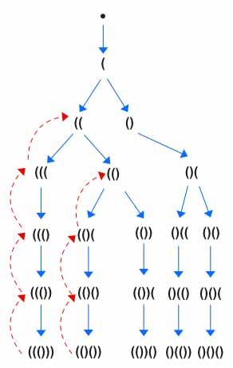
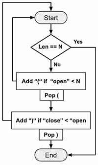
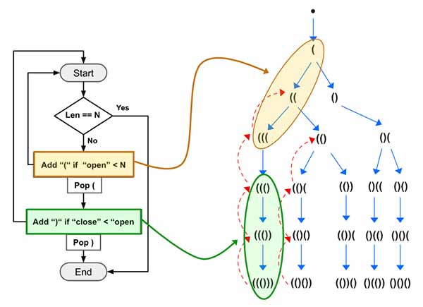
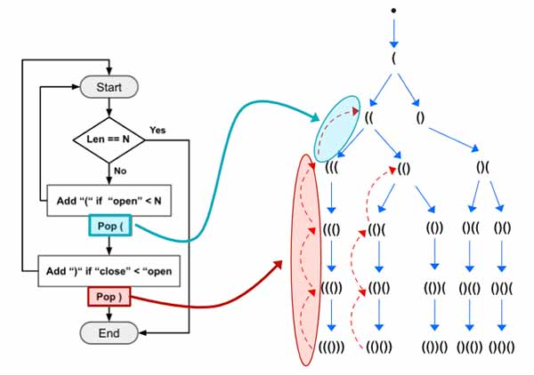
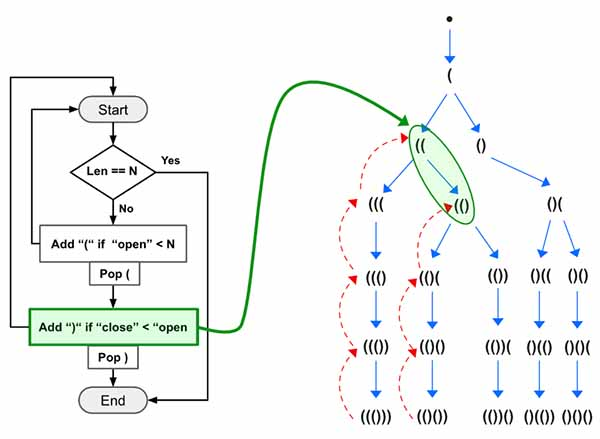

> All diagrams presented herein are original creations, meticulously designed to enhance comprehension and recall. Crafting these aids required considerable effort, and I kindly request attribution if this content is reused elsewhere.
{: .prompt-danger }

> **Difficulty** :  Easy
{: .prompt-tip }

> DFS, Backtracking, Stack
{: .prompt-info }

## Problem

Given `n` pairs of parentheses, write a function to *generate all combinations of well-formed parentheses*.

**Example 1:**

```
Input: n = 3
Output: ["((()))","(()())","(())()","()(())","()()()"]
```

**Example 2:**

```
Input: n = 1
Output: ["()"]
```

## Solution

If you have ever solved these types of problem then you know use of `stack` is very common to keep track of number of **Parentheses**. Before getting into the logic lets visualize the graph.



Here is the high level idea:

- Use DFS to find various paths.
- Keep adding `(` and call `dfs()` until the number of open parentheses reaches `n` 
- Keep adding `)` and call `dfs()` only if number of close parentheses is less than the open parentheses.



Now let's go through the **Example 1**, At first the Yellow box will run `3` times (Yellow Box) and add `(((` into the `stack`. :fire: the backtracking (`pop()`) won't be executed here. Then on the 4th run, the yellow part won't be executed as number of open will be equal to `N`. Now the green box will run `3` times and will produce `((()))`.



Now the length of the generated sequence will have both `open==close==N`. So we will add it to the `output` and return.

At first the close (red) backtracking logic (`pop()`) will be executed `3` times. Then the open (blue) backtracking logic (`pop()`)  will be executed only once.



The close logic (green) will be executed again. This will add `)` into the `stack`. Similarly the rest of the program will continue running.



Visualizing the problem helps us to develop the intuition before trying to code it. Now let's start by defining the variables.

We need an array to store the outputs, we also need a `stack`. Luckily in python an array can also behave like a `stack`.So lets define two variables.

```python
output = []
stack = []
```

Define the `dfs()` function. We need to keep track of open & close parentheses. So the `dfs` will take both of them as argument.

```python
def dfs(open_count, close_count):
```

Define the terminating condition. Whenever the `open_count` and `close_count` are equal to `n`, we know we have a valid sequence. 

```python
def dfs(open_count, close_count):
  if open_count == close_count == n:
    output.append("".join(stack))
    return
```

Now keep adding the open `(` parentheses if the `open_count < n` using `dfs()`. Increment the `open_count` by `1` and once done backtrack by popping from the `stack`.

```python
if open_count < n:
  stack.append("(")
  dfs(open_count+1,close_count)
  stack.pop()
```

Do the same for the `close_count`, expect the logic is different. Add `close_count` only if its `< open_count`.

```python
if close_count < open_count:
  stack.append(")")
  dfs(open_count,close_count+1)
  stack.pop()
```

At the end, invoke the `dfs()` and return `output`.

```python
dfs(0,0)
return output
```

## Final Code

Here is the full code.

```python
def generate_parentheses(n):
    output = []
    stack = []

    def dfs(open_count, close_count):
        if open_count == close_count == n:
            output.append("".join(stack))
            return

        if open_count < n:
            stack.append("(")
            dfs(open_count+1, close_count)
            stack.pop()

        if close_count < open_count:
            stack.append(")")
            dfs(open_count, close_count+1)
            stack.pop()
    dfs(0, 0)
    return output
```
