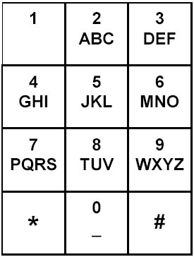
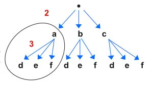

> All diagrams presented herein are original creations, meticulously designed to enhance comprehension and recall. Crafting these aids required considerable effort, and I kindly request attribution if this content is reused elsewhere.
{: .prompt-danger }

> **Difficulty** :  Easy
{: .prompt-tip }

> DFS, Backtracking 
{: .prompt-info }

## Problem

Given a string containing digits from `2-9` inclusive, return all possible letter combinations that the number could represent. Return the answer in **any order**.

A mapping of digits to letters (just like on the telephone buttons) is given below. Note that 1 does not map to any letters.



**Example 1:**

```
Input: digits = "23"
Output: ["ad","ae","af","bd","be","bf","cd","ce","cf"]
```

**Example 2:**

```
Input: digits = ""
Output: []
```

**Example 3:**

```
Input: digits = "2"
Output: ["a","b","c"]
```

## Solution

Let's define all the dependencies using a `map`.

```python
num2char={
  "2": "abc",
  "3": "def",
  "4": "ghi",
  "5": "jkl",
  "6": "mno",
  "7": "pqrs",
  "8": "tuv",
  "9": "wxyz",
}
```

Now build the graph to visualize. We need to traverse top-down. 



A `dfs()` function should be able to solve this easily. The dfs function can take the `index` of the input `nums` and at each level we can just pass the `prev_chars`. Whenever `len(prev_chars)==len(nums)` we can append it to the `output` array.

```python
def dfs(index,prev_chars):
  if len(prev_chars)==len(nums):
    output.append(prev_chars)
    return
```

Since at each level there are multiple options, we can loop through each of them and call the `dfs()` function.

```python
for c in num2char[nums[index]]:
  dfs(index+1,prev_chars+c)
```

Finally invoke the`dfs()`

```python 
if nums:
  dfs(0,"")

return output
```

This is the simple solution which didn't need backtracking as we know each path would lead to a success. If that wasn't the case then  we should have had implemented the backtracking. Here is an example of how the same solution would work using backtracking.

We increment  `index` and add `c` to `prev_chars`. Then after invoking `dfs()` we again backtrack. As you clearly see this backtracking is unnecessary as each path will lead to a solution.

```python
def dfs(index,prev_chars):
  if len(prev_chars)==len(nums):
    output.append(prev_chars)
    return

  for c in num2char[nums[index]]:
    prev_chars+=c
    index+=1

    dfs(i,prev_chars)
		
    #backtracking - not required here
    index-=1
    prev_chars=prev_chars[:-1]
```

## Final Code

Here is the full code.

```python
def letter_combinations(nums):
    output = []
    
    num2char = {
        "2": "abc",
        "3": "def",
        "4": "ghi",
        "5": "jkl",
        "6": "mno",
        "7": "pqrs",
        "8": "tuv",
        "9": "wxyz",
    }

    def dfs(index, prev_chars):
        if len(prev_chars) == len(nums):
            output.append(prev_chars)
            return

        for c in num2char[nums[index]]:
            dfs(index+1, prev_chars+c)

    if nums:
        dfs(0, "")

    return output
```
