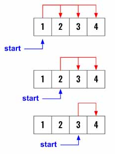

> All diagrams presented herein are original creations, meticulously designed to enhance comprehension and recall. Crafting these aids required considerable effort, and I kindly request attribution if this content is reused elsewhere.
{: .prompt-danger }

> **Difficulty** :  Easy
{: .prompt-tip }

> DFS, Backtracking
{: .prompt-info }

## Problem

Given an integer array `nums` and an integer `k`, return `true` if it is possible to divide this array into `k` non-empty subsets whose sums are all equal.

**Example 1:**

```
Input: nums = [4,3,2,3,5,2,1], k = 4
Output: true
Explanation: It is possible to divide it into 4 subsets (5), (1, 4), (2,3), (2,3) with equal sums.
```

**Example 2:**

```
Input: nums = [1,2,3,4], k = 3
Output: false
```

## Solution

A very simple problem to solve and almost similar to the [Find Unique Binary String](https://adeveloperdiary.com/algorithm/backtracking/find-unique-binary-string/) problem.

So from every `index` we need to start a `dfs()` to create combinations of length `k` using all `1 to n` numbers.



This instantly guides us to use **template 2** that we have already discussed  [here](https://adeveloperdiary.com/algorithm/backtracking/combination-sum/).


Define the output variable.

```python
output = []
```

Then create the `dfs()` which will take the `index` and current `path`. Whenever the `len(path)==k` we can append the `path` to `output`.

```python
def dfs(index, path):
  if len(path) == k:
    output.append(path.copy())
    return
```

Now define the `for` loop to call `dfs()` recursively. Below for the right boundary, we need to include `+1` as the numbers start from `1` and not `0`.

```python
  for j in range(index,n+1):
    path.append(j)
    dfs(j+1,path)
    path.pop()
```

At the end, call `dfs()` and return `output`.

```python
dfs(1,[])
return output
```

## Final Code

Here is the full code.

```python
def combine(n, k):
    output = []

    def dfs(index, path):
        if len(path) == k:
            output.append(path.copy())
            return
        for j in range(index, n+1):
            path.append(j)
            dfs(j+1, path)
            path.pop()

    dfs(1, [])
    return output

```
