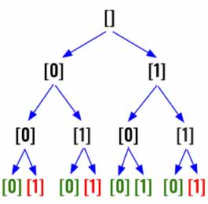

> All diagrams presented herein are original creations, meticulously designed to enhance comprehension and recall. Crafting these aids required considerable effort, and I kindly request attribution if this content is reused elsewhere.
{: .prompt-danger }

> **Difficulty** :  Easy
{: .prompt-tip }

> DFS, Backtracking
{: .prompt-info }

## Problem

Given an array of strings `nums` containing `n` **unique** binary strings each of length `n`, return *a binary string of length* `n` *that **does not appear** in* `nums`*. If there are multiple answers, you may return **any** of them*.

**Example 1:**

```
Input: nums = ["01","10"]
Output: "11"
Explanation: "11" does not appear in nums. "00" would also be correct.
```

**Example 2:**

```
Input: nums = ["00","01"]
Output: "11"
Explanation: "11" does not appear in nums. "10" would also be correct.
```

**Example 3:**

```
Input: nums = ["111","011","001"]
Output: "101"
Explanation: "101" does not appear in nums. "000", "010", "100", and "110" would also be correct.
```

## Solution

This is bit different, but definitely not a complicated problem. We need to basically find all the binary numbers of length `n` and if we find any of that does not belong to the input array then return the one does not belong.



Here we shall try to first solve to find all the combinations up to length `n`. Please refer my other problems if you are unable to understand the below solution. We are using [template 2](http://127.0.0.1:4000/assets/img/image-20240514221758079.jpg) here.

```python
def find_binary(n):
    output =[]
    
    def dfs(k,path):
        if k==n:
            output.append(''.join(path))
            return
        
        for c in ['0','1']:
            path.append(c)
            dfs(k+1,path)
            path.pop()
    dfs(0,[])
    return output
```

 ```
 print(find_binary(2))
 ['00', '01', '10', '11']
 print(find_binary(3))
 ['000', '001', '010', '011', '100', '101', '110', '111']
 ```

Now the only thing we have do is to modify the above and return a missing binary number. Let's first create a `map` using the input `nums`.

```python
binary_map = {s for s in nums}
```

Inside the `dfs()` we need to validate if the `path` is present in the `binary_map`, if not then return it, otherwise return `None`

```python
if k==n:
  found = ''.join(path)
	return None if found in binary_map else found
```

Finally, inside the `for` loop if we get a response which is not `None` we return that.

```python
for c in ['0','1']:
  path.append(c)
  found= dfs(k+1,path)
  if found is not None:
    return found
  path.pop()
```

At the end, return the `dfs()` function.

```python
return dfs(0,[])
```

## Final Code

Here is the full code.

```python
def find_binary(nums):
    n = len(nums)
    binary_map = {s for s in nums}

    def dfs(k, path):
        if k == n:
            found = ''.join(path)
            return None if found in binary_map else found

        for c in ['0', '1']:
            path.append(c)
            found = dfs(k+1, path)
            if found is not None:
                return found
            path.pop()

    return dfs(0, [])
```
