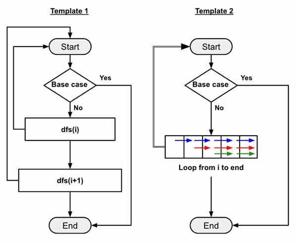

> All diagrams presented herein are original creations, meticulously designed to enhance comprehension and recall. Crafting these aids required considerable effort, and I kindly request attribution if this content is reused elsewhere.
{: .prompt-danger }

> **Difficulty** :  Easy
{: .prompt-tip }

> DFS, Backtracking
{: .prompt-info }

## Problem

Given an integer array `nums` and an integer `k`, return `true` if it is possible to divide this array into `k` non-empty subsets whose sums are all equal.

**Example 1:**

```
Input: nums = [4,3,2,3,5,2,1], k = 4
Output: true
Explanation: It is possible to divide it into 4 subsets (5), (1, 4), (2,3), (2,3) with equal sums.
```

**Example 2:**

```
Input: nums = [1,2,3,4], k = 3
Output: false
```

## Solution

The problem is very similar to 


Here also we will implement using **template 2** that we have already discussed  [here](https://adeveloperdiary.com/algorithm/backtracking/combination-sum/).



## Final Code

Here is the full code.

```python

```
