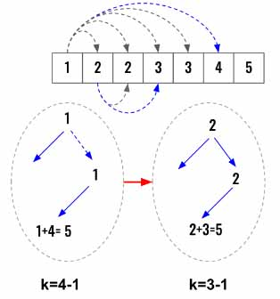

> All diagrams presented herein are original creations, meticulously designed to enhance comprehension and recall. Crafting these aids required considerable effort, and I kindly request attribution if this content is reused elsewhere.
{: .prompt-danger }

> **Difficulty** :  Easy
{: .prompt-tip }

> DFS, Backtracking
{: .prompt-info }

## Problem

Given two integers `n` and `k`, return *all possible combinations of* `k` *numbers chosen from the range* `[1, n]`.

You may return the answer in **any order**. 

**Example 1:**

```
Input: n = 4, k = 2
Output: [[1,2],[1,3],[1,4],[2,3],[2,4],[3,4]]
Explanation: There are 4 choose 2 = 6 total combinations.
Note that combinations are unordered, i.e., [1,2] and [2,1] are considered to be the same combination.
```

**Example 2:**

```
Input: n = 1, k = 1
Output: [[1]]
Explanation: There is 1 choose 1 = 1 total combination.
```

## Solution

The problem is very similar to [Combination Sum II](https://adeveloperdiary.com/algorithm/backtracking/combination-sum-ii/) however the difference is that we need to find `k` equal number of combinations and not less. Also in **Combination Sum II**, we can use one number again in a different combination, but here one number can only be used only once.

So this tells us that,

- We need to keep track of which number is already used and not to use that again (unless we backtrack). In the **Combination Sum I & II**, we had to keep track of the `path` only for one combination. However here it needs to be persisted across all traversals.

  ```python
  used=[False] * len(nums)
  ```

- Once we identify a solution `path_sum==target`, we need to run `dfs()` again by decrementing `k`. Then when `k==0`, we can return `True`

  ```python
  def dfs(index, path_sum, k):
    if k == 0:
      return True
  
    if path_sum==target:
      return dfs(0,0, k-1)
  ```



As we discuss in detail, this problem has similarities to the [N-Queens](https://adeveloperdiary.com/algorithm/backtracking/n-queens/) problem as well.

Now, here also we will implement using **template 2** that we have already discussed  [here](https://adeveloperdiary.com/algorithm/backtracking/combination-sum/).


The first thing to do is to find the `target`. Also define the `used` array for keeping track of the used numbers.

```python
target = sum(nums) //k
used=[False] * len(nums)
```

As discussed earlier, the `dfs()` will take three arguments, `index`, `path_sum` & `k`. Also define the conditions we have created earlier.

```python
def dfs(index, path_sum, k):
  if k == 0:
    return True

  if path_sum==target:
    return dfs(0,0, k-1)
```

Now as per the **template 2**, we will use a `for` loop till end of the `nums` array from current `index`. We have the condition to make sure current number is not `used` and the `path_sum+nums[j] <= target`. Then set the `used[j]=True`, run the `dfs()` function.

If the `dfs()` returns `True`, return `True` immediately. The `dfs()` will return `True` only if `if k == 0` and this will be `True` only if `dfs(0,0, k-1)` runs `k-1` times.

Finally backtrack by setting `used[j]=False`

```python
for j in range(index, len(nums)):
  if not used[j] and path_sum+nums[j] <= target:
    used[j]=True
    if dfs(j+1,path_sum+nums[j],k):
      return True
    used[j]=False
  
  return False
    
```

Finally, just invoke & return `dfs()` .

## Final Code

Here is the full code.

```python
def can_partition_k_subsets(nums, k):        
    
    target = sum(nums) //k
    used=[False] * len(nums)

    def dfs(index, path_sum, k):
        if k == 0:
            return True

        if path_sum==target:
            return dfs(0,0, k-1)

        for j in range(index, len(nums)):
            if used[j]==False and path_sum+nums[j] <= target:
                used[j]=True
                if dfs(j,path_sum+nums[j],k):
                    return True
                used[j]=False
        return False
    return dfs(0,0,k)
```
