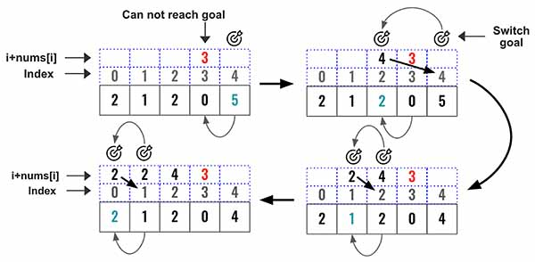

> All diagrams presented herein are original creations, meticulously designed to enhance comprehension and recall. Crafting these aids required considerable effort, and I kindly request attribution if this content is reused elsewhere.
{: .prompt-danger }

> **Difficulty** :  Easy
{: .prompt-tip }

> Backward to forward, greedy
{: .prompt-info }

## Problem

You are given an integer array `nums`. You are initially positioned at the array's **first index**, and each element in the array represents your maximum jump length at that position.

Return `true` *if you can reach the last index, or* `false` *otherwise*.

**Example 1:**

```
Input: nums = [2,3,1,1,4]
Output: true
Explanation: Jump 1 step from index 0 to 1, then 3 steps to the last index.
```

**Example 2:**

```
Input: nums = [3,2,1,0,4]
Output: false
Explanation: You will always arrive at index 3 no matter what. Its maximum jump length is 0, which makes it impossible to reach the last index.
```

## Solution

This problem needs to be solved in a greedy way. At every step we will take the best decision based on that time and not by looking ahead in the future. In this problem, we will start from the right end, keep moving the goal towards the left and find if it can reach index 0.



Here are the high level steps:

1. Set the goal to the last element. 

   ```python
   goal = len(nums)-1
   ```

   

2. Now move towards left and find from which index the current goal can be reached. We are having `len(nums) - 2` as the goal is already pointing at the last index so we need to start from 2nd last index.

   ```python
   for i in range(len(nums)-2,-1,-1):
   ```

   

3. It can be verified if from the current index the goal can be reached by   `current index + value at current index`. If the goal can be reached then shift the goal to current index. Now this is the new goal

   ```python
   if i + nums[i] >=goal:
     goal = i
   ```

   

4. Iterate until loop is completed and find if the goal is already at index 0. 

5. If goal has shifted to index 0 then return True.

   ```python
   return True if goal == 0 else False
   ```


## Final Code

Here is the full code.

```python
def can_jump(nums):
  goal = len(nums)-1
  
  for i in range(len(nums)-2,-1,-1):
    if i + nums[i] >=goal:
      goal = i
      
  return True if goal == 0 else False
```

