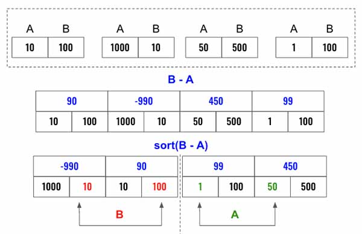

> All diagrams presented herein are original creations, meticulously designed to enhance comprehension and recall. Crafting these aids required considerable effort, and I kindly request attribution if this content is reused elsewhere.
{: .prompt-danger }

> **Difficulty** :  Easy
{: .prompt-tip }

> Greedy, Two Pointers
{: .prompt-info }

## Problem

A company is planning to interview `2n` people. Given the array `costs` where `costs[i] = [aCosti, bCosti]`, the cost of flying the `ith` person to city `a` is `aCosti`, and the cost of flying the `ith` person to city `b` is `bCosti`.

Return *the minimum cost to fly every person to a city* such that exactly `n` people arrive in each city.

**Example 1:**

```
Input: costs = [[10,20],[30,200],[400,50],[30,20]]
Output: 110
Explanation: 
The first person goes to city A for a cost of 10.
The second person goes to city A for a cost of 30.
The third person goes to city B for a cost of 50.
The fourth person goes to city B for a cost of 20.

The total minimum cost is 10 + 30 + 50 + 20 = 110 to 
have half the people interviewing in each city.
```

**Example 2:**

```
Input: costs = [[259,770],[448,54],[926,667],[184,139],[840,118],[577,469]]
Output: 1859
```

**Example 3:**

```
Input: costs = [[515,563],[451,713],[537,709],
[343,819],[855,779],[457,60],[650,359],[631,42]]
Output: 3086
```

## Solution

There is a way to solve this using `dfs()`, however if one just think beyond the complex solution, there is a much easier solution. 

Below are simple three steps. 

- Calculate `B-A`
- Sort the values
- The first half of the sorted list would need to go to city `B` (as going to city `A` will be very costly for them) and second half to city `A` (As city `B` will be very costly for them).  
- Now calculate the `total_cost`.



We are here trying to minimize the cost by sorting the cost difference between two cities. 

Start by calculating the difference can the sort the values.

```python
difference = []
for A, B in costs:
  difference.append([B-A, A, B])

difference.sort()
```

Now, loop though add cost for city `B` from 1st half of the array then cost of the city `A` from 2nd half of the array.

```python
cost = 0
for i in range(len(difference)):
  if i < (difference)//2 # first half
  	cost+= difference[i][2] # 3rd entry is B
  else:
  	cost+= difference[i][1] # 2nd entry is A    
return cost
```

## Final Code

Here is the full code.

```python
def two_city_sched_cost(costs):
  difference = []
  for A, B in costs:
    difference.append([B-A, A, B])

  difference.sort()
```
