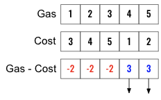
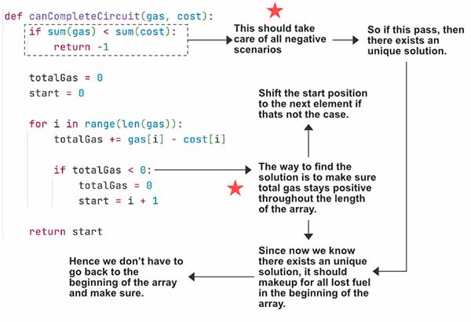

> All diagrams presented herein are original creations, meticulously designed to enhance comprehension and recall. Crafting these aids required considerable effort, and I kindly request attribution if this content is reused elsewhere.
{: .prompt-danger }

> **Difficulty** :  Medium
{: .prompt-warning }

> Greedy
{: .prompt-info }

## Problem

There are `n` gas stations along a circular route, where the amount of gas at the `ith` station is `gas[i]`.

You have a car with an unlimited gas tank and it costs `cost[i]` of gas to travel from the `ith` station to its next `(i + 1)th` station. You begin the journey with an empty tank at one of the gas stations.

Given two integer arrays `gas` and `cost`, return *the starting gas station's index if you can travel around the circuit once in the clockwise direction, otherwise return* `-1`. If there exists a solution, it is **guaranteed** to be **unique**

 

**Example 1:**

```
Input: gas = [1,2,3,4,5], cost = [3,4,5,1,2]
Output: 3
Explanation:
Start at station 3 (index 3) and fill up with 4 unit of gas. Your tank = 0 + 4 = 4
Travel to station 4. Your tank = 4 - 1 + 5 = 8
Travel to station 0. Your tank = 8 - 2 + 1 = 7
Travel to station 1. Your tank = 7 - 3 + 2 = 6
Travel to station 2. Your tank = 6 - 4 + 3 = 5
Travel to station 3. The cost is 5. Your gas is just enough to travel back to station 3.
Therefore, return 3 as the starting index.
```

**Example 2:**

```
Input: gas = [2,3,4], cost = [3,4,3]
Output: -1
Explanation:
You can't start at station 0 or 1, as there is not enough gas to travel to the next station.
Let's start at station 2 and fill up with 4 unit of gas. Your tank = 0 + 4 = 4
Travel to station 0. Your tank = 4 - 3 + 2 = 3
Travel to station 1. Your tank = 3 - 3 + 3 = 3
You cannot travel back to station 2, as it requires 4 unit of gas but you only have 3.
Therefore, you can't travel around the circuit once no matter where you start.
```

## Solution

At first it might be difficult to understand the solution (which is very simple though). You might have to iterate the solution few time to fully understand. Let me first try to provide some intuition first.

In a brute force way to solve the problem to first find the differences between `gas` and `cost`. Then have two loops, to start from each positive `index` (Blue) and see that leads to a solution. However this will take $O(n^2)$ time to complete.



There is a way to solve this using $O(n)$, however it's not very intuitive. 

Let's first use one of the clue - "If there exists a solution, it is **guaranteed** to be **unique**". How can we easily identify if there is even a solution ? Well, thats not actually very difficult. If `sum(gas)>=sum(cost)` that will indicate that we have enough `gas` to complete one cycle. 

```python
if sum(gas) < sum (cost):
  return False
```

The 2nd important part to understand that the amount of gas is cumulative, means the `gas` always adds up. So if there exists one unique solution (which we need to confirm first) then once the gas starts to accumulate it can never goes back to zero otherwise there will be more than one solution. Hence if we can find the `index` from which the `gas` always stays positive we know that that must be the only one starting point.

```python
total_gas = 0
start = 0

for i in range(len(gas)):
  total_gas+=gas[i]-cost[i]
  
  if total_gas < 0:
    total_gas = 0
    start = i+1

return start
```



## Final Code

Here is the full code.

```python
def can_complete_circuit(gas, cost):
  if sum(gas) < sum (cost):
    return False
  
  total_gas = 0
  start = 0

  for i in range(len(gas)):
    total_gas+=gas[i]-cost[i]

    if total_gas < 0:
      total_gas = 0
      start = i+1

  return start
```
