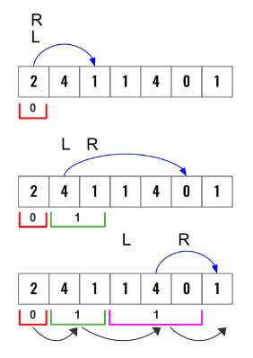

> All diagrams presented herein are original creations, meticulously designed to enhance comprehension and recall. Crafting these aids required considerable effort, and I kindly request attribution if this content is reused elsewhere.
{: .prompt-danger }

> **Difficulty** :  Easy
{: .prompt-tip }

> Greedy, 1D BST
{: .prompt-info }

## Problem

You are given a **0-indexed** array of integers `nums` of length `n`. You are initially positioned at `nums[0]`.

Each element `nums[i]` represents the maximum length of a forward jump from index `i`. In other words, if you are at `nums[i]`, you can jump to any `nums[i + j]` where:

- `0 <= j <= nums[i]` and
- `i + j < n`

Return *the minimum number of jumps to reach* `nums[n - 1]`. The test cases are generated such that you can reach `nums[n - 1]`.

**Example 1:**

```
Input: nums = [2,3,1,1,4]
Output: 2
Explanation: The minimum number of jumps to reach the last index is 2. Jump 1 step from index 0 to 1, then 3 steps to the last index.
```

**Example 2:**

```
Input: nums = [2,3,0,1,4]
Output: 2
```

## Solution

1.	This is similar to 1D BST solution as need to find farthest index based on current left and right pointer.
2.	Initially position **left** and **right** pointer to 0th index.
3.	Then move right pointer based on how **far** it can reach.
4.	Move the left pointer to **1+ current right** pointer.
5.	For each boundary increase jump count by 1.



In the beginning both `left` and `right` will point to `0` th index as the initial window. We will also set number of `jumps` needed to `0`

```python
left = right = 0
jumps = 0
```

Now we will have a `while` loop until the `right`  pointer reaches end of the `nums` array.

```python 
while right < len(nums) -1:
```

We need to keep finding how `farthest` we could move in the current window. We would need a `for` loop for this.

```python
  farthest = 0
  for i in range(left,right+1):
    farthest=max(farthest, i+nums[i])
```

Set `left` pointer to the left of the new window.

```python
  left = right+1
```

Assign `farthest` to  `right`.

```python
  right = farthest
```

Increment `jumps` by `1`.

```python
  jumps+=1
```

Finally, return jumps.

```python 
return jumps
```

## Final Code

Here is the full code.

```python
def jumps(nums):
  left = right = 0 
  jumps = 0
  
  while right < len(nums) - 1:
    fasthest = 0
    for i in range(l, right+1):
      fasthest = max(fasthest, i + nums[i])
    
    left= right +1 
    right = fasthest
    jumps+=1
 return jumps
```
