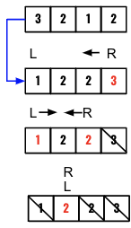

> All diagrams presented herein are original creations, meticulously designed to enhance comprehension and recall. Crafting these aids required considerable effort, and I kindly request attribution if this content is reused elsewhere.
{: .prompt-danger }

> **Difficulty** :  Easy
{: .prompt-tip }

> Greedy, Two Pointers
{: .prompt-info }

## Problem

You are given an array `people` where `people[i]` is the weight of the `ith` person, and an **infinite number of boats** where each boat can carry a maximum weight of `limit`. Each boat carries at most two people at the same time, provided the sum of the weight of those people is at most `limit`.

Return *the minimum number of boats to carry every given person*.

**Example 1:**

```
Input: people = [1,2], limit = 3
Output: 1
Explanation: 1 boat (1, 2)
```

**Example 2:**

```
Input: people = [3,2,2,1], limit = 3
Output: 3
Explanation: 3 boats (1, 2), (2) and (3)
```

**Example 3:**

```
Input: people = [3,5,3,4], limit = 5
Output: 4
Explanation: 4 boats (3), (3), (4), (5)
```

## Solution

1. **Sort** the array 

   ```python 
   people.sort()
   ```

   

2. Pick the **most heavy** person. Decrease the right pointer.

   ```python
   remain = limit - people[right]
   right-=1
   ```

   

3. Then try to fit a **slim person**. If works then increase the left pointer.

   ```python
   if left <= right and remain>=people[left]:
     left+=1
   ```

   

4. Repeat until left is greater than right pointer.

   ```python
   while left <= right:
   ```




## Final Code

Here is the full code.

```python
def num_rescue_boats(people,limit):
  left = 0
  right = len(people)-1 
  people.sort()
  boats=0
  
  while left <= right:
	  remain = limit - people[right]
		right-=1
    boats+=1
    
    if left <= right and remain>=people[left]:
  		left+=1
    
 return boats
  
```
