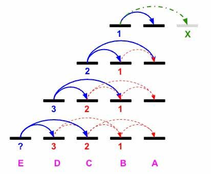

> All diagrams presented herein are original creations, meticulously designed to enhance comprehension and recall. Crafting these aids required considerable effort, and I kindly request attribution if this content is reused elsewhere.
{: .prompt-danger }

> **Difficulty** :  Easy
{: .prompt-tip }

> DP
{: .prompt-info }

## Problem

You are climbing a staircase. It takes `n` steps to reach the top.

Each time you can either climb `1` or `2` steps. In how many distinct ways can you climb to the top?

**Example 1:**

```
Input: n = 2
Output: 2
Explanation: There are two ways to climb to the top.
1. 1 step + 1 step
2. 2 steps
```

**Example 2:**

```
Input: n = 3
Output: 3
Explanation: There are three ways to climb to the top.
1. 1 step + 1 step + 1 step
2. 1 step + 2 steps
3. 2 steps + 1 step
```

## Solution

The problem is easy to understand so let's first visualize it. Say we have 4 stairs named `A,B,C,D,E`. The goal is to reach `A`. Now from `B` we can reach `1` way, thats making one jump. If we make two jumps thats **out of bound**.

- Now from `C` we can reach `B` by one jump and to `A` using a double jump. So total from `C ` we can reach `A` in `2` ways.
- From `D`, we can reach `C` by one jump and we already know that from `C` we have `2` ways to reach `A`. We also can reach `B` from `C` using a double jump and from `B` we can reach `A` in just `1` way. So in total we can reach `A` from `D` using `D->C` and `D->B`, which is `2 + 1 = 3` ways.
- I hope you see a pattern. From `E`, we can reach `A` using two ways `E->D` and `E->C`. Now from `D` we already know we have `3` ways to reach and from `C` we have `2` ways to reach `A`. So is we sum, there are `3+2=5` ways to reach from `E->A`




Let's use this concept to solve the problem first. We know `E=D+C`, `D=C+B`, however what is `C=B+?`. Imagine if one above the top is `X` (shown in above pic) then the value of `X` will be `0` as you are already at the top. Hence setting `X=0`, we get `C=B+A`. So if we set `A=1` and `X=0` then `C=1+1=2` and `B=A+X =1+0 =1`

So we can write the equations as $F_n = F_{n-1}+F_{n-2}$. Imagine $F_{n-1}$  to be initially `A` and  $F_{n-2}$ to `X`.

```python
F1,F2 = 1,0
for _ in range(n):
  T=F1
  F1=F1+F2
  F2=T
return F1
  
```

This problem can be solved using a recursive solution which we will explore now. It's a similar concept, however instead of starting from back, we are going to use recursion to explore from beginning and using call stack to reverse calculate from the base condition of when `curr_step==n` then `return 1` and when `curr_step >n` return `0` (This is simulating `X=0` in the DP solution).

The function will take `curr_steps` as an input and in every iteration we are going to find out the `steps` as `function(curr_steps+1)+function(curr_steps+2)` as defined by the problem itself. 

```python
def recursive_func(curr_steps):
  if curr_steps == n:
    return 1
  
  if curr_steps>n:
    return 0
  
  steps = recursive_func(curr_steps+1)+recursive_func(curr_steps+2)
  
  return steps
```

We shall cache the values so that program can run faster. Here is code where are caching the input `curr_steps` and output `steps`

```python
cache = {}
def recursive_func(curr_steps):
  if curr_steps == n:
    return 1
  
  if curr_steps>n:
    return 0
  
  if curr_steps in cache:
    return cache[curr_steps]
  
  steps = recursive_func(curr_steps+1)+recursive_func(curr_steps+2)
  cache[curr_steps] =  steps
  return steps
```

## Final Code

Here is the full code.

### Dynamic Programming

```python
def climbing_stairs(n):
  F1,F2 = 1,0
  for _ in range(n):
    T=F1
    F1=F1+F2
    F2=T
  return F1
```

### Recursive Method

```python
def climbing_stairs(n):
  cache = {}
  def recursive_func(curr_steps):
    if curr_steps == n:
      return 1

    if curr_steps>n:
      return 0

    if curr_steps in cache:
      return cache[curr_steps]

    steps = recursive_func(curr_steps+1)+recursive_func(curr_steps+2)
    cache[curr_steps] =  steps
    return steps
  
  return climbing_stairs(0)
```


