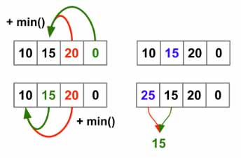

> All diagrams presented herein are original creations, meticulously designed to enhance comprehension and recall. Crafting these aids required considerable effort, and I kindly request attribution if this content is reused elsewhere.
{: .prompt-danger }

> **Difficulty** :  Easy
{: .prompt-tip }

> DP
{: .prompt-info }

## Problem

You are given an integer array `cost` where `cost[i]` is the cost of `ith` step on a staircase. Once you pay the cost, you can either climb one or two steps. You can either start from the step with index `0`, or the step with index `1`. Return *the minimum cost to reach the top of the floor*.

**Example 1:**

```
Input: cost = [10,15,20]
Output: 15
Explanation: You will start at index 1.
- Pay 15 and climb two steps to reach the top.
The total cost is 15.
```

**Example 2:**

```
Input: cost = [1,100,1,1,1,100,1,1,100,1]
Output: 6
Explanation: You will start at index 0.
- Pay 1 and climb two steps to reach index 2.
- Pay 1 and climb two steps to reach index 4.
- Pay 1 and climb two steps to reach index 6.
- Pay 1 and climb one step to reach index 7.
- Pay 1 and climb two steps to reach index 9.
- Pay 1 and climb one step to reach the top.
The total cost is 6.
```

## Solution

First, let's think in terms of a `dfs` problem. We can use the **template 2** that we have already discussed  [here](https://adeveloperdiary.com/algorithm/backtracking/combination-sum/).

At every step we can call our `dfs()` function twice and find which path leads to min cost to reach the top of the floor. This is very similar to the [Climbing Stairs](https://adeveloperdiary.com/algorithm/dp/climbing-stairs/), similarly we will add an additional `0` to `cost` as we did in the Climbing Stairs problem for the base case to work.

 ```python
 cost.append(0)     
 ```

Define a `min_cost` variable.

```python 
min_cost=float('inf')
```

In the `dfs()` function, we pass the current `index` and `curr_cost`. Our base condition is whenever `index==len(cost)` , we can compare `curr_cost` with `min_cost`.

```python
def dfs(index,curr_cost):
  nonlocal min_cost
  if index == len(cost):
    min_cost = min(min_cost,curr_cost)
    return     
```

Now we need to have a loop runs only twice.

```python
for j in range(index, min(index+2,len(cost))):
```

Inside the loop, we increment `curr_cost`, call `dfs()` again and backtrack `curr_cost`.

```python
for j in range(index, min(index+2,len(cost))):
  curr_cost+=cost[j]                
  dfs(j+1,curr_cost)                
  curr_cost-=cost[j]
```

At the end, call `dfs(0,0)` and return min_cost. (Full code at the end)

```python
dfs(0,0)
return min_cost
```

Unfortunately even though the code is all good, the solution won't pass the Leetcode as it will takes $O(2^n)$ time and Leetcode will expect the solution to be competed in $O(n)$ time.

### Dynamic Programming 

Idea to solve using Dynamic Programming is to start from backward (This is a patten in general). Consider the first example, we need to evaluate to find out if `20` or `15` is a place to be in. What we will do it, just a `0` at the end for the loop. Then for `15` find the `min` between `20` and `0`. Set that as the new cost for `15`.  Now do the same for `10`. The updated cost for `10` will be `10+15=25`.



```python
cost.append(0)
for i in range(len(cost)-3,-1,-1):
  cost[i]+= min(cost[i+1],cost[i+2])
  
```

Finally return the `min` `cost` from first or second location.

```python
return min(cost[0],cost[1])
```

## Final Code

Here is the full code.

### DFS/Backtrack Solution

```python
def min_cost_climbing_stairs(cost):
    min_cost = float('inf')
    cost.append(0)

    def dfs(index, curr_cost):
        nonlocal min_cost
        if index == len(cost):
            min_cost = min(min_cost, curr_cost)
            return
        for j in range(index, min(index+2, len(cost))):
            curr_cost += cost[j]
            dfs(j+1, curr_cost)
            curr_cost -= cost[j]
    dfs(0, 0)

    return min_cost
```

### Dynamic Programming Solution

```python
def min_cost_climbing_stairs(cost):
  cost.append(0)
  for i in range(len(cost)-3,-1,-1):
    cost[i]+= min(cost[i+1],cost[i+2])

  return min(cost[0],cost[1])
```


