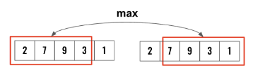

> All diagrams presented herein are original creations, meticulously designed to enhance comprehension and recall. Crafting these aids required considerable effort, and I kindly request attribution if this content is reused elsewhere.
{: .prompt-danger }

> **Difficulty** :  Easy
{: .prompt-tip }

> DP
{: .prompt-info }

## Problem

### House Robber I

You are a professional robber planning to rob houses along a street. Each house has a certain amount of money stashed, the only constraint stopping you from robbing each of them is that adjacent houses have security systems connected and **it will automatically contact the police if two adjacent houses were broken into on the same night**.

Given an integer array `nums` representing the amount of money of each house, return *the maximum amount of money you can rob tonight **without alerting the police***.

**Example 1:**

```
Input: nums = [1,2,3,1]
Output: 4
Explanation: Rob house 1 (money = 1) and then rob house 3 (money = 3).
Total amount you can rob = 1 + 3 = 4.
```

**Example 2:**

```
Input: nums = [2,7,9,3,1]
Output: 12
Explanation: Rob house 1 (money = 2), rob house 3 (money = 9) and rob house 5 (money = 1).
Total amount you can rob = 2 + 9 + 1 = 12.
```

### House Robber II

You are a professional robber planning to rob houses along a street. Each house has a certain amount of money stashed. All houses at this place are **arranged in a circle.** That means the first house is the neighbor of the last one. Meanwhile, adjacent houses have a security system connected, and **it will automatically contact the police if two adjacent houses were broken into on the same night**.

Given an integer array `nums` representing the amount of money of each house, return *the maximum amount of money you can rob tonight **without alerting the police***.

**Example 1:**

```
Input: nums = [2,3,2]
Output: 3
Explanation: You cannot rob house 1 (money = 2) and then rob house 3 (money = 2), because they are adjacent houses.
```

**Example 2:**

```
Input: nums = [1,2,3,1]
Output: 4
Explanation: Rob house 1 (money = 1) and then rob house 3 (money = 3).
Total amount you can rob = 1 + 3 = 4.
```

**Example 3:**

```
Input: nums = [1,2,3]
Output: 3
```

## Solution

### House Robber I

One of the main way to get dynamic programming solved is to split the problem into smaller problems and then find solutions to the smaller problem. Another important idea is also to save precomputed values so that we don't have to loop through every combinations. 

I have been trying to develop a method to easily solve dynamic programming. Like for other problems we do have at least a partial template, however for dynamic programing there is none. So the only option is solve many problems & gain an understanding and remember that for as long as needed for the interviews. 

Going forward I will try to derive a method for identifying patterns from the problem statement for guiding our brain to the right direction.

- [x] 1D DP Problem
- [ ] 2D DP Problem
- [ ] Backward 
- [x] Break into smaller problem
- [x] PreCompute values
- [ ] Caching

Let's start with the assumption that this problem can be solved in 1D. Since we can start from either direction, solving backward won't help much. Breaking this into smaller problem and also precomputing values for the smaller values might help. Let's see.

The main question we need to ask is - **"What we need to know to at minimum to find the max for any given index ?"**

Say we are trying to find the max at the place where the value is `3` (Refer the below diagram). 

- We know if we rob `3` then we can't rob the sequence of the houses includes the house adjacent (green), having value `18`.
- However, we can still rob houses ending prior to the green adjacent house (blue). 

In summary, we need to know just two numbers. 

- The max value if we rob the adjacent prior house (green). In this case it's `18`.
- The max value if we do **not** rob the adjacent prior house (green). In this case it's `7`.

We know the `18` is larger so it does not make sense to rob current house, however based on our current decision, the max value we can rob including or not-including current house is `18`. 


We can keep these two values and repeat. Like when evaluating for `1` (the next house). We know we need to find max of `18` and `18+1=19`. We know the final answer.

We know the value at the `index==0` won't change, however the value at `index=1` might change. So lets `insert` at the `0` `index` of the `nums` array so that we can write just one loop. (Remember this is optional and can be solved different ways without impacting the performance)


```python
nums.insert(0,0)
```

So we will be having a loop traversing through the array from left to right. We can start from `index=2` as the value at `index=1` is fixed and won't be changing. 

```python
for index in range(2,len(nums)):
```

Now at the current `index`, we will find the `max` between `current + the value of non adjacent cell`and `the value of adjacent cell`.

```python
for index in range(2,len(nums)):
  nums[index] = max( nums[index]+nums[index-2],nums[index-1])
```

Finally, return the value at the last `index`.

```python
return nums[-1]
```

### House Robber II

This is very similar to **House Robber I**, just that the last and first element of the array cannot be together. So what we can do is run `rob1` twice, one excluding first element and another time excluding last element.



Here is the code:

```python
if len(nums)==1:
  return nums[0]
return max(rob1(nums[:-1]),rob1(nums[1:]))
```

## Final Code

Here is the full code.

### House Robber I

```python
def bob(nums):
  if len(nums)==1:
    return nums[0]
  
  nums.insert(0,0)
  
  for index in range(2, len(nums)):
    nums[index] = max( nums[index]+nums[index-2],nums[index-1])
  
  return nums[-1]
```

### House Robber II

```python
def bob1(nums):
  if len(nums)==1:
    return nums[0]
  
  nums.insert(0,0)
  
  for index in range(2, len(nums)):
    nums[index] = max( nums[index]+nums[index-2],nums[index-1])
  
  return nums[-1]

def bob2(nums):
  if len(nums)==1:
    return nums[0]
  return max(rob1(nums[:-1]),rob1(nums[1:]))
```


