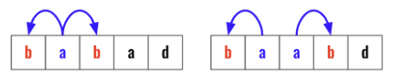

> All diagrams presented herein are original creations, meticulously designed to enhance comprehension and recall. Crafting these aids required considerable effort, and I kindly request attribution if this content is reused elsewhere.
{: .prompt-danger }

> **Difficulty** :  Easy
{: .prompt-tip }

> Two Pointers
{: .prompt-info }

## Problem

Given a string `s`, return *the longest* *palindromic* *substring* in `s`. 

**Example 1:**

```
Input: s = "babad"
Output: "bab"
Explanation: "aba" is also a valid answer.
```

**Example 2:**

```
Input: s = "cbbd"
Output: "bb" 
```

## Solution

The solution is self explanatory. Traverse the array and try to find palindrome for each index based on odd or even length string.



```python
for i in range(len(s)):
  # odd length
  find_palindrome(i,i)
  
  # even length  
  find_palindrome(i,i+1)
```

## Final Code

Here is the full code.

```python
def longest_palindrome(s):
  res=""
  resLen=0

  def findPalindrome(l,r):
    nonlocal resLen,res
    while l>=0 and r< len(s) and s[l]==s[r]:
      if resLen < (r-l+1):
        res=s[l:r+1]
        resLen=r-l+1
        l-=1
        r+=1

  for i in range(len(s)):
    # odd length            
    findPalindrome(i , i )            
    # even length
    findPalindrome(i , i+1 )

  return res
```


