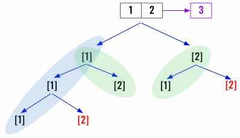
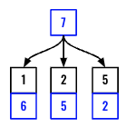
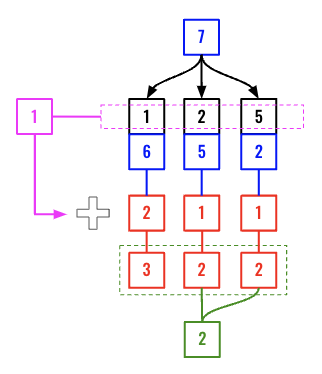
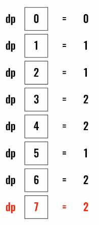

> All diagrams presented herein are original creations, meticulously designed to enhance comprehension and recall. Crafting these aids required considerable effort, and I kindly request attribution if this content is reused elsewhere.
{: .prompt-danger }

> **Difficulty** :  Easy
{: .prompt-tip }

> DP
{: .prompt-info }

## Problem

You are given an integer array `coins` representing coins of different denominations and an integer `amount` representing a total amount of money.

Return *the fewest number of coins that you need to make up that amount*. If that amount of money cannot be made up by any combination of the coins, return `-1`.

You may assume that you have an infinite number of each kind of coin.

**Example 1:**

```
Input: coins = [1,2,5], amount = 11
Output: 3
Explanation: 11 = 5 + 5 + 1
```

**Example 2:**

```
Input: coins = [2], amount = 3
Output: -1
```

**Example 3:**

```
Input: coins = [1], amount = 0
Output: 0
```

## Solution

### DFS/Backtracking Solution

We will first find out how to solve this problem using DFS/Backtracking solution. Consider an example where `coins=[1,2]` and `amount= 3`. At every step until we have reached or exceeded the `amount` we can keep adding each of the coins to the total. Then once we have reached the total we can find the min path.



We will start by defining the `min_path` variable.

```python
min_path=float("inf")
```

Now define the `dfs()` function. It takes the `remaining` amount and the current `path` as inputs. If the `remaining` amount is less then `amount` we return however if its same as `remaining` then we find the `len(path)` and update `min_path` if needed.

```python
 def dfs(remaining,path):            
    nonlocal min_path            
    if remaining < 0:
      return
    if remaining==0:
      min_path=min(min_path,len(path))
```

Now loop through all the `coins` and add the each coin to `path` then after recursively calling `dfs()` backtrack the added coin from the `path`.

```python
    for coin in coins:
      path.append(coin)
      dfs(remaining - coin, path)
      path.pop()
```

Finally, call `dfs()` and return `min_path`.

```python
dfs(amount,[])                
return min_path if min_path!=float("inf") else -1
```

Even though this is a proper solution, however the time complexity is very high $N^{\text{amount}}$ , where N is the number of different coin denominations. There is a more complex way of implementing this using **memoization**, however we are going to directly look into the DP solution next.

### Dynamic Programming

The idea again comes down to breaking the problem in smaller problem. Like we have done in the previous problems, let's consider `coins = [1,2,5]` and `amount = 7` as an example.

We need to find out, whats the fewest number of coins to make `7`? Since we have coins with value `1,2,5` we can subtract each coin from `7`. Referring the diagram below, if we know the fewest number of coins to make `6`,`5` & `2` when we can just add `1` to that number and find the min among them.



If we know that the fewest number of coins to make `6`,`5` & `2` are respectively `2`,`1` and `1` then we can add `1` to that number as we have used `1,2,5` once (pink arrow below). So the final values are `3,2,2`. Now we can take `min` among them and the final result is `2`. (Either `7-2=5` or `7-5=2`)



The only unknown part here is how do we know the **fewest number of coins** to make `6`,`5` & `2`? These numbers can also be anything (based on the `coins` array). However we know that these numbers will always be less than `amount`. So if we can have the **fewest number of coins to make** all the values from `0 - (amount-1)` then in the final step will need just `O(n)` to find the final result. (Here `n` is length of `coins`).

In this example, we will calculate all the values in a loop. (Refer below).



This is the main logic, where we have two `for` loops. One for finding fewest number of coins to make for each amounts from  `0 - amount`.

```python
for prev_amount in range(1, amount+1):
  for coin in coins:
    if prev_amount - coin >=0:
      cache[prev_amount]=min(cache[prev_amount], 1+ cache[prev_amount - coin])
```

Initially we will create the `cache` with `float("inf")` values with length `amount+1` and will set `cache[0]=0`.

```python 
cache = [float("inf")]*(amount+1)
cache[0]=0
```

Following are the patterns used here to find the DP solution.

- [x] 1D DP Problem
- [ ] 2D DP Problem
- [ ] Backward 
- [x] Break into smaller problem
- [x] PreCompute values
- [ ] Caching

## Final Code

Here is the full code.

```python
def coin_change(coins, amount):
  cache = [float("inf")]*(amount+1)
  cache[0]=0
  
  for prev_amount in range(1, amount+1):
    for coin in coins:
      if prev_amount - coin >=0:
        cache[prev_amount]=min(cache[prev_amount], 1+ cache[prev_amount - coin])
        
  return cache[amount] if cache[amount]!=float("inf") else -1
```


