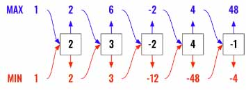

> All diagrams presented herein are original creations, meticulously designed to enhance comprehension and recall. Crafting these aids required considerable effort, and I kindly request attribution if this content is reused elsewhere.
{: .prompt-danger }

> **Difficulty** :  Easy
{: .prompt-tip }

> DP
{: .prompt-info }

## Problem

Given an integer array `nums`, find a subarray that has the largest product, and return *the product*.

The test cases are generated so that the answer will fit in a **32-bit** integer.

**Example 1:**

```
Input: nums = [2,3,-2,4]
Output: 6
Explanation: [2,3] has the largest product 6.
```

**Example 2:**

```
Input: nums = [-2,0,-1]
Output: 0
Explanation: The result cannot be 2, because [-2,-1] is not a subarray.
```

## Solution

It's evident that we can solve the problem just by traversing the array one time, but the only problem is the `-` sign which will shift the result. The `-` sign will reverse the result, that is, it will change the largest product to smallest one and the smallest one to largest one. Since we won't have any control over it, why don't we track both and finally find out the max one.

So let's create two variables `smallest` and `largest`. We need to set them to `1` and not `0` since we are working with product here.

```python 
smallest, largest = 1, 1
```

We also need to keep track of the `largest` at every iteration as in case there is only one negative number then at the end of the loop the `largest` value may not be largest. Try to solve `[2,3,-2,4]` and you will see at the end the `largest` is `4`, however the correct result is `2 x 3 = 6` and not `4`.

:fire: The other important trick to understand which value to initialize this with ? We know that the `nums` array can have any number, positives or negatives.

Say there is just one number and that is negative `[-5]` then the `max_product` must be `-5`. So we can initially say, the `max(nums)` is the `max_product` without knowing anything about the `nums` array.

```python 
max_product = max(nums)
```

Now, please refer the diagram below. Here we are going to keep track of `min` and `max` product for every iteration of the loop. We need to compare 3 values. 

- `MAX = max ( largest*nums[i],smallest*nums[i], nums[i])`
- `MIN = max ( largest*nums[i],smallest*nums[i], nums[i])`



We need to consider the current value (`nums[i]`) as well for finding `MIN` and `MAX`. Notice above we have `-2` as max and `-12` as min. Now `4` could be the next `MAX` and not `-8`. 

```python
for i in range(len(nums)):
  MAX = max ( largest*nums[i],smallest*nums[i], nums[i])
  MIN = min ( largest*nums[i],smallest*nums[i], nums[i])
  largest = MAX
  smallest = MIN
  max_product= max(max_product,largest)
```

We have one more edge case to take care. Whenever `nums[i]==0` we need to reset `largest` and `smallest` otherwise all the products going forward will be `0`.

```python
for i in range(len(nums)):
  if nums[i] ==0:
    largest=1
    smallest=1
    continue
  MAX = max( .... )  
```

Finally just return  the `max_product`.

```python
return max_product
```

## Final Code

Here is the full code. 

```python
def max_product(nums):
  smallest, largest = 1, 1
  max_product = max(nums)
  for i in range(len(nums)):
    if nums[i] ==0:
      largest=1
      smallest=1
      continue
    MAX = max ( largest*nums[i],smallest*nums[i], nums[i])
    MIN = min ( largest*nums[i],smallest*nums[i], nums[i])
    largest = MAX
    smallest = MIN
    max_product= max(max_product,largest)    
  return max_product
```
