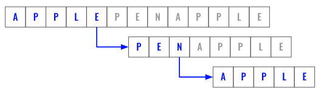
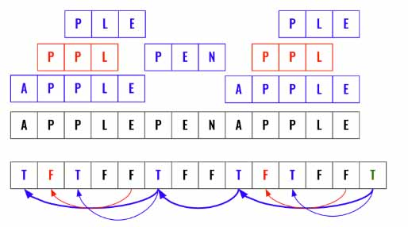
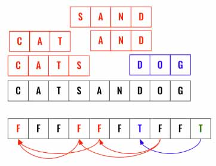
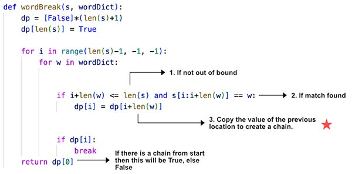

> All diagrams presented herein are original creations, meticulously designed to enhance comprehension and recall. Crafting these aids required considerable effort, and I kindly request attribution if this content is reused elsewhere.
{: .prompt-danger }

> **Difficulty** :  Easy
{: .prompt-tip }

> DP
{: .prompt-info }

## Problem

Given a string `s` and a dictionary of strings `wordDict`, return `true` if `s` can be segmented into a space-separated sequence of one or more dictionary words.

**Note** that the same word in the dictionary may be reused multiple times in the segmentation. 

**Example 1:**

```
Input: s = "leetcode", wordDict = ["leet","code"]
Output: true
Explanation: Return true because "leetcode" can be segmented as "leet code".
```

**Example 2:**

```
Input: s = "applepenapple", wordDict = ["apple","pen"]
Output: true
Explanation: Return true because "applepenapple" can be segmented as "apple pen apple".
Note that you are allowed to reuse a dictionary word.
```

**Example 3:**

```
Input: s = "catsandog", wordDict = ["cats","dog","sand","and","cat"]
Output: false
```

## Solution

### DFS Solution

The DFS Solution works really well as we will be moving forward from left to right only when we find a matching word in `wordDict`. We can use memorization using a map which would make this as fast as dynamic programming. Let's follow the **template 2** that we have already discussed [here](https://adeveloperdiary.com/algorithm/backtracking/combination-sum/).




Define the cache for memorization using map. Then define the `dfs()` function which takes truncated `s`.

```python
cache={}

def dfs(s):
  ...
```

Let's skip the base condition and focus on the actual algorithm first. Since we are using Template 2, we need to have a loop such that we are able to construct words using all the remaining letters as needed. We will start the loop from `1` so that we can keep increasing the window.

```python
	for index in range(1, len(s)):
```

Now keep increasing the `window` by `1` and each time validate to see its there in `wordDict`, if there is match we will call `dfs()` again using `remaining_s` to repeat this again. 

```python
	for index in range(1, len(s)):
    window = s[:i]
    remaining_s = s[i:]
    if window in wordDict and dfs(remaining_s):
      ...
```

If the `dfs()` inside `if` returns `True` then there is a solution for `remaining_s`, so add `remaining_s` in `cache`. Now, we do not have to iterate through the `for` loop as we know we have a match, hence we will return `True`

```python
    if window in wordDict and dfs(remaining_s):
    	cache[remaining_s]=True
      return True
      
```

At the end of `for` loop if the function has not returned then we know there is no solution for current `s`, so lets set that to the `cache` as `False` and return `False`.

```python 
	cache[s]=False
  return False
```

Finally, call the `dfs()` by passing `s` and return its return.

```python
return dfs(s)
```

Now, it's time to implement the base condition. If at anytime we have the final word then the current `s` will always be equal to one of the word present in `wordDict`. This will be the terminating condition.

```python
def dfs(s):
  if s in wordDict:
    return True
```

Next, if we already have found a solution for `s` then just return that as well. If could be either `True` or `False`.

```python
  if s in cache:
    return cache[s]
```

### Dynamic Programming Solution

- Loop backward, all the `True` (matched words) needs to the connected.
- Fill each position in **DP** (Cache) using the previous discovered position. If the previous position is False then the current word is not useful. **DP** of that position will also be False.
- The bold line indicates success. Not all True values contribute to this.

Here is an example. At the bottom is the cache (**DP**). Initially all elements are set to `False`. Then have 2 loops to match each word at every index location and update **DP** (Cache) based one the previous ending value.



Here is another example where the output is `False`.



Let's start by defining the `dp` cache array. The length of this needs to be `1+len(s)` as we need to start using `True` at the end to move forward. This is going to be our base condition. 

```python
dp = [False] * (len(s)+1)
dp[-1] = True
```

Now we need to loop through `s` from backward and then try to match each word. If we have iterated enough to be equal or less then  the length the current word in `wordDict` then only we can run the comparison.

```python
for i in range(len(s)-1,-1,-1):
  for w in wordDict:
    if i+len(w) <=len(s):
    	if s[i:i+len(w)]==w:
        dp[i]=dp[i+len(w)]
```

If there is at least one match then we don't have to continue looking for more words. 

```python
    if dp[i]:
    	break
```

Finally, return the output stored in `dp[0]`. 



## Final Code

Here is the full code. 

### DFS Solution 

```python
def word_break(s, wordDict):
  cache={}
  def dfs(s):
    if s in wordDict:
    	return True 
	  if s in cache:
  	  return cache[s]    
    for index in range(1, len(s)):
      window = s[:i]
      remaining_s = s[i:]
      if window in wordDict and dfs(remaining_s):
        cache[remaining_s]=True
        return True
    cache[s]=False
    return False   
return dfs(s)
```

### Dynamic Programming Solution

```python
def word_break(s, wordDict):
  dp = [False] * (len(s)+1)
	dp[-1] = True
  
  for i in range(len(s)-1,-1,-1):
    for w in wordDict:
      if i+len(w) <=len(s):
        if s[i:i+len(w)]==w:
          dp[i]=dp[i+len(w)]
    if dp[i]:
    	break 
      
  return dp[0]
```
