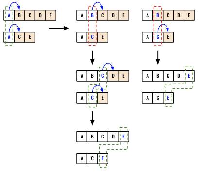
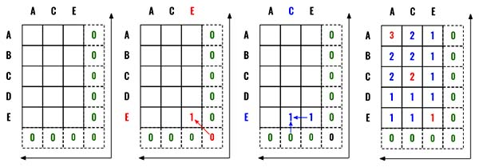

> All diagrams presented herein are original creations, meticulously designed to enhance comprehension and recall. Crafting these aids required considerable effort, and I kindly request attribution if this content is reused elsewhere.
{: .prompt-danger }

> **Difficulty** :  Easy
{: .prompt-tip }

> DP
{: .prompt-info }

## Problem

Given two strings `text1` and `text2`, return *the length of their longest **common subsequence**.* If there is no **common subsequence**, return `0`.

A **subsequence** of a string is a new string generated from the original string with some characters (can be none) deleted without changing the relative order of the remaining characters.

- For example, `"ace"` is a subsequence of `"abcde"`.

A **common subsequence** of two strings is a subsequence that is common to both strings.

**Example 1:**

```
Input: text1 = "abcde", text2 = "ace" 
Output: 3  
Explanation: The longest common subsequence is "ace" and its length is 3.
```

**Example 2:**

```
Input: text1 = "abc", text2 = "abc"
Output: 3
Explanation: The longest common subsequence is "abc" and its length is 3.
```

**Example 3:**

```
Input: text1 = "abc", text2 = "def"
Output: 0
Explanation: There is no such common subsequence, so the result is 0.
```

## Solution

### DFS/Recursive Solution

Solving this problem recursively would help to build the intuition for the dynamic programming approach. Let's walk through an example first. In order to compare two strings we need two indexes `i` and `j`. Initially we will set both of them to `0`. We will have just two separate scenarios in our `dfs()` function. 

- If the letters match (`A` and `A`) then we should next try to find common letters in the subsegment (highlighted in orange) (`B,C,D,E` and `C,E`). 
- If the letters **do not** match, then we will have **two paths** to take forward. 
  - Increment `i` , however keep `j` the same and compare `C,D,E` with `C,E` which eventually leads to finding both `C,E`.
  - Increment `j` , however keep `i` the same and compare `B,C,D,E` with `E` which eventually leads to finding `E`.
- Since both path after matching `A` finds different results (`C,E` vs `E`), we can take the `max` of the outcome as the problem is about finding the **longest** common subsequence. 



We can directly start with the `dfs()` function. Start with detecting the end of the starting. If at least one of the index is out of bound we can return `0` as no additional match can be found.

```python
def dfs(i,j):
  if i == len(text1) or j == len(text2):
    return 0
```

As discussed, if there is a match we can increment both the index, call `dfs()` recursively and return by adding `1` as we just found a match.

```python
  if text1[i]==text2[j]:
    return 1 + dfs(i+1,j+1)
```

Finally, if the letters do not match, we call `dfs()` twice and return the `max`.

```python
  else:
    return max(dfs(i+1, j), dfs(i, j+1))
```

At the end, call and return the `dfs()` function.

```python
return dfs(0,0)
```

This implementation will be Timed Out in LeetCode as it's expecting a solution in `O(n)` Time Complexity.

### Dynamic Programming Solution

We can use the very similar intuition from the `dfs` solution to implement using Dynamic Programming, however the only changes here are:

- Use loops instead of recursion
- Find the path from backward than forward.

As you see in the diagram below, this is a 2-Dimensional Dynamic Programming problem. We start with a cache to hold all the values. Since we are starting from backward we will have an additional column and row with `0` as the base condition. 

Now very similar to the `dfs` solution, if we find a match we increment `1` by taking the value from the diagonal element (This is same as incrementing both `i` and `j`). (Red arrow)

If there is no match, we take the `max` from the diagonal positions (This is same as incrementing `i` and `j` separately and taking `max` from them). (Blue Arrow).



In case you are not very clear, please review the `dfs` solution. 

Start by defining the `cache` to hold all the intermittent calculations. Initially we fill the entire `cache` with zeros. 

> Notice the outer loop is using `text1` and inner loop is using `text2`. 
{: .prompt-tip }

```python
cache = [[0 for _ in range(len(text2)+1) for _ in range(len(text1)+1)]]
```

Now have two nested loops.

```python 
for i in range(len(text1)-1,-1,-1):
  for j in range(len(text2)-1,-1,-1):
```

If there is a match, take from the diagonal values.

```python
for i in range(len(text1)-1,-1,-1):
  for j in range(len(text2)-1,-1,-1):
    if text1[i] == text2[j]:
      cache[i][j] = 1 + cache[i+1][j+1]
```

If there is not a match then take the max.

```python
for i in range(len(text1)-1,-1,-1):
  for j in range(len(text2)-1,-1,-1):
    if text1[i] == text2[j]:
      cache[i][j] = 1 + cache[i+1][j+1]
   	else:
      cache[i][j] = max(cache[i+1][j],cache[i][j+1])
```

Finally return the value from the `[0][0]` position.

```python
return cache[0][0]
```


## Final Code

Here is the full code.

### DFS/Recursive 

```python
def longest_common_subsequence(text1: str, text2: str) -> int:

  def dfs(i,j):
    if i == len(text1) or j == len(text2):
      return 0

    if text1[i]==text2[j]:
      return 1+ dfs(i+1,j+1)

    else:
      return max(dfs(i+1, j), dfs(i, j+1))


  return dfs(0,0)
```

### Dynamic Programming

```python
def longest_common_subsequence(text1: str, text2: str) -> int:                
  
  cache = [[0 for _ in range(len(text2)+1)] for _ in range(len(text1)+1)]    
  
  for i in range(len(text1)-1,-1,-1):
    for j in range(len(text2)-1,-1,-1):
      if text1[i] == text2[j]:
        cache[i][j] = 1 + cache[i+1][j+1]
      else:
        cache[i][j] = max(cache[i+1][j],cache[i][j+1])

  return cache[0][0]
```
