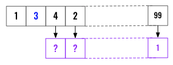
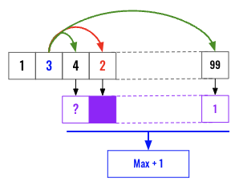
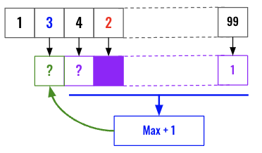

> All diagrams presented herein are original creations, meticulously designed to enhance comprehension and recall. Crafting these aids required considerable effort, and I kindly request attribution if this content is reused elsewhere.
{: .prompt-danger }

> **Difficulty** :  Easy
{: .prompt-tip }

> DP
{: .prompt-info }

## Problem

Given an integer array `nums`, return *the length of the longest **strictly increasing*** ***subsequence***.

**Example 1:**

```
Input: nums = [10,9,2,5,3,7,101,18]
Output: 4
Explanation: The longest increasing subsequence is [2,3,7,101], therefore the length is 4.
```

**Example 2:**

```
Input: nums = [0,1,0,3,2,3]
Output: 4
```

**Example 3:**

```
Input: nums = [7,7,7,7,7,7,7]
Output: 1
```

## Solution

The requirement to move from left to right itself gives away the clue that this problem can be solved by moving in the opposite direction. We can use `dfs()` to solve this by constructing a tree and traversing to find out which path leads to the solution, however the thought process of solving using Dynamic Programming in this case is very intuitive. 

We are going to again try to find whats needed for an element at index `i` to be part of the **largest** increasing sub-sequence ? Below is an example where we are trying find out whats the **longest strictly increasing subsequence** from index `1`, that is number `3`.  

Now if we already know the **longest strictly increasing subsequence** from each of the elements of the right of `3`, then we can just loop through that (shown in purple color) array or map object and find the `max` value of those where the current number `3` is smaller than the respective element .



Let's see that visually, we have a second loop to iterate all the elements at the right of `3`. We are going to discard if any element that is smaller than `3`. In this case, `2` is smaller, so we do **not** need its longest strictly increasing subsequence so we masked that out in the purple array. (Cache). At the end we find the `max` and increment it by `1` for finding out the longest strictly increasing subsequence including `3`. 



Finally we set the **longest strictly increasing subsequence** value for `3` in our cache (purple array) and process the previous number `1`.



Start with defining the purple array as our cache for the dynamic programming. Now each value by them self is automatically part of a subsequence of length `1` so lets initialize the array with all `1`s. 

```python
cache = [1] * len(nums)
```

Now start the outer loop to traverse our `nums` array from back. The last element will always have associated longest strictly increasing subsequence value as `1` so we can skip that and start from the element prior to that. (Hence `-2` below)

```python
for i in range(len(nums)-2,-1,-1)
```

For each of the element at index `i` we need to traverse till end of the array and collect the longest strictly increasing subsequence number for any element larger than the current index value.

```python
for i in range(len(nums)-2,-1,-1):
  lsis_so_far =[1]
  for j in range(i+1, len(nums)):
    if nums[i] < nums [j]:
      lsis_so_far.append(cache[j])
  cache[i]=1+max(lsis_so_far)
  
```

Now, we will not write like this way as we can always have a **rolling max** than need to store all of the values to a temporary `lsis_so_far` array.

```python
for i in range(len(nums)-2,-1,-1):
  for j in range(i+1, len(nums)):
    if nums[i] < nums[j]:
      cache[i]= max(cache[i],cache[j]+1)            
```

Finally return the `max` from the `cache`. We can also use a rolling max here, however does not really change the outcome in LeetCode.

```python
return max(cache)
```

## Final Code

Here is the full code. 

```python
def longest_strictly_increasing_subsequence(nums):
    cache = [1] * len(nums)
    for i in range(len(nums)-2, -1, -1):
        for j in range(i+1, len(nums)):
            if nums[i] < nums[j]:
                cache[i] = max(cache[i], cache[j]+1)
    return max(cache)

```

